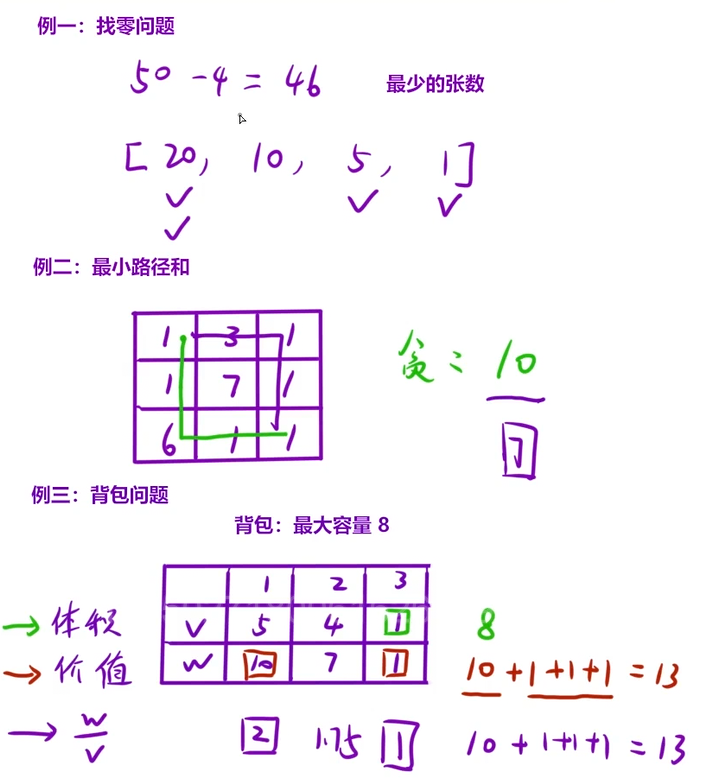
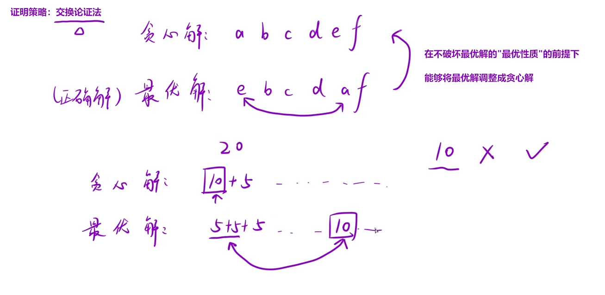
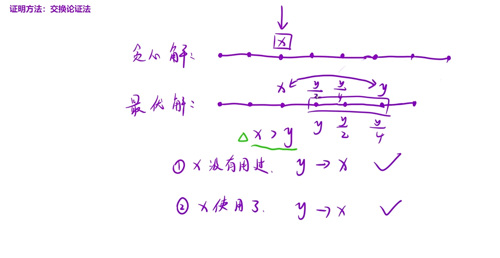

# 算法学习
## 基础算法
### 双指针

### 滑动窗口

### 二分查找

### 前缀和

### 模拟

### 哈希表

### 字符串

### 栈

### 分治


#### 快速排序（非递归版本）

使用栈来模拟递归过程，将需要排序的区间[l, r]压入栈中，循环处理直到栈为空。

```cpp
class Solution {
public:
    // 分区函数：将数组分为两部分，左边小于基准值，右边大于等于基准值
    int partition(vector<int>& nums, int left, int right) {
        // 选择最右边的元素作为基准值
        int pivot = nums[right];
        int i = left - 1; // i指向小于基准值的最后一个元素的位置
        
        for (int j = left; j < right; j++) {
            // 如果当前元素小于基准值，将其交换到左边区域，[0,1]维护的是小于基准值的数据
            if (nums[j] < pivot) {
                i++;
                swap(nums[i], nums[j]);
            }
        }
        // 将基准值放到正确位置
        swap(nums[i + 1], nums[right]);
        return i + 1; // 返回基准值的位置
    }
    
    void quickSort(vector<int>& nums) {
        int n = nums.size();
        if (n <= 1) return;
        
        stack<pair<int, int>> stk; // 存储待排序区间[l, r]
        stk.push({0, n - 1}); // 初始区间：整个数组
        
        while (!stk.empty()) {
            auto [left, right] = stk.top();
            stk.pop();
            
            if (left < right) {
                // 分区操作
                int pivot_idx = partition(nums, left, right);
                
                // 将左右两个子区间压入栈中
                // 先处理右区间，再处理左区间（栈的特性，后进先出）
                stk.push({pivot_idx + 1, right}); // 右区间
                stk.push({left, pivot_idx - 1});  // 左区间
            }
        }
    }
};
```

### 队列 + 宽搜(BFS)

### 优先级队列

### BFS解决FloodFill问题

### BFS解决最短路径问题

### 多源BFS

### BFS解决拓扑排序

---

## 递归回溯与搜索
### 递归算法

### 搜索算法

### 回溯与剪枝

### FloodFill算法

### 记忆化搜索

---

## 动态规划
1. 状态表示：dp表中值所表示的含义；怎么来的：经验 + 题目要求；发现重复子问题
2. 状态转移方程：dp[i]=dp[];


1. 创建dp表
2. 初始化
3. 填表
4. 返回值
5. 空间优化：滚动数组
### 斐波那契数列模型

### 路径问题

### 简单多状态dp问题

### 子数组问题

### 子序列问题

### 回文串问题

### 两个数组的dp问题

### 01背包问题

### 完全背包问题

### 二维费用背包问题

### 似包非包

### 卡特兰数

---

## 贪心算法

贪心算法背后的原理是简单的，贪心策略很多很多;

什么是贪心算法：贪婪+鼠目寸光
贪心策略:解决问题的策略，局部最优，变为全局最优

1. 把解决问题的过程分为若干步；
2. 解决每一步的时候，都选择当前看起来“最优的”解法；
3. “希望”得到全局最优解；


经典例题一：找零问题
经典例题二：最小路径和
经典例题三：背包问题


贪心算法的特点：
1. 贪心策略的提出：具体问题具体分析
    - 贪心策略的提出是没有标准以及模板的
    - 可能每一道题的贪心策略都是不同的
2. 贪心策略的正确性
    - 因为有可能“贪心策略”是一个错误的方法
    - 正确的贪心策略，我们是需要“证明”的

多总结贪心策略，记住策略，再用到其他题，学会如何证明；

### 860.柠檬水找零
https://leetcode.cn/problems/lemonade-change/description/
证明：交换论证法


最优解和贪心解，唯一的不同就是找20的策略，我们采用（10+5），那么假设最优解是采用（5+5+5）；
看10元能不能替换成5+5，有一张10元，在后续操作中没有使用，表示可以替换。那在后面的操作中使用了，依旧可以替换；

所以最优解能够通过交换的方式得到贪心解，就证明贪心解就是最优的；
### 2208.将数组和减半的最少操作次数
https://leetcode.cn/problems/minimum-operations-to-halve-array-sum/



### 121.买卖股票的最佳时机
https://leetcode.cn/problems/best-time-to-buy-and-sell-stock/?envType=study-plan-v2&envId=top-100-liked
dp或者贪心(部分)，优先贪心，不能在dp

### 