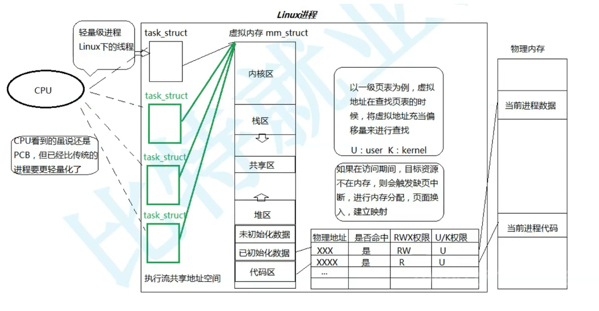
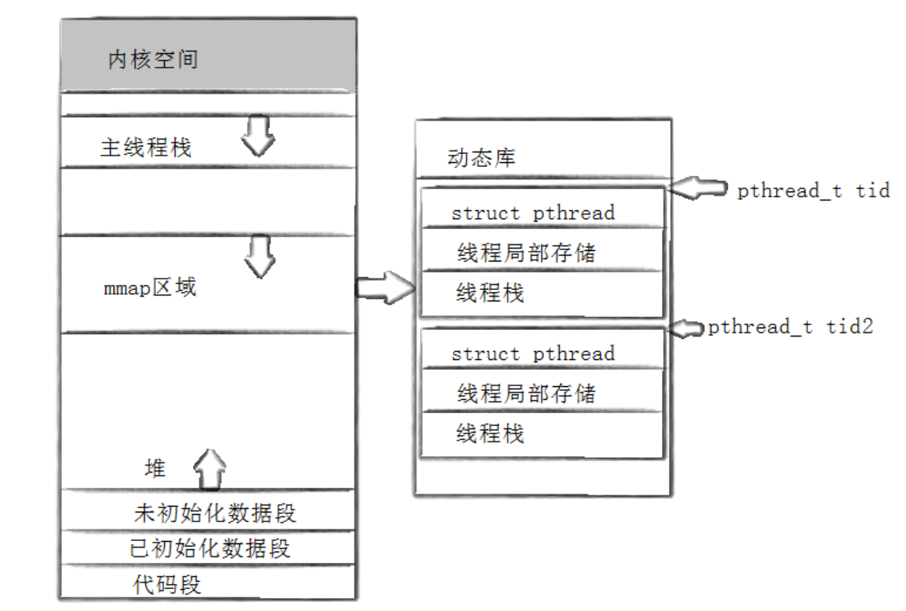
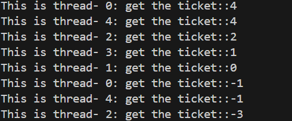
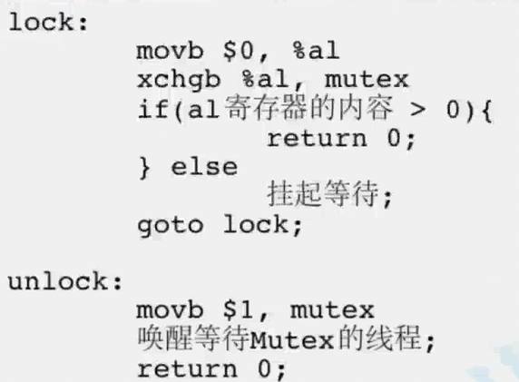
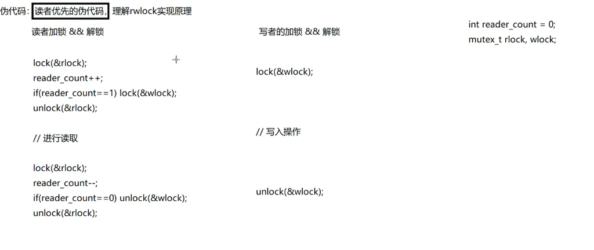

# 线程

## 目录

1. [线程的基本概念](#线程的基本概念)
2. [代码实践体现](#代码实践体现)
3. [同步与互斥](#同步与互斥)
4. [互斥](#互斥)
5. [同步](#同步)
6. [cp问题](#cp问题)
7. [信号量 POSIX](#信号量-posix)
8. [环形队列的生成者消费者模型](#环形队列的生成者消费者模型)
9. [线程安全的单例模式](#线程安全的单例模式)
10. [互斥锁](#互斥锁)
11. [自旋锁](#自旋锁)
12. [读者和写者问题 -- 读写锁](#读者和写者问题----读写锁)
13. [重要接口速查表](#重要接口速查表)
14. [C++11线程库学习](#c11线程库学习)

---

## 线程的基本概念

### Linux下认识线程

**1. 什么是线程？**

线程：是进程的一个执行分支。线程的执行粒度，要比进程细。线程是操作系统调度的基本单位。

进程：是操作系统分配资源的基本实体。

在Linux中，线程是在进程“内部”运行的，线程在进程的地址空间中运行。

**2. Linux中，为什么线程在进程的地址空间中运行？**

因为：任何执行流，都需要资源！地址空间是进程的资源窗口（一个进程能看到的数据是通过地址空间来看的），

**3. Linux中，线程的执行粒度比进程更细？**

进程的执行资源被多个线程共享，线程在进程中执行，当然更细。

**4. 如何理解进程？**

最开始认识进程：内核数据结构（task_struct）+ 代码和数据

现在重新理解进程：
内核观点：进程是承担分配系统资源的基本实体（一大堆的内核数据结构 + 代码和数据（地址空间） + 页表 + 一部分物理内存）

操作系统以进程为单位，给我们分配资源，而线程，是进程内部的执行流资源（PCB）。

以前认识的进程，操作系统以进程为单位分配资源，只不过只有一个执行流（PCB）。本质这才是进程的特殊情况。

**5. 操作系统要不要管理线程？**

先描述再组织？是的，在教程中有专门的数据结构：TCB（thread ctrl block）

Windows中就是这样做的，但想一下，操作系统要管理多进程，然后每个进程下还要管理每个进程的多线程执行流。太复杂了。进程EPROCESS 和 线程ETHREAD 分别管理（线程中很多数据结构和进程相同，维护成本，健壮性不强，为什么不能一跑，跑几年）

Linux中，尊重先描述，再组织。但是没规定必须用新的数据结构和方式来描述管理。我们可以直接使用进程的组织框架，进程的task_struct也是有自己的上下文，调度切换，优先级，被调度。线程也是这样，只不过执行粒度更细而已，所以直接复用进程的结构组织模式（task_struct）

这里也可以看到，Linux管理进程的数据结构是（task_struct），应该叫做执行流管理模块，包含了进程和线程。

**操作系统被叫做计算机世界的哲学，是一本设计操作系统的指南，至于具体怎么去做，他不管，但概念根据操作系统来**

**6. CPU能不能知道执行的是进程还是线程？需要关心吗？**

**CPU调度不需要区分线程和进程**。CPU只有调度执行流的概念，不需要关心是进程还是线程，只需要给我调度执行流就行了，只要能让我找到代码和数据执行的就行了。

站在它的角度调度大小：
操作系统：执行流<=进程 在Linux内核中：线程<=执行流<=进程
因此，在Linux中的执行流，叫做轻量级进程（可以说没有进程，没有线程，统一是执行流），但要分开来讲，也同样能解释。

**7. 小故事加深理解**

我们把进程看做一个家庭，家庭有爷爷，奶奶，爸爸，妈妈，我，妹妹。爷爷奶奶每天听戏曲《穆桂英挂帅》，喜欢京剧；爸爸妈妈每天外出上班挣钱养家；而我和妹妹每天就是学习；我们都在利用家庭的资源，完成着自己的事，任务。这些任务依赖于家庭的资源，共同目的就是把家里的日子过好。

这也就是多线程的理解，利用进程分配到的资源，执行各种细小的工作任务，最后目的是完成一项任务。

### 重谈地址空间（第4讲）

**1. 当操作系统进行进程/线程切换（上下文切换）时，CPU 需要保存和恢复哪些关键寄存器？其中 CR3 寄存器扮演什么角色？**

通用寄存器

CPU内部的CR3寄存器，直接指向页目录。CR2引起缺页中断的异常虚拟地址，缺页中断后需要重新申请内存啥的，CR2就是保存中断位置，以便于下次访问。

**2. 物理内存与存储层次**

**物理内存（RAM）的定义：**
物理内存，被分为4kb的大小内存块的，叫做页框/页帧（实际RAM中的存储块Page Frame）。`4kb = 2 * 2 ^ 10`

**重要澄清：物理内存 ≠ 所有存储设备**

物理内存（RAM）只是计算机存储层次结构中的一部分，不包括：
- ❌ **寄存器**：CPU内部的存储单元，速度最快，容量最小
- ❌ **高速缓存（Cache）**：CPU和内存之间的缓存，速度介于寄存器和内存之间
- ❌ **磁盘**：外部存储设备，速度最慢，容量最大

**计算机存储层次结构（从快到慢，从小到大）：**

```
1. 寄存器（Register）
   - 位置：CPU内部
   - 速度：最快（1个CPU周期）
   - 容量：最小（几十到几百字节）
   - 用途：存储当前正在处理的数据

2. L1 Cache（一级缓存）
   - 位置：CPU内部
   - 速度：1-2 CPU周期
   - 容量：32KB - 64KB
   - 用途：存储最近访问的指令和数据

3. L2 Cache（二级缓存）
   - 位置：CPU内部或CPU附近
   - 速度：10-20 CPU周期
   - 容量：256KB - 512KB
   - 用途：存储较常用的数据

4. L3 Cache（三级缓存）
   - 位置：CPU内部或CPU附近
   - 速度：40-75 CPU周期
   - 容量：几MB到几十MB
   - 用途：存储多个核心共享的数据

5. 物理内存（RAM）
   - 位置：主板上的内存条
   - 速度：100-300 CPU周期
   - 容量：几GB到几十GB
   - 用途：存储程序和数据（这是"物理内存"的真正含义）

6. 磁盘（Disk/SSD）
   - 位置：外部存储设备
   - 速度：最慢（几万到几十万CPU周期）
   - 容量：最大（几百GB到几TB）
   - 用途：长期存储数据
```

**关键理解：**

1. **物理内存特指RAM**：物理内存就是主板上的内存条（RAM），不包括寄存器、Cache和磁盘

2. **存储层次的作用**：
   - 寄存器 → Cache → 内存 → 磁盘，形成多级存储体系
   - 速度快的容量小，速度慢的容量大
   - 通过缓存机制，让CPU大部分时间访问快速存储

3. **为什么需要多级存储？**
   - CPU速度极快（GHz级别）
   - 内存速度相对较慢（需要100-300周期）
   - 通过Cache缓存热点数据，提高访问速度

**关于CPU：**

**CPU（Central Processing Unit，中央处理器）**：
- ✅ 是的，CPU就是中央处理器的英文缩写
- CPU是计算机的核心部件，负责执行指令和处理数据
- CPU包含：
  - **运算器（ALU）**：执行算术和逻辑运算
  - **控制器（CU）**：控制指令执行流程
  - **寄存器**：存储临时数据
  - **Cache**：高速缓存

**重要概念：虚拟地址空间 vs 物理内存**

**关键区别：**
- **虚拟地址空间**：每个进程都有独立的4GB虚拟地址空间（32位系统），这是逻辑上的地址范围
- **物理内存**：所有进程共享同一块物理内存（RAM），这是实际存在的硬件内存

**重要理解：**
1. **每个进程都有4GB虚拟地址空间，但不是4GB物理内存**
   - 32位系统：每个进程的虚拟地址范围是 0x00000000 ~ 0xFFFFFFFF（4GB）
   - 但物理内存只有一块（例如：8GB的RAM），所有进程共用

2. **虚拟地址通过页表映射到物理内存**

---

### 什么是页表？为什么要有页表？

**页表的定义：**

页表（Page Table）是操作系统用来将虚拟地址映射到物理地址的查找表。它是虚拟内存管理的核心数据结构。

**为什么需要页表？**

#### 1. 解决内存管理的基本问题

**问题：如果没有页表会怎样？**

假设没有页表，程序直接使用物理地址：

```
程序A：使用物理地址 0x1000
程序B：使用物理地址 0x1000  ← 冲突！两个程序访问同一块内存
```

**问题：**
- ❌ 多个程序无法同时运行（地址冲突）
- ❌ 程序必须知道物理内存布局（不现实）
- ❌ 无法实现内存保护（一个程序可能破坏另一个程序的数据）
- ❌ 无法实现虚拟内存（无法将不常用的数据换出到磁盘）

#### 2. 实现虚拟内存的核心机制

**虚拟内存的好处：**

```
每个进程看到的地址空间：
进程A：0x00000000 ~ 0xFFFFFFFF (4GB虚拟地址)
进程B：0x00000000 ~ 0xFFFFFFFF (4GB虚拟地址)
进程C：0x00000000 ~ 0xFFFFFFFF (4GB虚拟地址)

实际物理内存：只有 8GB RAM

页表的作用：将每个进程的虚拟地址映射到不同的物理地址
```

**通过页表实现：**
- ✅ **进程隔离**：每个进程有独立的虚拟地址空间
- ✅ **内存保护**：可以设置页的读写权限
- ✅ **按需分配**：只分配实际使用的物理内存
- ✅ **内存共享**：多个进程可以共享同一块物理内存（如共享库）

#### 3. 为什么不能直接映射每个字节？

**如果为每个字节建立映射：**

```
32位系统：4GB 虚拟地址空间 = 4,294,967,296 字节
每个映射条目需要：8字节（32位虚拟地址 + 32位物理地址）
总大小 = 4,294,967,296 × 8 = 32GB

问题：页表本身就需要 32GB 内存！这比实际物理内存还大！
```

**解决方案：分页（Paging）**


将内存分成固定大小的页（Page）：
- 每页大小：4KB
- 页数：4GB / 4KB = 1,048,576 页
- 每个页表项：4字节
- 单级页表大小：1,048,576 × 4 = 4MB

进一步优化：使用两级页表
- 页目录：4KB（必须）
- 页表：按需分配，大多数进程只用几个页表
- 总大小：4KB + N × 4KB（N通常很小，如3-5个）
   ```
   进程A的虚拟地址 0x08048000 → 页表转换 → 物理地址 0x12345000
   进程B的虚拟地址 0x08048000 → 页表转换 → 物理地址 0x56789000
   ```
   不同进程的相同虚拟地址，映射到不同的物理地址（进程独立数据）

3. **物理内存可以共享**
   - **共享库**：多个进程的虚拟地址可以映射到同一块物理内存（如libc.so）
   - **共享内存**：进程间通信时，多个进程可以映射到同一块物理内存
   - **进程独立数据**：每个进程的栈、堆等映射到不同的物理内存

4. **按需分配**
   - 进程创建时，只分配虚拟地址空间（页目录和少量页表）
   - 物理内存按需分配：访问时才分配物理页框（缺页中断）
   - 进程可能只使用几MB物理内存，但拥有4GB虚拟地址空间

**示例说明：**
```
系统有8GB物理内存，运行3个进程：

进程A：
  虚拟地址空间：0x00000000 ~ 0xFFFFFFFF (4GB)
  实际使用物理内存：50MB
  映射关系：虚拟地址 → 页表 → 物理页框

进程B：
  虚拟地址空间：0x00000000 ~ 0xFFFFFFFF (4GB)
  实际使用物理内存：100MB
  映射关系：虚拟地址 → 页表 → 物理页框（与进程A不同）

进程C：
  虚拟地址空间：0x00000000 ~ 0xFFFFFFFF (4GB)
  实际使用物理内存：30MB
  映射关系：虚拟地址 → 页表 → 物理页框（与A、B不同）

共享库（libc.so）：
  所有进程的虚拟地址都映射到同一块物理内存（共享）

总计：3个进程 × 4GB虚拟地址空间 = 12GB虚拟地址空间
      但实际只使用 50MB + 100MB + 30MB = 180MB物理内存
```

**3. 虚拟地址是如何转换到物理地址的？ 32位系统为例**

**3.1 虚拟地址的格式**

32位虚拟地址被分为三部分：`32 = 10 + 10 + 12`
- **高10位**：页目录索引（PDE Index），范围0~1023
- **中10位**：页表索引（PTE Index），范围0~1023  
- **低12位**：页内偏移（Page Offset），范围0~4095（4KB）

**示例：**
```
虚拟地址：0x12345678
二进制：  0001 0010 0011 0100 0101 0110 0111 1000
          └─┬─┘└─────┬─────┘└──────┬──────┘
            │        │             │
        页目录索引  页表索引      页内偏移
        (10位)     (10位)        (12位)
```

**3.2 为什么使用两级页表？**

**单级页表的问题：**
- 32位地址空间 = 4GB
- 每页大小 = 4KB
- 需要页表项数 = 4GB / 4KB = 1M 项
- 每项 = 4字节
- **总大小 = 1M × 4 = 4MB**

问题：每个进程都需要4MB的页表，但大多数进程只使用很少的内存，太浪费！

**两级页表的优势：**
- **页目录（Page Directory）**：1024项 × 4字节 = **4KB**（必须存在）
- **页表（Page Table）**：按需分配，大多数进程只用很少的页表
- 优势：节省内存、按需分配、更灵活

**3.3 两级页表的结构**

```
页目录（Page Directory）
  ├── 页目录项0（PDE 0）→ 指向页表0的物理地址
  ├── 页目录项1（PDE 1）→ 指向页表1的物理地址
  ├── ...
  └── 页目录项1023（PDE 1023）→ 指向页表1023的物理地址

每个页表（Page Table）
  ├── 页表项0（PTE 0）→ 指向页框0的物理地址
  ├── 页表项1（PTE 1）→ 指向页框1的物理地址
  ├── ...
  └── 页表项1023（PTE 1023）→ 指向页框1023的物理地址
```

**关键概念区分：**
- **页目录（Page Directory）**：一级表，存储页表的物理地址
- **页表（Page Table）**：二级表，存储页框的物理地址
- **页目录项（PDE）**：页目录中的条目，指向页表
- **页表项（PTE）**：页表中的条目，指向页框（物理页）
- **页框/页帧（Page Frame）**：物理内存中的4KB块

**3.4 地址转换的完整过程**

```
步骤1：从CR3寄存器获取页目录的物理地址
  CR3寄存器 → 页目录的物理地址（例如：0x100000）

步骤2：使用虚拟地址的高10位作为页目录索引
  pde_index = (virtual_addr >> 22) & 0x3FF;  // 取高10位
  访问：页目录[pde_index] → 得到页目录项（PDE）
  PDE中存储了页表的物理地址

步骤3：使用虚拟地址的中10位作为页表索引
  pte_index = (virtual_addr >> 12) & 0x3FF;  // 取中10位
  访问：页表[pte_index] → 得到页表项（PTE）
  PTE中存储了页框的物理地址（页框起始地址，低12位是标志位）

步骤4：使用虚拟地址的低12位作为页内偏移
  offset = virtual_addr & 0xFFF;  // 取低12位
  最终物理地址 = 页框起始地址 + offset
```

**转换路径：**
```
虚拟地址 → CR3 → 页目录 → 页表 → 页框 → 物理地址
         (寄存器) (一级)  (二级) (物理页)
```

**3.5 页表大小说明**

- **页目录**：固定4KB（1024项 × 4字节），每个进程必须有一个
- **每个页表**：4KB（1024项 × 4字节），按需分配
- **总大小**：4KB（页目录）+ N × 4KB（N个页表，N通常很小）

大多数进程只使用几个页表，而不是1024个，所以总大小远小于4MB。

**3.6 TLB缓存（Translation Lookaside Buffer）详解**

**什么是TLB缓存？**

TLB（Translation Lookaside Buffer，转换后备缓冲区）是CPU中的硬件缓存，用于加速虚拟地址到物理地址的转换。

**为什么需要TLB缓存？**

**问题：页表转换需要多次内存访问**
```
正常页表转换过程（无TLB）：
1. 访问页目录（内存访问1）
2. 访问页表（内存访问2）
3. 访问页框（内存访问3）

每次地址转换需要 2-3 次内存访问，非常慢！
内存访问延迟：~100-300 CPU周期
```

**解决方案：TLB缓存**

TLB缓存存储最近使用的虚拟地址到物理地址的映射关系，避免每次都访问页表。

```
使用TLB缓存后：
1. 首先查找TLB缓存（CPU硬件，1-2周期）
   - 命中：直接获得物理地址（1-2周期）✅
   - 未命中：访问页表（100-300周期），然后将结果存入TLB

性能提升：从 200-600周期 降低到 1-2周期（命中时）
```

**TLB缓存的工作原理**

```
CPU访问虚拟地址时的流程：

步骤1：检查TLB缓存
  ├─ 命中（TLB Hit）
  │   └─ 直接返回物理地址（1-2周期）✅ 快速！
  │
  └─ 未命中（TLB Miss）
      ├─ 通过CR3访问页目录（内存访问1）
      ├─ 访问页表（内存访问2）
      ├─ 获得物理地址
      └─ 将映射关系存入TLB（供下次使用）

步骤2：使用物理地址访问内存
```

**TLB缓存的特点**

1. **容量有限**：
   - 通常只有几十到几百个条目（如64-512条）
   - 使用LRU（最近最少使用）算法淘汰旧条目
   - 容量越小，命中率越低

2. **速度极快**：
   - 位于CPU内部，硬件实现
   - 访问延迟：1-2 CPU周期
   - 比内存访问快100倍以上

3. **与页表的关系**：
   - TLB缓存页表的条目（PTE）
   - TLB是页表的"缓存副本"
   - TLB失效时，需要从页表重新加载

**LRU算法（Least Recently Used，最近最少使用）详解**

**什么是LRU算法？**

LRU是一种缓存淘汰算法，当缓存空间已满时，淘汰**最久未被使用**的数据。

**为什么TLB使用LRU算法？**

TLB容量有限（如512条），但进程可能有数千个页表项。当TLB满了，需要淘汰旧的条目为新条目腾出空间。

**LRU算法的基本原理：**

```
核心思想：最近使用的数据，很可能还会被使用
淘汰策略：淘汰最久未被访问的条目
```

**LRU算法的实现（简化示例）：**

```c
// 伪代码示意：LRU算法的实现
struct tlb_entry {
    unsigned long vpn;      // 虚拟页号
    unsigned long ppn;      // 物理页号
    unsigned long access_time;  // 最后访问时间
};

// 查找TLB条目
tlb_entry* tlb_lookup(unsigned long vpn) {
    // 1. 在TLB中查找
    for (int i = 0; i < TLB_SIZE; i++) {
        if (tlb[i].vpn == vpn) {
            // 命中：更新访问时间
            tlb[i].access_time = current_time++;
            return &tlb[i];  // ✅ 命中
        }
    }
    
    // 2. 未命中：需要从页表加载
    return NULL;  // ❌ 未命中
}

// 添加TLB条目（TLB未命中时）
void tlb_insert(unsigned long vpn, unsigned long ppn) {
    // 1. 查找空闲位置
    int empty_slot = -1;
    for (int i = 0; i < TLB_SIZE; i++) {
        if (tlb[i].vpn == 0) {  // 空槽
            empty_slot = i;
            break;
        }
    }
    
    // 2. 如果没有空闲位置，淘汰最久未使用的
    if (empty_slot == -1) {
        unsigned long oldest_time = tlb[0].access_time;
        int lru_index = 0;
        
        for (int i = 1; i < TLB_SIZE; i++) {
            if (tlb[i].access_time < oldest_time) {
                oldest_time = tlb[i].access_time;
                lru_index = i;
            }
        }
        empty_slot = lru_index;  // 淘汰最久未使用的条目
    }
    
    // 3. 插入新条目
    tlb[empty_slot].vpn = vpn;
    tlb[empty_slot].ppn = ppn;
    tlb[empty_slot].access_time = current_time++;
}
```

**LRU算法示例：**

```
假设TLB容量为4，当前状态：

时间 操作           TLB状态（按访问时间排序，最新在右）
t1   访问页1        [1:0x1000]                    (访问时间1)
t2   访问页2        [1:0x1000, 2:0x2000]         (访问时间2)
t3   访问页3        [1:0x1000, 2:0x2000, 3:0x3000]  (访问时间3)
t4   访问页4        [1:0x1000, 2:0x2000, 3:0x3000, 4:0x4000]  (已满)
t5   访问页1        [2:0x2000, 3:0x3000, 4:0x4000, 1:0x1000]  (页1更新)
t6   访问页5        [3:0x3000, 4:0x4000, 1:0x1000, 5:0x5000]  (淘汰页2)

淘汰规则：总是淘汰最久未使用的（最左边的）
```

**LRU算法的优势：**

- ✅ **符合局部性原理**：最近访问的数据很可能再次被访问
- ✅ **实现相对简单**：只需记录访问时间或维护访问顺序
- ✅ **命中率较高**：相比随机淘汰，LRU通常有更好的命中率

**LRU算法的变种：**

1. **硬件LRU**：CPU硬件实现的LRU，速度极快
2. **软件LRU**：操作系统实现的LRU，灵活性更高
3. **伪LRU（PLRU）**：硬件优化的近似LRU算法，节省硬件成本

---

### LRU Cache 完整实现示例

下面是一个完整的 LRU Cache 实现，使用双向链表 + 哈希表实现 O(1) 时间复杂度的操作：

```cpp
#include <iostream>
#include <list>
#include <unordered_map>

class LRUCache {
private:
    
    std::list<std::pair<int, int>> cache; // 双向链表：存储键值对，按访问时间排序（头部最新，尾部最久）
    std::unordered_map<int, std::list<std::pair<int, int>>::iterator> map; // 哈希表：key -> 指向链表中对应节点的迭代器
    int cap;  // 缓存容量

public:
    // 构造函数：初始化容量
    LRUCache(int capacity) : cap(capacity) {
    }

    // 获取键对应的值
    // 时间复杂度：O(1)
    int get(int key) {
        // 1. 检查 key 是否存在
        if (map.count(key) > 0) {
            // 2. 获取键值对
            auto it = map[key];
            auto temp = *it;
            
            // 3. 从链表中删除原位置
            cache.erase(it);
            
            // 4. 插入到链表头部（标记为最新使用）
            cache.push_front(temp);
            
            // 5. 更新哈希表，指向新的位置
            map[key] = cache.begin();
            
            // 6. 返回值
            return temp.second;
        }
        return -1;  // key 不存在
    }

    // 插入或更新键值对
    // 时间复杂度：O(1)
    void put(int key, int value) {
        // 情况1：key 已存在（更新操作）
        if (map.count(key) > 0) {
            // 删除旧位置
            cache.erase(map[key]);
            map.erase(key);
        }
        // 情况2：key 不存在且缓存已满
        else if (cap == cache.size()) {
            // 获取最久未使用的（链表尾部）
            auto temp = cache.back();
            // 从哈希表删除
            map.erase(temp.first);
            // 删除链表尾部节点（LRU 淘汰）
            cache.pop_back();
        }
        // 情况3：key 不存在且缓存未满，直接插入
        
        // 插入到链表头部
        cache.push_front(std::make_pair(key, value));
        // 更新哈希表，指向新节点
        map[key] = cache.begin();
    }

    // 打印当前缓存状态（用于调试）
    void print() {
        std::cout << "Cache (最新 -> 最久): ";
        for (const auto& p : cache) {
            std::cout << "[" << p.first << ":" << p.second << "] ";
        }
        std::cout << std::endl;
    }
};

// 使用示例
int main() {
    LRUCache cache(3);  // 容量为 3

    std::cout << "=== LRU Cache 测试 ===" << std::endl;

    // 插入操作
    std::cout << "\n1. 插入 (1,100):" << std::endl;
    cache.put(1, 100);
    cache.print();

    std::cout << "\n2. 插入 (2,200):" << std::endl;
    cache.put(2, 200);
    cache.print();

    std::cout << "\n3. 插入 (3,300):" << std::endl;
    cache.put(3, 300);
    cache.print();

    // 访问操作（会更新访问顺序）
    std::cout << "\n4. 访问 key=2 (get(2)):" << std::endl;
    int val = cache.get(2);
    std::cout << "返回值: " << val << std::endl;
    cache.print();  // 2 会移到头部

    // 插入新元素，触发淘汰
    std::cout << "\n5. 插入 (4,400) (缓存已满，会淘汰最久未使用的):" << std::endl;
    cache.put(4, 400);
    cache.print();  // 1 被淘汰（最久未使用）

    // 更新已存在的 key
    std::cout << "\n6. 更新 key=3 的值为 350:" << std::endl;
    cache.put(3, 350);
    cache.print();  // 3 会移到头部

    // 访问不存在的 key
    std::cout << "\n7. 访问 key=1 (已被淘汰):" << std::endl;
    val = cache.get(1);
    std::cout << "返回值: " << val << " (不存在返回 -1)" << std::endl;

    return 0;
}
```

**运行结果：**
```
=== LRU Cache 测试 ===

1. 插入 (1,100):
Cache (最新 -> 最久): [1:100] 

2. 插入 (2,200):
Cache (最新 -> 最久): [2:200] [1:100] 

3. 插入 (3,300):
Cache (最新 -> 最久): [3:300] [2:200] [1:100] 

4. 访问 key=2 (get(2)):
返回值: 200
Cache (最新 -> 最久): [2:200] [3:300] [1:100] 

5. 插入 (4,400) (缓存已满，会淘汰最久未使用的):
Cache (最新 -> 最久): [4:400] [2:200] [3:300] 

6. 更新 key=3 的值为 350:
Cache (最新 -> 最久): [3:350] [4:400] [2:200] 

7. 访问 key=1 (已被淘汰):
返回值: -1 (不存在返回 -1)
```

### 实现要点

1. **数据结构选择**：
   - 双向链表：维护访问顺序，头部最新，尾部最久
   - 哈希表：O(1) 快速定位链表节点

2. **时间复杂度**：
   - `get()`: O(1)
   - `put()`: O(1)

3. **空间复杂度**：O(capacity)

4. **关键操作**：
   - 访问时：将节点移到链表头部
   - 淘汰时：删除链表尾部节点
   - 更新时：删除旧节点，插入新节点到头部

### 优化版本（使用 splice 避免删除重建）

```cpp
int get(int key) {
    if (map.count(key) > 0) {
        auto it = map[key];
        // 使用 splice 将节点移到头部（更高效）
        cache.splice(cache.begin(), cache, it);
        return it->second;
    }
    return -1;
}
```

**TLB缓存在进程/线程切换中的作用**

**进程切换时：**
```
进程A运行
  └─ TLB中存储进程A的页表项

切换到进程B
  ├─ CR3寄存器改变（指向进程B的页目录）
  ├─ TLB中的条目失效（因为页表变了）⚠️
  ├─ 必须刷新TLB（flush_tlb()）
  └─ 重新加载进程B的页表项到TLB
      └─ 开始时TLB未命中多，性能下降
```

**线程切换时：**
```
线程1运行（进程A）
  └─ TLB中存储进程A的页表项

切换到线程2（同一进程A）
  ├─ CR3寄存器不变（共享地址空间）✅
  ├─ TLB中的条目仍然有效（页表没变）✅
  ├─ 不需要刷新TLB
  └─ TLB命中率高，性能好
```

**为什么线程切换更快？**

**关键原因：TLB缓存仍然有效**

```
线程切换快的根本原因：
1. CR3寄存器不变 → 页表不变
2. TLB缓存有效 → 地址转换快
3. CPU缓存有效 → 内存访问快
```

**TLB缓存的实际影响**

**高并发场景下的性能差异：**

```
场景：1000次上下文切换

线程切换（TLB有效）：
  1000次 × 0.5微秒 = 500微秒

进程切换（TLB失效）：
  1000次 × 3微秒 = 3000微秒

性能差异：6倍！
```

**优化建议：**

1. **优先使用线程**：需要资源共享时，线程比进程快得多
2. **减少进程切换**：避免频繁创建和销毁进程
3. **线程池**：复用线程，减少创建/销毁开销
4. **CPU亲和性**：将线程绑定到特定CPU核心，提高缓存命中率

**3.7 CPU Cache（高速缓存）详解**

**什么是CPU Cache？**

CPU Cache是位于CPU和内存之间的高速缓存，用于加速数据访问。它是多级存储体系结构中的关键组件。

**为什么需要CPU Cache？**

**问题：CPU和内存的速度差距巨大**

```
CPU速度：      3-5 GHz（每秒30-50亿次操作）
内存速度：      ~200-400 MHz（每秒2-4亿次操作）
速度差距：      CPU比内存快10-20倍！

CPU访问内存需要等待：
- L1 Cache命中：   1-2 CPU周期
- L2 Cache命中：   10-20 CPU周期
- L3 Cache命中：   40-75 CPU周期
- 内存访问：       100-300 CPU周期

没有Cache，CPU大部分时间在等待内存！
```

**解决方案：多级Cache体系**

```
存储层次结构（从快到慢）：

CPU核心
  ↓
L1 Cache（一级缓存）
  ├─ L1指令缓存（L1I）：存储指令，32KB，1-2周期
  └─ L1数据缓存（L1D）：存储数据，32KB，1-2周期
  ↓
L2 Cache（二级缓存）
  └─ 统一缓存：存储指令和数据，256KB，10-20周期
  ↓
L3 Cache（三级缓存）
  └─ 共享缓存：多个核心共享，8-32MB，40-75周期
  ↓
主内存（RAM）
  └─ 几GB到几十GB，100-300周期
  ↓
硬盘（SSD/HDD）
  └─ 几百万周期
```

**CPU Cache的工作原理**

**1. 数据访问流程：**

```
CPU需要读取数据时的流程：

步骤1：检查L1 Cache
  ├─ 命中（L1 Hit）
  │   └─ 直接返回数据（1-2周期）✅ 最快！
  │
  └─ 未命中（L1 Miss）
      │
      步骤2：检查L2 Cache
        ├─ 命中（L2 Hit）
        │   └─ 返回数据（10-20周期），同时加载到L1
        │
        └─ 未命中（L2 Miss）
            │
            步骤3：检查L3 Cache
              ├─ 命中（L3 Hit）
              │   └─ 返回数据（40-75周期），同时加载到L2和L1
              │
              └─ 未命中（L3 Miss）
                  │
                  步骤4：访问主内存
                    └─ 返回数据（100-300周期），同时加载到L3、L2和L1
```

**2. Cache的局部性原理**

Cache的有效性基于两个重要的局部性原理：

**时间局部性（Temporal Locality）：**
- **原理**：最近访问的数据，很可能还会被访问
- **应用**：Cache保存最近访问的数据
- **示例**：循环变量、函数调用的栈帧

**空间局部性（Spatial Locality）：**
- **原理**：访问某个数据时，很可能访问附近的数据
- **应用**：Cache按块（Cache Line）加载数据，通常64字节
- **示例**：数组顺序访问、代码顺序执行

**什么是热数据（Hot Data）？**

**热数据（Hot Data）的定义：**

热数据是指**被频繁访问的数据**，在Cache中有很高的命中率。

**热数据的特征：**

```
数据访问频率：  高 ←──────────────→ 低
              热数据           冷数据
            （Hot Data）    （Cold Data）
              ↓                ↓
          Cache命中率高    Cache命中率低
          性能好           性能差
```

**热数据的示例：**

1. **循环变量**：
```c
for (int i = 0; i < 1000000; i++) {
    sum += arr[i];  // i是热数据，一直在Cache中
}
```

2. **频繁使用的全局变量**：
```c
int global_counter = 0;  // 多个线程频繁访问，是热数据

void* thread_func(void* arg) {
    for (int i = 0; i < 1000; i++) {
        global_counter++;  // 频繁访问
    }
}
```

3. **共享数据结构**：
```c
// 线程共享的堆数据，频繁访问
int* shared_data = malloc(1000 * sizeof(int));
// 多个线程同时访问，成为热数据
```

**CPU Cache在进程/线程切换中的作用**

**进程切换时：**

```
进程A运行
  └─ Cache中存储进程A的热数据
     ├─ L1/L2 Cache：进程A的代码和数据
     └─ Cache命中率高，访问速度快

切换到进程B
  ├─ CR3寄存器改变（页表改变）
  ├─ 虚拟地址空间不同
  ├─ Cache中的进程A数据失效（因为虚拟地址变了）⚠️
  └─ 需要重新加载进程B的数据到Cache
      └─ 开始时Cache未命中多，性能下降（"冷启动"）
```

**线程切换时：**

```
线程1运行（进程A）
  └─ Cache中存储进程A的热数据
     ├─ 共享代码段（所有线程共享）
     ├─ 共享数据段（全局变量）
     └─ Cache命中率高

切换到线程2（同一进程A）
  ├─ CR3寄存器不变（共享地址空间）✅
  ├─ 虚拟地址空间相同 ✅
  ├─ Cache中的数据仍然有效 ✅
  │   ├─ 代码段：仍然在Cache中（所有线程共享）
  │   └─ 数据段：仍然在Cache中（全局变量共享）
  └─ Cache命中率高，性能好
```

**为什么线程切换更快？**

**关键原因：Cache中的数据仍然有效**

**线程切换快的根本原因：**
1. CR3寄存器不变 → 页表不变
2. TLB缓存有效 → 地址转换快
3. **CPU缓存有效 → 内存访问快** ← 这里！

**Cache的实际影响**

**高并发场景下的性能差异：**

```
场景：1000次上下文切换，每次访问100次内存

线程切换（Cache有效）：
  1000次 × 0.5微秒 = 500微秒
  每次内存访问平均：10周期（Cache命中）
  总开销：较小

进程切换（Cache失效）：
  1000次 × 3微秒 = 3000微秒
  每次内存访问平均：200周期（Cache未命中）
  总开销：较大

性能差异：显著！
```

**Cache配置的影响**

- **Cache越大，命中率越高**
  - L1 Cache：32KB → 64KB，命中率提升
  - L2 Cache：256KB → 512KB，命中率提升
  - L3 Cache：8MB → 16MB，命中率提升

- **线程切换的优势更明显**
  - Cache越大，线程切换时保留的有效数据越多
  - Cache配置越高，线程切换相对于进程切换的优势越大

**优化建议：**

1. **提高数据局部性**：
   - 顺序访问数组（空间局部性）
   - 重用局部变量（时间局部性）

2. **减少缓存失效**：
   - 避免频繁的进程切换
   - 优先使用线程（共享Cache）

3. **CPU亲和性**：
   - 将线程绑定到特定CPU核心
   - 充分利用该核心的Cache

4. **减少伪共享（False Sharing）**：
   - 避免多个线程访问同一Cache Line的不同变量
   - 使用内存对齐和填充

**4. 关于页内偏移和数据类型**

页框大小是4KB，但变量可能跨页吗？不会！

- **变量地址**：变量的起始地址（虚拟地址）
- **页内偏移**：虚拟地址的低12位，范围0~4095
- **变量大小**：由类型决定（int=4字节，double=8字节等）

**示例：**
```c
int a = 100;  // 假设a的虚拟地址是0x08049000
// 虚拟地址：0x08049000
// 页内偏移：0x000（低12位）
// 变量大小：4字节（int类型）
// 实际访问：页框起始地址 + 0x000，读取4字节
```

CPU根据指令中的类型信息知道要读取多少字节，不会超出页框范围。如果变量真的跨页（极少见），CPU会分两次访问。

**5. 回到线程问题**
**线程分配资源，本质就是分配地址空间范围；而代码有地址吗?有地址，每个函数都有独立的地址，也就是天然的划分，交给线程**

### 线程与进程切换


**1. 线程比进程更轻量化，为什么？**

整个生命周期都轻量化：
a. 创建和释放更加轻量化（生死）
b. 切换更加轻量化（运行）

CPU硬件级别的缓存Cache，Cache，存储CPU调度过程中高度被访问的数据，叫做热数据。也是线程命中率比较大的原因。

**CPU调度的时候，一个进程中的多个线程，上下文虽然在变化，但是Cache中的数据不变或者少量更新，因为很多进程数据都是线程共享的。线程切换的时候只需要数据切换，不需要Cache保存。但是如果是整个进程切换，热的Cache缓存需要直接丢弃，重新缓存Cache数据，又冷变热。所以说线程切换效率更高。Cache配置越高越大**

**2. 如何区分线程切换还是进程切换？**

**关键：比较两个执行流的 `mm_struct` 指针是否相同**

```c
// 调度器中的判断逻辑（伪代码）
void schedule() {
    struct task_struct *prev = current;  // 当前执行流
    struct task_struct *next = pick_next_task();  // 下一个执行流
    
    // 判断是否需要切换地址空间
    if (prev->mm != next->mm) {
        // mm_struct 不同 → 进程切换
        // 需要更新 CR3 寄存器
    } else {
        // mm_struct 相同 → 线程切换
        // CR3 寄存器不变
    }
}
```

**判断规则：**
- **进程切换**：`prev->mm != next->mm`（不同的 `mm_struct` 指针）
- **线程切换**：`prev->mm == next->mm`（相同的 `mm_struct` 指针）

**3. 操作系统调度器与CPU的运行逻辑详解**

**3.1 调度器（操作系统内核软件）的职责**

调度器是操作系统内核中的软件模块，负责：
1. **选择下一个要运行的执行流**：从就绪队列中选择一个 `task_struct`
2. **保存当前执行流的上下文**：将CPU寄存器的值保存到 `task_struct` 中
3. **恢复下一个执行流的上下文**：从 `task_struct` 中恢复CPU寄存器的值
4. **判断是否需要切换地址空间**：比较 `mm_struct` 指针，决定是否更新CR3

**3.2 CPU（硬件）的职责**

CPU是硬件，负责：
1. **执行指令**：根据寄存器中的值执行代码
2. **地址转换**：使用CR3寄存器进行虚拟地址到物理地址的转换
3. **保存/恢复寄存器**：响应调度器的切换操作

**3.3 完整运行流程**

```
┌─────────────────────────────────────────────────────────┐
│ 1. 调度器选择下一个执行流                                │
│    next = pick_next_task();                             │
└─────────────────────────────────────────────────────────┘
                        ↓
┌─────────────────────────────────────────────────────────┐
│ 2. 保存当前执行流的上下文                                │
│    save_context(prev);                                   │
│    - 将CPU寄存器保存到 prev->thread_struct 中          │
│    - 包括：rip, rsp, rax, rbx, rcx, rdx 等             │
└─────────────────────────────────────────────────────────┘
                        ↓
┌─────────────────────────────────────────────────────────┐
│ 3. 判断是否需要切换地址空间                              │
│    if (prev->mm != next->mm) {                          │
│        // 进程切换：更新CR3寄存器                        │
│        write_cr3(next->mm->pgd);                        │
│        flush_tlb();  // 刷新TLB缓存                     │
│    }                                                     │
│    // 线程切换：CR3不变                                  │
└─────────────────────────────────────────────────────────┘
                        ↓
┌─────────────────────────────────────────────────────────┐
│ 4. 恢复下一个执行流的上下文                              │
│    restore_context(next);                                │
│    - 从 next->thread_struct 恢复CPU寄存器               │
│    - 包括：rip, rsp, rax, rbx, rcx, rdx 等             │
└─────────────────────────────────────────────────────────┘
                        ↓
┌─────────────────────────────────────────────────────────┐
│ 5. CPU开始执行新执行流的代码                            │
│    - CPU从RIP寄存器获取下一条指令的虚拟地址             │
│    - 使用CR3寄存器进行地址转换                          │
│    - 从物理内存读取指令并执行                           │
└─────────────────────────────────────────────────────────┘
```

**3.4 关键数据结构：task_struct**

```c
// Linux内核中的task_struct结构（简化）
struct task_struct {
    // 执行流标识
    pid_t pid;              // 轻量级进程ID
    pid_t tgid;             // 线程组ID（主线程的PID）
    
    // 地址空间（关键！）
    struct mm_struct *mm;   // 内存描述符指针（不保存在寄存器中！）
    struct mm_struct *active_mm;
    
    // CPU寄存器上下文（保存在这里，切换时恢复）
    struct thread_struct thread;  // 包含所有CPU寄存器的值
    // thread_struct 包含：
    //   - rip（指令指针）
    //   - rsp（栈指针）
    //   - rax, rbx, rcx, rdx 等通用寄存器
    //   - rflags（标志寄存器）
    //   - 其他寄存器...
    
    // 调度信息
    int priority;
    // ... 其他字段
};

// mm_struct 结构（地址空间描述符）
struct mm_struct {
    pgd_t *pgd;  // 页目录的物理地址（这个值会写入CR3寄存器）
    // ... 其他地址空间信息
};
```

**3.5 寄存器保存位置详解**

**重要理解：mm_struct 不保存在CPU寄存器中！**

| 数据 | 保存位置 | 说明 |
|------|---------|------|
| **mm_struct指针** | `task_struct->mm`（内存中） | 不保存在寄存器中，调度器通过比较指针判断 |
| **页目录物理地址** | `mm_struct->pgd`（内存中） | 切换时写入CR3寄存器 |
| **CR3寄存器** | CPU硬件寄存器 | 存储当前页目录的物理地址 |
| **RIP（指令指针）** | `task_struct->thread.rip`（内存中） | 切换时保存/恢复，CPU执行时使用 |
| **RSP（栈指针）** | `task_struct->thread.rsp`（内存中） | 切换时保存/恢复，CPU执行时使用 |
| **通用寄存器** | `task_struct->thread.rax`等（内存中） | 切换时保存/恢复，CPU执行时使用 |

**3.6 如何判断mm_struct是否相同？**

**方法：比较指针值**

```c
// 调度器中的实际代码逻辑（简化）
void __schedule(void) {
    struct task_struct *prev = current;  // 当前执行流
    struct task_struct *next = pick_next_task();  // 下一个执行流
    
    // 关键判断：比较mm_struct指针
    if (prev->mm != next->mm) {
        // 指针不同 → 不同的mm_struct → 进程切换
        switch_mm(prev->mm, next->mm, next);
        // switch_mm 内部会：
        //   1. 将 next->mm->pgd 写入CR3寄存器
        //   2. 刷新TLB缓存
    }
    // else: 指针相同 → 相同的mm_struct → 线程切换
    //       CR3寄存器不变，TLB缓存仍然有效
    
    // 切换上下文（寄存器）
    switch_to(prev, next);
}
```

**判断原理：**
- **mm_struct是内核数据结构**，存储在内存中，每个进程/线程的 `task_struct` 中有一个指针 `mm`
- **线程共享mm_struct**：同一进程的线程，`task_struct->mm` 指向同一个 `mm_struct` 对象
- **进程独立mm_struct**：不同进程，`task_struct->mm` 指向不同的 `mm_struct` 对象
- **调度器通过比较指针**：`prev->mm == next->mm` 来判断是否共享地址空间

**示例：**
```c
// 进程A的主线程
task_struct_A_main->mm = mm_struct_A;  // 指针值：0x1000

// 进程A的线程1
task_struct_A_thread1->mm = mm_struct_A;  // 指针值：0x1000（相同！）

// 进程B的主线程
task_struct_B_main->mm = mm_struct_B;  // 指针值：0x2000（不同！）

// 判断：
task_struct_A_main->mm == task_struct_A_thread1->mm  // true → 线程切换
task_struct_A_main->mm == task_struct_B_main->mm      // false → 进程切换
```

**3.7 CR3寄存器的更新时机**

```c
// 进程切换时的CR3更新（伪代码）
void switch_mm(struct mm_struct *prev_mm, 
               struct mm_struct *next_mm,
               struct task_struct *next) {
    // 1. 获取新进程的页目录物理地址
    unsigned long pgd_phys = next_mm->pgd;  // 从mm_struct中获取
    
    // 2. 写入CR3寄存器（CPU硬件寄存器）
    write_cr3(pgd_phys);  // 这是CPU指令，将值写入CR3
    
    // 3. 刷新TLB缓存（因为页表变了）
    flush_tlb();
}
```

**关键点：**
- **mm_struct->pgd**：存储在内存中，是页目录的物理地址
- **CR3寄存器**：CPU硬件寄存器，存储当前使用的页目录物理地址
- **更新时机**：只有在 `mm_struct` 不同时才更新CR3（进程切换）
- **线程切换**：`mm_struct` 相同，CR3不变，TLB缓存仍然有效

### 线程的优点

**1. 创建和切换成本低**

- **创建代价小**：创建一个新线程的代价比创建一个新进程的代价小得多
  - 线程共享进程的地址空间（`mm_struct`），无需复制页表
  - 只需分配独立的栈空间和初始化寄存器上下文
  - 创建时间：线程 ~5-10微秒，进程 ~100-1000微秒

- **切换代价小**：线程之间切换比进程切换快得多
  - **根本原因**：共享地址空间，CR3寄存器不变，TLB缓存仍然有效
  - **性能数据**：线程切换 ~0.5-1微秒，进程切换 ~2-5微秒
  - **不需要的操作**：不需要保存地址空间和页表，不需要将Cache数据进行重新缓存
  - **实际影响**：高并发场景下，线程切换的开销差异会被显著放大

**2. 资源占用少**

- 线程占用的资源比进程少很多
  - 共享进程的地址空间、文件描述符表、信号处理等
  - 只需独立的栈空间（通常8MB）和寄存器上下文
  - 内存占用：线程 ~8MB，进程 ~几十MB到几GB

**3. 充分利用多核CPU**

- **计算密集型应用（CPU密集型）**
  - 为了能在多处理器系统上运行，将计算分解到多个线程中实现
  - 大部分只使用CPU资源，比如加密、解密、压缩算法
  - **线程数量选择**：并不是越多越好，计算密集型一般有多少CPU核心就创建多少线程
  - **原因**：超过CPU核心数的线程会导致频繁的上下文切换，反而降低效率
  - **示例**：4核CPU，创建4个线程处理计算任务，每个线程绑定一个核心

- **I/O密集型应用**
  - 为了提高性能，将I/O操作重叠，线程可以同时等待不同的I/O操作
  - 应用场景：拷贝、网络传输、网络通信
  - **线程数量选择**：线程数可以 > CPU核心数（通常2-4倍）
  - **原因**：线程在等待I/O时会被阻塞，CPU可以切换到其他线程执行
  - **示例**：4核CPU，可以创建8-16个线程处理网络请求

### 线程的缺点

**1. 性能损失**

- 针对计算密集应用，线程间切换也是有成本的
- 每个线程都会瓜分时间片，不要创建很多线程，建议和CPU数量相近（多进程同样）
- **过度线程化的问题**：创建过多线程会导致：
  - 频繁的上下文切换开销
  - CPU缓存失效
  - 调度器负担加重

**2. 健壮性降低和缺乏访问控制**

- **资源共享的陷阱**：大部分资源线程所共享，缺乏访问控制
  - 一个线程运行时，可能影响另外一个线程
  - 一个线程的野指针或除零错误，会影响到整个进程
  - **本质原因**：进程收到信号，所有线程都要执行（进程独立时，一个进程崩溃不影响其他进程）

- **异常传播**：单个线程出现异常，会导致整个进程崩溃
  - 线程出异常就等同于进程出异常
  - 进程申请的资源就要被释放，所有线程都会被终止

**3. 编程难度高**

- **多线程的编程难度更高**，出风险的概率比较大，出问题很难排查

- **为什么编程更难？**
  - **共享内存的陷阱**：所有线程看到相同的内存，一个线程的修改会影响其他线程
  - **竞态条件**：多个线程同时访问共享资源，执行结果依赖于线程的执行顺序
  - **调试困难**：线程执行顺序不确定，问题难以复现
  - **死锁风险**：多个线程互相等待资源，容易形成死锁

- **线程安全问题**：
  - **数据竞争**：多个线程同时读写同一变量
  - **需要同步机制**：互斥锁（Mutex）、信号量（Semaphore）、条件变量等
  - **常见陷阱**：忘记加锁、锁的粒度不当、死锁、过度同步等

### 线程的异常

单个线程出现除零，野指针等异常问题，会导致线程崩溃，进程也会崩溃，进程申请的资源就要被释放，多进程也就释放了。线程出异常就等同于进程出异常，收到信号，进而终止所有线程。

### 线程的用途

**1. 计算密集型（CPU密集型）**

- 合理使用多线程能够提升程序执行效率
- **适用场景**：加密、解密、压缩算法、图像处理、科学计算等
- **线程数量**：线程数 ≈ CPU核心数
- **原因**：充分利用多核CPU的并行计算能力，超过核心数的线程会导致频繁切换

**2. IO密集型**

- 多线程能明显提升用户体验
- **适用场景**：
  - 网盘能够边下载，边观看
  - Web服务器处理多个HTTP请求
  - 数据库连接池处理多个查询
- **线程数量**：线程数可以 > CPU核心数（通常2-4倍）
- **原因**：线程在等待IO时会被阻塞，CPU可以切换到其他线程执行，提高并发处理能力

**3. 混合型任务**

- **策略**：根据IO等待时间调整线程数量
- **公式**：线程数 = CPU核心数 × (1 + IO等待时间 / CPU计算时间)
- **示例**：如果IO等待时间是CPU计算时间的2倍，4核CPU可以创建12个线程

### 线程和进程

**1. 本质区别**

- **进程是资源分配的基本单位**：操作系统以进程为单位分配资源（地址空间、文件描述符等）
- **线程是调度的基本单位**：CPU调度的是线程（执行流），而不是进程
- **从Linux内核角度看**：线程和进程都是 `task_struct` 管理的执行流，区别在于是否共享 `mm_struct`（地址空间）

**2. 线程的资源模型**

- **线程的资源是共享进程数据，但拥有自己的一部分数据**

- **独占资源**（每个线程独立）：
  - **线程ID**：每个线程的唯一标识
  - **一组寄存器（独立上下文）**：rip、rsp、rax、rbx等，保存线程的执行状态
  - **栈**：每个线程有独立的栈空间（通常8MB），用于函数调用和局部变量
  - **errno**：错误码，每个线程独立
  - **信号屏蔽字**：每个线程可以设置不同的信号屏蔽
  - **调度优先级**：每个线程可以有不同的优先级

- **共享资源**（所有线程共享）：
  - **地址空间（mm_struct）**：所有线程共享同一个虚拟地址空间
  - **代码和数据**：代码段、数据段、BSS段、堆区都是共享的
  - **文件描述符表**：一个线程打开的文件，其他线程可以直接使用
  - **信号处理方式**：信号处理函数是进程级别的，所有线程共享
  - **当前工作目录**：所有线程的工作目录相同
  - **用户id和组id**：进程的身份标识，所有线程共享

**3. 线程 vs 进程的选择指南**

**选择线程的场景：**
- 需要共享大量数据（共享内存、全局变量）
- 需要频繁通信（通过共享内存，无需IPC机制）
- 计算密集型任务，充分利用多核CPU
- IO密集型任务，提高并发处理能力
- 需要快速创建和销毁（如线程池）

**选择进程的场景：**
- 需要资源隔离（一个任务崩溃不影响其他任务）
- 需要安全性（不同权限、不同用户）
- 需要稳定性（服务器守护进程）
- 任务之间相对独立，通信较少
- 需要利用多机分布式（进程可以迁移到不同机器）

**选择依据**：需要资源隔离用进程，需要资源共享用线程

## 代码实践体现
Linux 内核中有没有明确的线程的概念呢？没有的。只有轻量级进程的概念，不会给我们直接一共线程的系统调用，只会给我们提供轻量级进程的系统调用。但是我们程序员需要线程接口。因此就有程序员完成了**pthread库** 应用层，轻量级进程接口进行封装。为用户提供线程接口。Linux平台默认自带，编程时使用第三方pthread库。

```cpp
#include <pthread>

int pthread_create(pthread_t* thread,const pthread_attr_t *attr
                        ,void* (*start_routine)(void*),void* arg);
```
- `pthread_t` 整形封装来的，`thread`是个输出型参数，`thread id`，无符号长整数`unsigned long int`
- `const pthread_attr_t* attr` 线程的属性，大多时候不用管，设置为`nullptr`
- `void* (*start_routine)(void*)` 函数指针，返回值和参数都是`void*`的函数指针，指定线程的函数接口（入口函数），参数和返回值的问题
- `void* arg`，线程创建成功后，新线程回调入口函数时，需要参数，这个参数就是给回调函数传递参数的
- 返回值，成功0，非零表示错误，没有errno

**注意：在使用`gcc/g++`编译时，要使用 `-pthread`,才能编译通过（链接成功）即：`g++ -o $@ $^ -pthread`**

提问：为什么只需要`-l`就可以链接成功?
回答：因为`pthread库`是系统自带的。

--- 
```cpp
#include<iostream>
#include<pthread.h>
#include<unistd.h>

void* threadRoutine(void* arg)
{
    while(1)
    {
        std::cout<<"new thread,pid:"<<getpid()<<std::endl;
        sleep(2);
    }
    
    return nullptr;
}

int main()
{
    pthread_t tid;
    pthread_create(&tid,nullptr,threadRoutine,nullptr);
    while(1)
    {
        std::cout<<"main thread,pid:"<<getpid()<<std::endl;
        sleep(1);
    }

    return 0;
}
```

通过指令`ps -aL`可以查询线程（轻量级进程LWP），如图：


可以发现PID是完全相同的，LWP则不相同，其中PID和LWP相同的那个是主线程

那使用信号`killed -9 LWP`，杀死的是进程还是线程？是进程，线程出现异常，进程也会退出

```cpp
#include<iostream>
#include<pthread.h>
#include<unistd.h>
#include<string.h>

int g_val = 0;
void show(const std::string& name)
{
    std::cout<<name<<std::endl;
}

void* threadRoutine(void* arg)
{
    while(1)
    {
        printf("new thread pid: %d,g_val:%d,&g_val: 0x%p\n",getpid(),g_val,&g_val);
        show("new thread");
        sleep(1);
    }
    
    return nullptr;
}

int main()
{
    pthread_t tid;
    pthread_create(&tid,nullptr,threadRoutine,nullptr);
    while(1)
    {
        printf("main thread pid: %d,g_val:%d,&g_val: 0x%p\n",getpid(),g_val,&g_val);
        show("main thread");
        sleep(1);
        g_val++;
    }

    return 0;
}
```


可以的出结论：函数是重入的，全局变量也是共享的，都可以访问，也就是说明线程间通信是很简单的。并发性更加先进。
重入：同一个函数被不同的执行流调用，当前一个·流程还没有结束，就有其他执行流再次进入，我们称之为重入。

```cpp
#include<iostream>
#include<pthread.h>
#include<unistd.h>
#include<string.h>

int g_val = 0;
void show(const std::string& name)
{
    std::cout<<name<<std::endl;
}

void* threadRoutine(void* arg)
{
    char* name = (char*)arg;
    while(1)
    {
        printf("%s pid: %d\n",name,getpid());
        sleep(1);
    }
    
    return nullptr;
}

int main()
{
    pthread_t tid;
    pthread_create(&tid,nullptr,threadRoutine,(void*)"Thread 1");
    while(1)
    {
        printf("main thread pid: %d, tid: %lu\n",getpid(),tid);
        sleep(1);
    }

    return 0;
}
```

在`arg`中传入参数，`threadRoutine`接受到参数，如图：


如果我们想拿到自己的线程id怎么拿到? `pthread_self()`
```cpp
pthread_t pthread_selt(void);
```

### 线程的等待

主线程创建了新线程，也就有管理的义务，所以应该是最后退出。所以新线程创建出来了，也需要被等待。
1. 防止新线程内存泄漏
2. 接受任务结束信息（是否完成，是否有错）

```cpp
int pthread_join(pthread_t thread, void **retval);
```

这个函数默认阻塞等待。主线程要做两件事，确认新线程结束以及获取返回信息。等待可以确定新线程结束，而`retval`可以得到新线程结束的返回信息。返回值是0表示成功执行，返回值22，表示线程分离（一种可能），失败码，可以用strerror(返回值);来查询错误信息。

### 线程退出的方式
1. `return (void*)1;` return返回退出新线程
2. `pthread_exit((void*)1);` 函数退出返回
3. `pthread_cancel(pthread_t tid)` 主线程调用函数取消新线程，不常用

主线程调用pthread_exit(),其他线程不会退出。

**注意：exit()，是专门推出进程的，不能用于退出线程**

### 线程的参数和返回值

**重点，新线程的参数和返回值，可以是任何类对象！！！**

如下代码：

```cpp
struct request
{
    int num1_;
    int num2_;
    char oper_;

    request(int num1,int num2,char oper)
    :num1_(num1),num2_(num2),oper_(oper)
    {}
};

struct response
{   
    int result_;
    std::string retval_="0";

    response* resRun(request* rep)
    {
        switch (rep->oper_)
        {
        case '+':
            result_=rep->num1_+rep->num2_;
            break;
        case '-':
            result_=rep->num1_-rep->num2_;
            break;
        case '*':
            result_=rep->num1_*rep->num2_;
            break;
        case '/':
            if(rep->num2_==0) 
            {
                retval_="除零错误";
                return this;
            }
            result_=rep->num1_/rep->num2_;
            break;
        default:
            break;
        }

        return this;
    }
};

void* threadRoutine(void* arg)
{
    //强转接受
    request* rep = static_cast<request*>(arg);
    //逻辑处理
    response* rsp = new response();
    rsp->resRun(rep);
    //新线程退出
    pthread_exit(rsp);
}
int main()
{
    pthread_t tid;
    request* rep = new request(1,0,'/');
    pthread_create(&tid,nullptr,threadRoutine,rep);
    //数据等待，接受数据
    void* ret;
    pthread_join(tid,&ret);
    response* rsp=static_cast<response*>(ret);
    std::cout<<rsp->result_<<" "<<rsp->retval_<<std::endl;
    return 0;
}
```

### C++11的线程库与Linux的原生线程库

`#include<thread>` 
`#include<pthread.h>`

举例说明关系：当我们用`g++ -o $@ $^ -std=c++11`这样编译的时候，会报错：
链接错误，链接的是pthread_create()，也就是说C++11的<thread>就是对Linux的原生线程库的封装。新版本的ubuntu已经优化`g++ -o $@ $^`就可以直接跑C++11以及线程库。默认Ubuntu>=21.0，已经默认支持C++17了
所以标准的方式是`g++ -o $@ $^ -std=c++11 -lpthread`


**C++语言，具有跨平台型，因为c++11的线程库，已经封装了Linux/Windows各自的线程库。**

### tid如何理解？线程对于Linux来说是什么？
我们之前说过，线程就是轻量级进程,进程的创造是通过用户层的接口fork(),创造的子进程，而这个函数在底层实际上是调用了clone()函数，这是Linux操作系统的函数，用户无法调用。同样，我们的线程创建也是如此。


- 第一个参数是一个函数指针，也就是创建出来的执行流，就会使用这个函数方法。
- 第二个参数自定义一个栈
- 第三个参数就是需不需要和地址空间实现共享，线程是默认需要实现共享

clone我们无法直接调用，就被线程库封装了，我们就是在使用pthread_create等接口。我们调用需要提供一个回调函数，以及一个独立栈，回调函数就是执行代码，独立栈先不管。

也就是说，线程的概念，是线程库在帮我们维护，线程库动态库会加载到内存中，通过页表映射到共享区。线程库维护线程概念，也就是要维护线程的属性，操作系统维护执行流。所以线程库先描述，再组织，维护线程的集合，数组的形式来维护。也就是线程控制块TCB；对上告诉我们属性等，对下要知道这个线程对应那个执行流，由用户来维护的线程，就叫做用户级线程。TCB的每一个起始地址也就是线程的tid。tid地址在堆栈之间的区域

线程栈：每个线程都有自己的调度执行流，这个函数调度到另外的函数，都有自己的函数调度，也就需要独立的栈结构。因此除了主线程的栈是在栈中，其他的栈结构都在TCB中，由mmap()在任何可用虚拟地址分配，地址位于共享区，但是不能被相互访问。



这也就是为什么我们查到底层LWP的值和我们查到tid差距很大的原因，LWP是操作系统轻量级进程的管理，而tid是pthread管理tcb模块用的虚拟地址（动态库中）。

证明：当我们创建多个线程时，都会调用threadRoutine()函数接口，但函数内部的临时变量，都是各自独立的，这就表明，线程是有自己独立的栈结构。

```cpp
void* threadRoutine(void* args)
{
    int test_i=0;
    for(test_i=0;test_i<10;test_i++)
    {
        std::cout<<toHex(pthread_self())<<", test_i="<<test_i<<std::endl;
        sleep(1);
    }
    pthread_exit((void*)0);
}

int main()
{
    std::vector<pthread_t> tids;
    for(int i=0;i<NUM;i++)
    {
        pthread_t tid;
        tids.push_back(tid);
        pthread_create(&tids[i],nullptr,threadRoutine,nullptr);
        sleep(1);
    }
    for(int i=0;i<NUM;i++)
    {
        pthread_join(tids[i],nullptr);
    }

    return 0;
}
```


### 线程局部存储

每个线程都有独立的栈结构，而不是私有的栈结构。线程和线程之间没有秘密，栈上的数据都是可以访问的。
全局变量是每个线程都可以访问的。但如果我要一个私有的全局变量呢？
`__thread int g_val=100;` 线程的局部存储，`__thread`编译选项，每个线程都生成一份。局部存储只能用来定义内置类型，无法定义自定义类型。减少系统调用次数。

### 线程分离

- 默认情况下，新创建的线程是需要被等待资源释放的，没有释放会造成内存泄漏。如果不关心join的返回值时，等待就成了一种负担，因此我们需要一个系统调用，告诉系统，线程退出后自动释放资源。

```cpp
int pthread_detach(pthread_t tid);
```
可以使用主线程分离和新线程自己分离，可以造成同样的效果。注意保证主线程必须最后退出。主线程结束，进程资源就会被释放。
## 同步与互斥
## 互斥
### 线程的互斥问题引入

我们定义一个全局变量时，这个全局变量是共享资源，多线程并发访问时，会造成共享数据发生数据不一致问题！
对于一个多线程全局变量做++/--的时候，是否是安全的？ 不是原子的。

```cpp
int tickets=1000;

class ThreadDatas
{
public:
    ThreadDatas(int num)
    {
        tidname_="This is thread- " + std::to_string(num);
    }
public:
    std::string tidname_;
};

void* gitticket(void* args)
{
    ThreadDatas* td=static_cast<ThreadDatas*>(args);
    while(1)
    {
        if(tickets>0)
        {
            usleep(1000);
            printf("%s: get the ticket::%d\n",td->tidname_.c_str(),tickets);
            tickets--;
        }
        else break;
    }

    return nullptr;
}
int main()
{
    std::vector<pthread_t> tids;
    std::vector<ThreadDatas> thread_datas;
    for(int i=0;i<NUM;i++)
    {
        pthread_t tid;
        ThreadDatas* td=new ThreadDatas(i);
        pthread_create(&tid,nullptr,gitticket,td);
        tids.push_back(tid);
    }

    for(int i=0;i<NUM;i++)
    {
        pthread_join(tids[i],nullptr);
    }
    return 0;
}
```



举个例子，CPU执行`tickets--`操作，有三个步骤：1.将tickets的数据从内存拷贝到CPU；2.执行--操作；3.再将数据拷贝到内存。每个步骤都会有对应的汇编代码。我们举例，有1000张票，CPU中有两个线程在执行抢票操作，进程1，执行完步骤1，将第1000张票拷贝进入CPU，然后时间片就没有了，就等待CPU调度；进程2特别幸运，将第1000张票，拷贝进入后，依次执行完整流程，更新内存票数是999，然后时间片还没有结束，继续多次执行，直到将内存中的票数执行到10时，终于结束了时间片。此时，线程1，重新开始执行，根据上下文接着执行，将原本的1000拿到了，然后依次操作，最后将999覆盖到原本10张票上。这就是数据不一致。

对于tickets--这行代码，被转化为3条汇编代码，我们说它不具备原子性，可以在任意一条汇编代码结束后，时间片切换。一个操作是原子的，意味着它在执行过程中不可分割：要么完全执行，要么完全不执行，不会出现“执行到一半被其他线程打断”的情况。

那图片结果中，为什么会出现负数？跟循环条件判断有关，是因为tickets=1时，5个线程并发进入循环，也就是线程0进入循环，然后时间片结束，CPU切换，线程1进入，再次切换，就这样五个线程都进入循环，都执行tickets--操作，也就有了之前的结果。

为什么会有两个-1呢？那就是因为出现了第一个例子的情况，对全局变量++/--的操作，并发覆盖，覆盖了数据。

**那如何解决这个问题呢？对于共享数据的访问，我们必须保证只有一个执行流进行访问**

### 线程互斥锁

锁的定义初始化，可以是全局的，也可以是局部的，只需要所有线程使用同一把锁就可以。
`pthread_mutex_init` ：两个参数一个是系统类型锁，一个是锁的属性，一般为nullptr，即可，当成构造函数；
`pthread_mutex_destroy`：参数就是所需释放的锁，当成析构函数；
`pthread_mutex_t mutex = PTHREAD_MUTEX_INITIALIZER; `：定义为全局直接初始化，不用init和destroy；

```cpp
#include <pthread.h>

int pthread_mutex_init(pthread_mutex_t *restrict mutex, //初始化锁
    const pthread_mutexattr_t *restrict attr);

int pthread_mutex_destroy(pthread_mutex_t *mutex);  //互斥锁的释放 

pthread_mutex_t mutex = PTHREAD_MUTEX_INITIALIZER;  //全局锁

```

锁的使用：

比如tickets是临界资源，访问临界资源的区域，在加锁与解锁之间的代码叫做临界区。
加锁的本质：是使用时间来换安全。
加锁的表现：对于临界区代码，串行执行。
加锁的原则：尽量保证临界区代码越少越好。
串行执行，会降低并发度，因此越少代码越好。

```cpp
#include <pthread.h>

int pthread_mutex_lock(pthread_mutex_t *mutex);     //使用锁

int pthread_mutex_unlock(pthread_mutex_t *mutex);   //解锁
```

局部锁代码演示：
```cpp
int tickets=10000;

class ThreadDatas
{
public:
    ThreadDatas(int num,pthread_mutex_t* lock)
    {
        tidname_="This is thread- " + std::to_string(num);
        lock_=lock;
    }
public:
    std::string tidname_;
    pthread_mutex_t* lock_;
};

void* gitticket(void* args)
{
    ThreadDatas* td=static_cast<ThreadDatas*>(args);
    while(1)
    {   
        //有可能出现只有一个线程在抢票，是因为线程对锁的竞争能力不同，一直一个线程抢到锁
        pthread_mutex_lock(td->lock_);  //申请到锁就执行，没有申请到，就阻塞等待。
        if(tickets>0)
        {
            usleep(1000);
            printf("%s: get the ticket::%d\n",td->tidname_.c_str(),tickets);
            tickets--;
            pthread_mutex_unlock(td->lock_);
        }
        else 
        {
            pthread_mutex_unlock(td->lock_);
            break;
        }
        usleep(20); //为什么加入这个就可以多线程抢票？因为在这个线程sleep期间，其他线程申请锁
        //这个也是在模拟，抢到票后，收取数据等业务流程，并不会再次立马抢票
    }
    printf("%s ...quit\n",td->tidname_.c_str());
    return nullptr;
}
int main()
{
    std::vector<pthread_t> tids;
    std::vector<ThreadDatas*> thread_datas;
    pthread_mutex_t lock;
    pthread_mutex_init(&lock,nullptr);
    for(int i=0;i<NUM;i++)
    {
        pthread_t tid;
        ThreadDatas* td=new ThreadDatas(i,&lock);
        thread_datas.push_back(td);
        pthread_create(&tid,nullptr,gitticket,td);
        tids.push_back(tid);
    }

    for(int i=0;i<NUM;i++)
    {
        pthread_join(tids[i],nullptr);
    }
    pthread_mutex_destroy(&lock);

    return 0;
}
```
举个例子，你们学校有自习室，外边有一把钥匙，你一大早来，拿到钥匙进入自习室自习。中午你饿了，你拿着钥匙出来，却发现有很多同学虎视眈眈的盯着你手里的钥匙，你刚把钥匙放回原位，其他同学开始走过来了，你就后悔了，害怕吃完饭后抢不到钥匙，所以你就立马重新拿起钥匙，又进入了自习室。但是饿了，啥事没干，你又出去，放钥匙，又后悔，又进入，如此反复。饥饿问题就产生了。

纯互斥环境，容易导致其他线程申请不到锁，从而导致线程的饥饿问题。当然并不是必然存在的。适合用于纯互斥场景。那如何解决可能存在的饥饿问题呢？

我们需要一个观察员：1.外边来的必须排队，一个一个来；2.出来的人，不能立马排队，必须排到队尾；保证所有线程或者人获取锁。无序的获取，变成了有一定的顺序性。

按照一定的顺序获取资源我们叫做同步；，而一次只允许一个执行流访问就叫做互斥

那么，有个问题，我们的锁，也是共享资源，那如何保证锁资源是安全的呢？
所以申请锁和释放锁的过程本身就是原子的。（如何做到的）

那么临界区中，线程可以被切换吗？可以被切换，但是临界区中的线程时带着锁走的，所以其他线程仍然无法访问里面资源。对于其他线程来讲，只关注当前线程是否将锁释放，那么可以说临界区代码对于其他线程来说就是原子的。

### 锁的原理

**原子性的定义（教材标准定义）：**

原子性（Atomicity）是指：**一个操作要么完全执行，要么完全不执行，不会出现中间状态**。从外部观察者的角度看，原子操作是不可分割的。

**关键理解：**

1. **一条汇编指令的执行过程**
   - 一条汇编指令在CPU内部可能包含多个微操作（micro-operations）
   - 例如：`xchgb %al, mutex` 可能包括：读取内存 → 交换值 → 写回内存
   - **指令执行过程中可能被中断或线程切换**

2. **原子性 ≠ 不可中断**
   - 原子性不是指指令执行过程中不能被中断
   - 而是指：**即使被中断，从外部观察者的角度看，操作仍然是不可分割的**
   - 硬件保证：即使指令执行过程中发生中断，其他线程也看不到"部分完成"的状态

3. **xchgb指令是原子的吗？**
   - **是的**，`xchgb`在x86架构中是原子指令
   - 原因：硬件在总线级别保证了该指令的原子性
   - 即使执行过程中发生中断，硬件会确保：
     - 要么整个交换操作完成（mutex和al都更新）
     - 要么整个操作都不发生（保持原值）
   - 其他线程**永远看不到**"只读了一半"或"只写了一半"的中间状态

4. **为什么普通指令不是原子的？**
   ```asm
   ; 普通指令：可能暴露中间状态
   mov %eax, mutex    ; 如果这是64位值，可能需要多次内存访问
   ; 如果在这条指令执行过程中被切换，其他线程可能看到部分更新的值
   ```

**总结：**
- 原子性 = 从外部观察不可分割，不会暴露中间状态
- 一条汇编指令可能包含多个操作，执行过程中可能被切换
- 但原子指令由硬件保证：即使被切换，也不会暴露中间状态给其他线程

那么锁到底是怎样实现原子的呢？

下图是lock的伪代码：



整体逻辑是这样的：现在有线程1和线程2，两个在竞争锁，而锁在内存了就是个普通的数据结构，比如int类型，lock=1;这就是内存中的值。第一句汇编`movb $0, %al` 就是将0赋值到后面这个寄存器中，假设是CPU中的eax寄存器，此时，线程1和线程2都有机会访问执行到这句，假设线程1先执行到这句，线程2就继续等待CPU调度，线程1刚执行完第一句，CPU调度就结束了，线程1就保存eax中的内容0,以及下一次要执行的汇编语句（第二条）；然后就是线程2来接受调度，它又很幸运，它执行完第一句，又执行了第二句，将CPU寄存器中的0和内存中lock=1；做了交换，此时eax中就报存的是1，内存lock就保存的是0，此时调度又结束了，将数据和上下文拷贝带走；线程1被调度，将之前保存的数据和上下文拷贝到相应的寄存器，此时eax中为0，第二句交换，将lock=0和eax中的值交换，都是0，if语句`挂起等待`，直到调度结束，线程2被调度，拷贝数据和上下文，if判断，成立就返回。

**Acat的疑问：unlock为什么是直接给mutex赋值，而不是从线程身上把锁交换回来？**
**注意，线程寄存器中al上的值只是临时变量，这个al只是临时用于判断，是否有锁，进入临界区的作用，后续al寄存器中的值很有可能被覆盖**

完整的生命周期：线程A执行流程：
---
1. 调用 lock()
   - al = 0
   - xchgb: mutex(1→0), al(0→1)  ✅ 成功
   - if(al > 0) 返回，进入临界区
   - 此时：mutex = 0（被锁），al = 1（临时值，不再使用）

2. 执行临界区代码
   - 可以访问共享资源
   - 寄存器 al 的值可能被后续代码覆盖
   - 锁的状态仍然是 mutex = 0

3. 调用 unlock()
   - movb $1, mutex  // 直接设置 mutex = 1
   - 唤醒等待线程
   - 此时：mutex = 1（可用），al 的值无关紧要


这个流程中，最大的特点就是那样，我把钥匙随身携带，xchgb它就是一条汇编，所以是原子的，这也就是锁是原子的关键所在。寄存器!=寄存器的内容。

交换的本质：把内存中共享资源（lock），交换到CPU寄存器当中，在把数据交换到线程上下文硬件中，这个是线程私有的。也就是把一个共享的锁，让一个线程用一条汇编语句的方式，交换到自己的上下文中，当前线程就有了锁。

### 锁的应用

对锁进行相应的封装，使得代码更加优雅。也就是利用率C++的RAII机制。

```cpp
#pragma once
#include<pthread.h>

class LockGuard
{
public:
    LockGuard(pthread_mutex_t* lock):lock_(lock)
    {
        pthread_mutex_lock(lock_);
    }
    ~LockGuard()
    {
        pthread_mutex_unlock(lock_);
    }
private:
    pthread_mutex_t* lock_;
};
```

```cpp
void *gitticket(void *args)
{
    ThreadDatas *td = static_cast<ThreadDatas *>(args);
    while (1)
    {
        {   //临界区，不管以什么方式，只要出了作用域，就直接释放，也就解锁。
            LockGuard lockguard(&lock);
            if (tickets > 0)
            {
                usleep(1000);
                printf("%s: get the ticket::%d\n", td->tidname_.c_str(), tickets);
                tickets--;
            }
            else
                break;
        }
    }
    printf("%s ...quit\n", td->tidname_.c_str());
    return nullptr;
}
```

看起来是否优雅多了。

### 线程安全

线程安全：多个线程并发同一段代码时，不会出现不同的结果。就是线程安全的；常见的是对全局变量或者静态变量进行操作，并且没有锁的保护的情况下，会出现该问题。（多线程）

重入：同一个函数被多个执行流调用，当前一个流程还没有执行完，就有其他执行流再次进入，我们称为重入。一个函数在重入的情况下，结果不会有不同，那么这个是可重入函数，否则，这个是不可重入函数。（重入）

大部分函数是不可重入函数，重入与不重入没有褒贬之分，只是如何使用，也就是加锁。。。
可重入函数，只要没有使用全局变量，没有malloc堆上空间，只是个单纯的临时变量栈上空间，这种比如swap等。

不可重入函数，多线程调用时，可能有问题。可重入函数，多调用时，没有问题；

常见的线程不安全：
- 不保护共享变量的函数
- 函数状态随着被调用的次数，函数状态发生变化的函数
- 返回静态变量指针的函数
- 调用线程不安全函数的函数

常见的线程安全：
- 每个线程对全局变量或静态变量只读，没有写入权限，一般是线程安全的
- 类或者接口对于线程来说都是原子操作
- 多线程切换不会导致该接口出现二义性

 ### 死锁

 一把锁也会生成死锁，死锁是指在一组进程中都有占用释放的资源，但因互相申请被其他进程占用不释放的资源而处于的一种永久等待状态

一把锁也会生成死锁，比如申请两次锁，第一次把锁申请走了，下一次有向内存空间申请，陷入等待。

死锁的必要条件：（条件必须同时满足）
1. 互斥条件，一个资源只能被一个执行流使用；（前提）
2. 请求与保存条件：一个执行流因请求资源而阻塞时，对已获得的资源保持不放；（原则）
3. 不剥夺条件：一个执行流已获得的资源，在未使用完之前，无法强行剥夺；（原则）
4. 循环等待条件：若干执行流之间形成一种头尾相连的等待资源的关系；（重要条件）

如何解决死锁问题？
理念：破坏四个必要条件，破坏其中一个：
1. 请求与保持条件--->请求与不保持--->申请锁2时，失败了，连带释放锁1；`int pthread_mutex_trylock()`
2. 不剥夺条件--->剥夺条件--->释放锁；
3. 循环等待条件--->加锁顺序一致；
4. 资源一次性分配；

避免死锁的算法
1. 死锁检测算法
2. 银行家算法


## 同步

同步问题，是保证数据安全的情况下，让我们线程访问资源具有一定的顺序。

### 解决方案 条件变量

条件变量必须依赖于锁的使用，条件变量的使用是和锁一样的。

```cpp
#include <pthread.h>

int pthread_cond_destroy(pthread_cond_t *cond); 
int pthread_cond_init(pthread_cond_t *restrict cond, const pthread_condattr_t *restrict attr);
pthread_cond_t cond = PTHREAD_COND_INITIALIZER;
```

将线程加入等待：
```cpp
int pthread_cond_wait(pthread_cond_t *restrict cond, pthread_mutex_t *restrict mutex);
```
1. pthread_cond_wait，让线程等待时，会自动释放锁；

唤醒等待:
```cpp
int pthread_cond_broadcast(pthread_cond_t *cond);   //唤醒所有等待
int pthread_cond_signal(pthread_cond_t *cond);      //唤醒等待队列中的一个线程，默认第一个
```

## cp问题

cp问题：consumer productor问题，生产消费者模型

生产者消费者模型：进行一定程度的解耦，生产者不必在意消费者，消费者也不必在意生产者；是一种多进程多线程的同步互斥策略。321原则；

优点：支持忙闲不均，解耦

 重点：321原则---3中关系--2个角色（生产者和消费者）--1个交易场所（特定结构的内存空间）

 **充分理解：模型前后都会有相应业务处理。从而理解生产消费者模型的高并发。**

 ### 基于阻塞队列的cp模型

BlockingQueue（阻塞队列） 是一个线程安全的有界队列，用于实现生产者-消费者模型。

1. 线程间通信：作为生产者与消费者之间的缓冲通道，生产者通过 push() 放入数据，消费者通过 pop() 取出数据。
2. 自动阻塞：当队列为空时，pop() 会阻塞等待；当队列满时，push() 会阻塞等待，无需手动轮询。
3. 同步机制：使用互斥锁（pthread_mutex_t）保证线程安全，使用条件变量（pthread_cond_t）实现等待和唤醒。

**线程安全操作**

`push()` 方法（生产者接口）：
```cpp
    // 生产者接口：队列已满则阻塞等待，放入元素后达到高水位线唤醒消费者
    void push(const T& task)
    {
        pthread_mutex_lock(&mutex_);
        //如果队列已满，则等待生产者条件变量
        if(q_.size()==extremum_)
        {
            pthread_cond_wait(&p_cond_,&mutex_);
        }
        // 没有达到极值，继续生产并入队
        q_.push(task);
        //如果队列大小大于等于高水位线，则唤醒消费者
        if(q_.size()>=height_water_) pthread_cond_signal(&c_cond_);
        pthread_mutex_unlock(&mutex_);
    }
```

`pop()` 方法（消费者接口）：
```cpp
    // 消费者接口：当队列为空时阻塞等待，取出元素后若低于低水位线唤醒生产者
    T pop()
    {
        pthread_mutex_lock(&mutex_);
        //如果队列为空，则等待消费者条件变量
        if(q_.size()==0)
        {
            //进入这里表示持有锁，但条件不满足，函数释放锁，但一旦条件满足，我就持有锁
            pthread_cond_wait(&c_cond_,&mutex_);
        }
        T task = q_.front();
        q_.pop();
        //如果队列大小小于等于低水位线，则唤醒生产者
        if(q_.size()<=low_water_) pthread_cond_signal(&p_cond_);
        pthread_mutex_unlock(&mutex_);
        return task;
    }
```

**优势：**
1. 解耦：生产者和消费者互不关心，只需操作队列
2. 支持忙闲不均：队列缓冲可平滑处理速率差异
3. 背压控制：通过水位线避免频繁唤醒，提高效率
4. 线程安全：所有操作都在互斥锁保护下进行


**生产消费者模型是高效的？要考虑前置和后置操作**

1. 生产者之前：获取数据（用户或者网络，花费时间），加入阻塞队列；
2. 消费者之后：获取数据，加工处理数据（业务，花费时间）；

我们从整体上来看，生产者获取数据需要时间，从网络中读写，此时消费者可以获取数据，同理，生产者在生产，消费者在处理数据，一个在对临界区资源处理，一个对获取资源（本地）资源处理，因此可以说两者可以是**并发**进行的。所以结合生产消费前后，一定是高效的。

**为什么锁和条件变量之间还有一个判断？必须在加锁与解锁之间？**

因为并不是你抢到了锁就能利用资源，比如抢票，本身就没有票，怎么抢；而这个判断临界资源是否满足条件的过程，也是对临界资源的访问。所以也是在加锁和解锁之间。

```cpp
    T pop()
    {
        pthread_mutex_lock(&mutex_);
        if(q_.size()==0)    //？这里会出错
        {
            //那么被误唤醒咋办？
            pthread_cond_wait(&c_cond_,&mutex_);
            //进入这里表示持有锁，但条件不满足，函数释放锁，但一旦条件满足，我就持有锁
        }
        T task = q_.front();
        q_.pop();
        if(q_.size()<=low_water_) pthread_cond_signal(&p_cond_);
        pthread_mutex_unlock(&mutex_);
        return task;
    }
```

### 伪唤醒/误唤醒：

举例：当消费者阻塞队列中有多个线程，而生产者只生产了一个数据，结果使用的是`pthread_cond_broadcast(&p_cond_)`唤醒了整个队列，多个被唤醒的消费者，竞争锁，一个成功后完成消费，再释放锁，此时剩下的消费者线程依旧会竞争锁，然后执行消费，但是此时已经没有数据可以消费---就会产生错误

```cpp
    if(q_.size()==0)    //？这里会出错,会出现误唤醒
```

所以一般采用`while`来进行判断；

```cpp
    T pop()
    {
        pthread_mutex_lock(&mutex_);
        while(q_.size()==0)    //防止误唤醒
        {
            //那么被误唤醒咋办？
            pthread_cond_wait(&c_cond_,&mutex_);
            //进入这里表示持有锁，但条件不满足，函数释放锁，但一旦条件满足，我就持有锁
        }
        T task = q_.front();
        q_.pop();
        if(q_.size()<=low_water_) pthread_cond_signal(&p_cond_);
        pthread_mutex_unlock(&mutex_);
        return task;
    }
```

多生产多消费，只需要创建多个生产者和消费者。为什么能直接改就可以？因为321原则。

根据前面的生产消费模型前置和后置，都会花费时间，因此多生产多消费的意义就有了，提升并发度

## 信号量 POSIX

共享资源，同样能被拆成多份。比如：arr[90];其中0~29一个线程访问，30~59一个线程访问，60~89一个线程访问。这是支持的。如何做到呢？同时允许多少个线程进来，这个就是由信号量决定。所以只要能够合理分配资源，就允许这么多线程并发访问

信号量就是原子性的去修改一个计数器，保证pv操作是原子的一个计数器。申请信号量就是对计数器做--（p操作），释放信号量就是++（v操作）

信号量保证的是让多少人进来，而具体资源该如何分配，应该有程序员安排。（其他模型）

信号量的本质是一把计数器，那他的本质是什么？用来描述临界资源数目的，同时也把资源是否就绪放到了临界区之外。只要信号量申请成功，就一定有资源。申请资源的本质，已经间接判断资源是否就绪。

### 代码接口

**1. 初始化信号量 (Initialize Semaphore)**

```cpp
#include <semaphore.h>

int sem_init(sem_t *sem, int pshared, unsigned int value);
```

参数:
- `sem`: 信号量指针
- `pshared`: `0`表示线程间共享，非零表示进程间共享
- `value`: 信号量初始值

**2. 销毁信号量 (Destroy Semaphore)**

```cpp
int sem_destroy(sem_t *sem);
```

**3. 等待信号量 (Wait for Semaphore)**

功能: 等待信号量，会将信号量的值减1

```cpp
int sem_wait(sem_t *sem);  // P()
```

## 环形队列的生成者消费者模型

### 数据结构环形队列

环形队列（Circular Queue），也称为循环队列，是一种线性数据结构，使用固定大小的数组实现队列，通过模运算实现数组的循环使用。

**环形队列的特点：**

1. **固定大小**：使用固定大小的数组，避免动态内存分配
2. **循环利用**：通过模运算(`%`)实现数组的循环利用，当索引到达数组末尾时，自动回到开头
3. **高效插入删除**：只需要维护两个指针（生产者和消费者位置），时间复杂度O(1)
4. **空间利用率高**：相比普通队列，避免频繁的内存申请和释放

**判空和判满的两种方式**

1. **引用计数器方式**：使用计数器`count`记录队列中元素的数量
   - 队列为空：`count == 0`
   - 队列为满：`count == N`（N为队列容量）

2. **空一格位置方式**：牺牲一个存储单元来区分空和满的状态
   - 队列为空：`head == tail`（生产者和消费者位置相同）
   - 队列为满：`(head + 1) % cap == tail`（生产者的下一个位置是消费者位置）
   - 注意：这种方式下，队列实际只能存储`capacity-1`个元素，其中一个位置必须保持空闲

**环形队列的基本结构：**

```cpp
template<class T>
class RingQueue
{
private:
    std::vector<T> ring_;    // 环形缓冲区
    int cap_;                // 队列容量
    int producer_pos_;       // 生产者位置
    int consumer_pos_;       // 消费者位置
    sem_t space_sem_;        // 空间信号量（表示可用空间数量）
    sem_t data_sem_;         // 数据信号量（表示数据数量）
    pthread_mutex_t pmutex_; // 生产者互斥锁
    pthread_mutex_t cmutex_; // 消费者互斥锁
};
```

**关键实现要点：**

1. **生产者位置和消费者位置**：通过两个索引表示生产者和消费者在环形队列中的位置
2. **模运算实现循环**：`(pos + 1) % cap_` 实现位置的循环移动
3. **两个信号量**：
   - `space_sem_`：表示队列中可用的空间数量，初始值为队列容量
   - `data_sem_`：表示队列中已有的数据数量，初始值为0
4. **分离的互斥锁**：生产者和消费者使用不同的互斥锁，可以进一步减少锁竞争

**环形队列的优势（相比阻塞队列）：**

1. **更高效率**：使用信号量直接控制资源数量，避免条件变量的判断开销
2. **锁分离**：生产者和消费者使用不同的锁，减少锁竞争，提高并发度
3. **固定内存**：预分配固定大小内存，避免动态内存管理的开销
4. **实现简单**：信号量的PV操作直接对应资源的申请和释放，逻辑更清晰

### 基于信号量的环形队列实现

**生产者操作（push）：**

```cpp
void push(const T& in)
{
    sem_wait(&space_sem_);      // P(space) - 申请空间信号量
    pthread_mutex_lock(&pmutex_); // 保护生产者位置的更新
    
    ring_[producer_pos_] = in;
    producer_pos_ = (producer_pos_ + 1) % cap_;  // 循环移动
    
    pthread_mutex_unlock(&pmutex_);
    sem_post(&data_sem_);        // V(data) - 释放数据信号量
}
```

**消费者操作（pop）：**

```cpp
void pop(T* out)
{
    sem_wait(&data_sem_);        // P(data) - 申请数据信号量
    pthread_mutex_lock(&cmutex_); // 保护消费者位置的更新
    
    *out = ring_[consumer_pos_];
    consumer_pos_ = (consumer_pos_ + 1) % cap_;  // 循环移动
    
    pthread_mutex_unlock(&cmutex_);
    sem_post(&space_sem_);       // V(space) - 释放空间信号量
}
```

**为什么环形队列使用信号量更合适？**

1. **资源计数**：信号量的本质就是计数器，天然适合表示可用空间和已有数据的数量
2. **自动阻塞**：当信号量为0时，`sem_wait()`会自动阻塞，无需手动判断队列满/空
3. **解耦同步**：通过两个独立的信号量（空间信号量、数据信号量）实现生产者和消费者的解耦
4. **减少锁竞争**：生产者和消费者使用不同的互斥锁，只在更新各自位置时需要加锁

**信号量接口补充：**

**4. 释放信号量 (Post Semaphore)**

功能: 释放信号量，会将信号量的值加1

```cpp
int sem_post(sem_t *sem);  // V()
```

返回值: 成功返回0，失败返回-1并设置errno


## 线程安全的单例模式

单例模式在设计的时候分两种理念：饿汉方式和懒汉方式

- 吃完饭，立马就洗完，这种就是饿汉方式，因为下次吃饭直接就可以端碗吃饭；
- 吃完饭，等到下次吃饭的时候再洗碗，就是懒汉方式，核心思想延迟加载，需要的时候就做，不需要就先不做，从而优化服务器启动速度；

懒汉模式举例：
1. 定义变量和申请空间的时候，是立刻就申请了吗？
2. 打开文件，inode数据块，是不是直接就加载到内存里呢？

好处，启动加载更快；

### 代码示例

#### 1. 饿汉模式（线程安全，程序启动时创建）

```cpp
#include <iostream>
#include <pthread.h>

class Singleton {
public:
    // 获取单例对象
    static Singleton* getInstance() {
        return &instance_;  // 直接返回，线程安全
    }

    void show() {
        std::cout << "Singleton instance address: " << this << std::endl;
    }

private:
    // 私有构造函数，防止外部创建
    Singleton() {
        std::cout << "Singleton created (饿汉模式)" << std::endl;
    }

    // 禁止拷贝构造和赋值
    Singleton(const Singleton&) = delete;
    Singleton& operator=(const Singleton&) = delete;

    // 静态成员变量，程序启动时自动创建
    static Singleton instance_;
};

// 在类外定义静态成员（程序启动时创建，线程安全）
Singleton Singleton::instance_;

// 使用示例
void* thread_func(void* arg) {
    Singleton* s = Singleton::getInstance();
    s->show();
    return nullptr;
}

int main() {
    pthread_t t1, t2, t3;
    pthread_create(&t1, nullptr, thread_func, nullptr);
    pthread_create(&t2, nullptr, thread_func, nullptr);
    pthread_create(&t3, nullptr, thread_func, nullptr);

    pthread_join(t1, nullptr);
    pthread_join(t2, nullptr);
    pthread_join(t3, nullptr);

    return 0;
}
```

**特点：**
- ✅ 线程安全：程序启动时创建，多线程访问无需加锁
- ✅ 实现简单：不需要考虑线程同步
- ❌ 启动慢：即使不使用也会创建
- ❌ 无法延迟加载

---

#### 2. 懒汉模式 - 非线程安全版本（有问题）

```cpp
class Singleton {
public:
    static Singleton* getInstance() {
        if (instance_ == nullptr) {  // ❌ 多线程下可能创建多个实例
            instance_ = new Singleton();
        }
        return instance_;
    }

private:
    Singleton() {}
    static Singleton* instance_;
};

Singleton* Singleton::instance_ = nullptr;
```

**问题：** 多线程同时调用 `getInstance()` 时，可能创建多个实例。

---

#### 3. 懒汉模式 - 使用互斥锁（线程安全但性能较差）

```cpp
#include <pthread.h>

class LockGuard {
public:
    LockGuard(pthread_mutex_t* lock) : lock_(lock) {
        pthread_mutex_lock(lock_);
    }
    ~LockGuard() {
        pthread_mutex_unlock(lock_);
    }
private:
    pthread_mutex_t* lock_;
};

class Singleton {
public:
    static Singleton* getInstance() {
        LockGuard lock(&mutex_);  // 加锁保护
        if (instance_ == nullptr) {
            instance_ = new Singleton();
        }
        return instance_;
    }

private:
    Singleton() {
        std::cout << "Singleton created (懒汉模式-互斥锁)" << std::endl;
    }
    Singleton(const Singleton&) = delete;
    Singleton& operator=(const Singleton&) = delete;

    static Singleton* instance_;
    static pthread_mutex_t mutex_;
};

Singleton* Singleton::instance_ = nullptr;
pthread_mutex_t Singleton::mutex_ = PTHREAD_MUTEX_INITIALIZER;
```

**特点：**
- ✅ 线程安全
- ✅ 延迟加载
- ❌ 性能差：每次调用都要加锁，即使实例已创建

---

#### 4. 懒汉模式 - 双重检查锁定（DCLP，推荐）

```cpp
#include <pthread.h>

class LockGuard {
public:
    LockGuard(pthread_mutex_t* lock) : lock_(lock) {
        pthread_mutex_lock(lock_);
    }
    ~LockGuard() {
        pthread_mutex_unlock(lock_);
    }
private:
    pthread_mutex_t* lock_;
};

class Singleton {
public:
    static Singleton* getInstance() {
        // 第一次检查：如果已创建，直接返回（不加锁，性能好）
        if (instance_ == nullptr) {
            LockGuard lock(&mutex_);  // 加锁
            // 第二次检查：防止多线程同时通过第一次检查
            if (instance_ == nullptr) {
                instance_ = new Singleton();
            }
        }
        return instance_;
    }

private:
    Singleton() {
        std::cout << "Singleton created (懒汉模式-双重检查锁定)" << std::endl;
    }
    Singleton(const Singleton&) = delete;
    Singleton& operator=(const Singleton&) = delete;

    static Singleton* instance_;
    static pthread_mutex_t mutex_;
};

Singleton* Singleton::instance_ = nullptr;
pthread_mutex_t Singleton::mutex_ = PTHREAD_MUTEX_INITIALIZER;
```

**特点：**
- ✅ 线程安全
- ✅ 延迟加载
- ✅ 性能好：实例创建后，后续调用无需加锁

**工作原理：**
1. 第一次检查：如果 `instance_` 不为空，直接返回（无锁，快速）
2. 如果为空，加锁进入临界区
3. 第二次检查：再次检查是否为空（防止多线程同时通过第一次检查）
4. 创建实例并返回

---

#### 5. C++11 局部静态变量版本（最推荐，C++11及以上）

```cpp
class Singleton {
public:
    static Singleton& getInstance() {
        // C++11 保证局部静态变量初始化是线程安全的
        static Singleton instance;  // 只初始化一次，线程安全
        return instance;
    }

    void show() {
        std::cout << "Singleton instance address: " << this << std::endl;
    }

private:
    Singleton() {
        std::cout << "Singleton created (C++11局部静态变量)" << std::endl;
    }
    Singleton(const Singleton&) = delete;
    Singleton& operator=(const Singleton&) = delete;
};

// 使用示例
void* thread_func(void* arg) {
    Singleton& s = Singleton::getInstance();
    s.show();
    return nullptr;
}

int main() {
    pthread_t t1, t2, t3;
    pthread_create(&t1, nullptr, thread_func, nullptr);
    pthread_create(&t2, nullptr, thread_func, nullptr);
    pthread_create(&t3, nullptr, thread_func, nullptr);

    pthread_join(t1, nullptr);
    pthread_join(t2, nullptr);
    pthread_join(t3, nullptr);

    return 0;
}
```

**特点：**
- ✅ 线程安全：C++11 标准保证局部静态变量初始化是线程安全的
- ✅ 延迟加载：第一次调用时才创建
- ✅ 代码简洁：无需手动管理锁和指针
- ✅ 自动析构：程序结束时自动销毁
- ✅ 推荐使用：C++11 及以上版本的最佳选择

**注意：** C++11 之前，局部静态变量的初始化不是线程安全的，需要使用其他方法。


## 互斥锁

## 自旋锁

当临界区资源处理时间很短，就可以使用自旋锁。不断的申请锁，相当于一个死循环的互斥锁(非阻塞) trywait()

## 读者和写者问题 -- 读写锁

有1到n个读者，有1到n个写者，遵守321原则，3个关系，2个角色，1个交易场所

3中关系：写写：竞争互斥；写读：互斥，同步；读读：共享并发；（因为不会把数据拿走）

生产者和消费者（数据会变更拿走）；

读写锁：`pthread_rwlock_init`接口都差不多
以读加锁：`pthread_rwlock_rdlock()`; 以写加锁：`pthread_rwlock_wrlock()`;
解锁：`pthread_rwlock_unlock()`;

理论的理解：
- 读多写少;
- 读者和写者,读者多，写者少，就有可能出现饥饿问题；
- 读者优先（模型）；写者优先；两种同步模型



疑问解答：为什么申请锁和释放锁不需要同一个线程？理解错误，错以为线程申请锁是和mutex交换，释放锁也是，这里没有理解，申请锁的目的只是为了判断，进入临界区；mutex只是表示锁的状态，1表示可以申请，0表示无法申请。

---

## 重要接口速查表

本文档整理了Linux线程编程中需要熟练掌握的重要接口，包括线程管理、互斥锁、条件变量、信号量等。

### 一、线程管理接口

#### 1. 创建线程

```cpp
#include <pthread.h>

int pthread_create(pthread_t* thread,                    // 输出参数：线程ID
                   const pthread_attr_t* attr,            // 线程属性，通常为nullptr
                   void* (*start_routine)(void*),         // 线程入口函数
                   void* arg);                            // 传递给入口函数的参数

// 返回值：成功返回0，失败返回错误码
```

**参数说明：**
- `thread`：输出型参数，存储创建的线程ID（`pthread_t`类型，实际是`unsigned long int`）
- `attr`：线程属性，大多数情况设置为`nullptr`使用默认属性
- `start_routine`：函数指针，线程的入口函数，返回值和参数都是`void*`
- `arg`：传递给线程入口函数的参数，可以是任何类型的指针

---

#### 2. 获取线程ID

```cpp
#include <pthread.h>

pthread_t pthread_self(void);
// 返回值：当前线程的线程ID
```

**说明：** 获取调用线程自己的线程ID。

---

#### 3. 等待线程退出

```cpp
#include <pthread.h>

int pthread_join(pthread_t thread,    // 要等待的线程ID
                 void** retval);       // 输出参数：接收线程的返回值

// 返回值：成功返回0，失败返回错误码
```

**参数说明：**
- `thread`：要等待的线程ID
- `retval`：输出参数，接收线程的返回值（`void*`类型的指针）

**功能：**
- 阻塞等待指定线程退出
- 获取线程的返回值
- 防止线程资源泄漏

---

#### 4. 线程退出

```cpp
#include <pthread.h>

// 方式1：在线程函数中return
return (void*)value;

// 方式2：显式退出
void pthread_exit(void* retval);

// 方式3：取消线程（不常用）
int pthread_cancel(pthread_t thread);
```

**说明：**
- `return`：在线程入口函数中使用，返回值会传递给`pthread_join`的`retval`
- `pthread_exit()`：显式退出线程，参数是返回值
- `pthread_cancel()`：取消指定线程（不常用）

**注意：** `exit()`用于退出进程，不能用于退出线程！

---

#### 5. 分离线程

```cpp
#include <pthread.h>

int pthread_detach(pthread_t thread);
// 返回值：成功返回0，失败返回错误码
```

**功能：** 将线程设置为分离状态，线程退出后自动回收资源，无需`pthread_join`等待。

**注意：** 分离后的线程不能再调用`pthread_join`。

---

### 二、互斥锁接口

#### 1. 初始化互斥锁

```cpp
#include <pthread.h>

// 方式1：动态初始化
int pthread_mutex_init(pthread_mutex_t* mutex,              // 互斥锁指针
                       const pthread_mutexattr_t* attr);     // 属性，通常为nullptr

// 方式2：静态初始化（全局锁）
pthread_mutex_t mutex = PTHREAD_MUTEX_INITIALIZER;

// 返回值：成功返回0，失败返回错误码
```

**说明：**
- 动态初始化：需要调用`pthread_mutex_destroy()`释放
- 静态初始化：全局锁直接定义，无需手动释放

---

#### 2. 销毁互斥锁

```cpp
#include <pthread.h>

int pthread_mutex_destroy(pthread_mutex_t* mutex);
// 返回值：成功返回0，失败返回错误码
```

**注意：** 必须在所有线程都不再使用该锁后才能销毁。

---

#### 3. 加锁

```cpp
#include <pthread.h>

// 阻塞加锁：如果锁被占用，会阻塞等待
int pthread_mutex_lock(pthread_mutex_t* mutex);

// 非阻塞加锁：如果锁被占用，立即返回，不阻塞
int pthread_mutex_trylock(pthread_mutex_t* mutex);
// 返回值：成功返回0，锁已被占用返回EBUSY

// 返回值：成功返回0，失败返回错误码
```

**说明：**
- `pthread_mutex_lock()`：阻塞等待直到获得锁
- `pthread_mutex_trylock()`：尝试加锁，失败立即返回

---

#### 4. 解锁

```cpp
#include <pthread.h>

int pthread_mutex_unlock(pthread_mutex_t* mutex);
// 返回值：成功返回0，失败返回错误码
```

**注意：** 加锁和解锁必须配对使用，且必须在同一线程中（实际上解锁可以在不同线程，但这是设计问题，不建议这样做）。


---

### 三、条件变量接口

**重要：** 条件变量必须与互斥锁配合使用！

#### 1. 初始化条件变量

```cpp
#include <pthread.h>

// 方式1：动态初始化
int pthread_cond_init(pthread_cond_t* cond,                    // 条件变量指针
                      const pthread_condattr_t* attr);          // 属性，通常为nullptr

// 方式2：静态初始化（全局条件变量）
pthread_cond_t cond = PTHREAD_COND_INITIALIZER;

// 返回值：成功返回0，失败返回错误码
```

---

#### 2. 销毁条件变量

```cpp
#include <pthread.h>

int pthread_cond_destroy(pthread_cond_t* cond);
// 返回值：成功返回0，失败返回错误码
```

---

#### 3. 等待条件变量

```cpp
#include <pthread.h>

int pthread_cond_wait(pthread_cond_t* cond,           // 条件变量
                      pthread_mutex_t* mutex);         // 互斥锁

// 返回值：成功返回0，失败返回错误码
```

**关键机制：**
1. **自动释放锁**：调用`pthread_cond_wait()`时，会自动释放`mutex`锁
2. **阻塞等待**：线程进入等待队列，等待被唤醒
3. **重新加锁**：被唤醒后，自动重新获得`mutex`锁

**使用模式（必须加锁后调用）：**
```cpp
pthread_mutex_lock(&mutex);
while (条件不满足) {              // 必须用while，不能用if（防止伪唤醒）
    pthread_cond_wait(&cond, &mutex);
}
// 执行操作
pthread_mutex_unlock(&mutex);
```

---

#### 4. 唤醒等待的线程

```cpp
#include <pthread.h>

// 唤醒一个等待的线程（默认唤醒队列中的第一个）
int pthread_cond_signal(pthread_cond_t* cond);

// 唤醒所有等待的线程
int pthread_cond_broadcast(pthread_cond_t* cond);

// 返回值：成功返回0，失败返回错误码
```

**说明：**
- `pthread_cond_signal()`：只唤醒一个线程，通常唤醒等待队列中的第一个
- `pthread_cond_broadcast()`：唤醒所有等待该条件变量的线程

**使用模式：**
```cpp
pthread_mutex_lock(&mutex);
// 修改条件
条件 = 满足;
pthread_cond_signal(&cond);        // 或 broadcast()
pthread_mutex_unlock(&mutex);
```
---

### 四、信号量接口

#### 1. 初始化信号量

```cpp
#include <semaphore.h>

int sem_init(sem_t* sem,           // 信号量指针
             int pshared,          // 0：线程间共享，非0：进程间共享
             unsigned int value);  // 信号量初始值

// 返回值：成功返回0，失败返回-1并设置errno
```

**参数说明：**
- `sem`：信号量指针
- `pshared`：共享方式，0表示线程间共享，非0表示进程间共享
- `value`：信号量的初始值（表示可用资源的数量）

---

#### 2. 销毁信号量

```cpp
#include <semaphore.h>

int sem_destroy(sem_t* sem);
// 返回值：成功返回0，失败返回-1并设置errno
```

---

#### 3. P操作（等待信号量）

```cpp
#include <semaphore.h>

int sem_wait(sem_t* sem);     // P操作：信号量值减1，如果为0则阻塞

// 返回值：成功返回0，失败返回-1并设置errno
```

**功能：**
- 信号量值减1
- 如果信号量值为0，则阻塞等待
- 如果信号量值大于0，则继续执行

---

#### 4. V操作（释放信号量）

```cpp
#include <semaphore.h>

int sem_post(sem_t* sem);     // V操作：信号量值加1，唤醒等待的线程

// 返回值：成功返回0，失败返回-1并设置errno
```

**功能：**
- 信号量值加1
- 如果有线程在等待，唤醒其中一个

---


### 五、读写锁接口

读写锁（Read-Write Lock）允许多个线程同时读取，但写操作需要独占访问。

#### 1. 初始化读写锁

```cpp
#include <pthread.h>

// 方式1：动态初始化
int pthread_rwlock_init(pthread_rwlock_t* rwlock,              // 读写锁指针
                        const pthread_rwlockattr_t* attr);      // 属性，通常为nullptr

// 方式2：静态初始化（全局读写锁）
pthread_rwlock_t rwlock = PTHREAD_RWLOCK_INITIALIZER;

// 返回值：成功返回0，失败返回错误码
```

---

#### 2. 销毁读写锁

```cpp
#include <pthread.h>

int pthread_rwlock_destroy(pthread_rwlock_t* rwlock);
// 返回值：成功返回0，失败返回错误码
```

---

#### 3. 读加锁（共享锁）

```cpp
#include <pthread.h>

// 阻塞读加锁：如果写锁被占用，会阻塞等待
int pthread_rwlock_rdlock(pthread_rwlock_t* rwlock);

// 非阻塞读加锁：如果写锁被占用，立即返回
int pthread_rwlock_tryrdlock(pthread_rwlock_t* rwlock);
// 返回值：成功返回0，锁已被占用返回EBUSY

// 返回值：成功返回0，失败返回错误码
```

**说明：**
- 多个线程可以同时获得读锁（共享）
- 读锁和写锁互斥（不能同时持有）
- 读锁之间不互斥（多个读者可以并发）

---

#### 4. 写加锁（独占锁）

```cpp
#include <pthread.h>

// 阻塞写加锁：如果有读锁或写锁被占用，会阻塞等待
int pthread_rwlock_wrlock(pthread_rwlock_t* rwlock);

// 非阻塞写加锁：如果有读锁或写锁被占用，立即返回
int pthread_rwlock_trywrlock(pthread_rwlock_t* rwlock);
// 返回值：成功返回0，锁已被占用返回EBUSY

// 返回值：成功返回0，失败返回错误码
```

**说明：**
- 写锁是独占的，同一时刻只能有一个线程持有写锁
- 写锁和读锁互斥（不能同时持有）
- 写锁和写锁互斥（不能同时持有）

---

#### 5. 解锁

```cpp
#include <pthread.h>

int pthread_rwlock_unlock(pthread_rwlock_t* rwlock);
// 返回值：成功返回0，失败返回错误码
```

**说明：** 读锁和写锁使用同一个解锁函数。

---

#### 6. 使用示例

```cpp
#include <pthread.h>
#include <iostream>

int shared_data = 0;
pthread_rwlock_t rwlock = PTHREAD_RWLOCK_INITIALIZER;

// 读者线程
void* reader(void* arg) {
    for (int i = 0; i < 5; i++) {
        pthread_rwlock_rdlock(&rwlock);        // 读加锁
        printf("读者 %ld: 读取数据 = %d\n", pthread_self(), shared_data);
        pthread_rwlock_unlock(&rwlock);        // 解锁
        usleep(100000);
    }
    return nullptr;
}

// 写者线程
void* writer(void* arg) {
    for (int i = 0; i < 3; i++) {
        pthread_rwlock_wrlock(&rwlock);        // 写加锁
        shared_data++;
        printf("写者 %ld: 写入数据 = %d\n", pthread_self(), shared_data);
        pthread_rwlock_unlock(&rwlock);        // 解锁
        usleep(200000);
    }
    return nullptr;
}

int main() {
    pthread_t readers[3], writers[2];
    
    // 创建读者线程
    for (int i = 0; i < 3; i++) {
        pthread_create(&readers[i], nullptr, reader, nullptr);
    }
    
    // 创建写者线程
    for (int i = 0; i < 2; i++) {
        pthread_create(&writers[i], nullptr, writer, nullptr);
    }
    
    // 等待所有线程
    for (int i = 0; i < 3; i++) {
        pthread_join(readers[i], nullptr);
    }
    for (int i = 0; i < 2; i++) {
        pthread_join(writers[i], nullptr);
    }
    
    pthread_rwlock_destroy(&rwlock);
    return 0;
}
```

**读写锁的特点：**
- **读多写少场景**：适合读操作远多于写操作的场景
- **并发性能**：多个读者可以同时读取，提高并发性能
- **饥饿问题**：可能出现读者饥饿或写者饥饿，取决于实现策略
- **两种策略**：读者优先（默认）或写者优先

---

### 六、自旋锁接口

自旋锁（Spin Lock）在获取锁失败时不会阻塞，而是不断循环尝试获取锁。

**适用场景：** 临界区执行时间很短，不希望线程被阻塞（避免上下文切换开销）

#### 1. 初始化自旋锁

```cpp
#include <pthread.h>

// 方式1：动态初始化
int pthread_spin_init(pthread_spinlock_t* lock,        // 自旋锁指针
                      int pshared);                      // 0：线程间共享，非0：进程间共享

// 方式2：静态初始化（全局自旋锁）
pthread_spinlock_t lock = PTHREAD_SPINLOCK_INITIALIZER;  // 注意：某些系统可能不支持

// 返回值：成功返回0，失败返回错误码
```

**参数说明：**
- `pshared`：0表示线程间共享，非0表示进程间共享（通常使用0）

---

#### 2. 销毁自旋锁

```cpp
#include <pthread.h>

int pthread_spin_destroy(pthread_spinlock_t* lock);
// 返回值：成功返回0，失败返回错误码
```

---

#### 3. 加锁

```cpp
#include <pthread.h>

// 自旋加锁：如果锁被占用，会一直循环等待（不阻塞）
int pthread_spin_lock(pthread_spinlock_t* lock);

// 尝试加锁：如果锁被占用，立即返回（不阻塞）
int pthread_spin_trylock(pthread_spinlock_t* lock);
// 返回值：成功返回0，锁已被占用返回EBUSY

// 返回值：成功返回0，失败返回错误码
```

**关键区别：**
- **互斥锁**：获取锁失败时，线程进入阻塞状态，让出CPU
- **自旋锁**：获取锁失败时，线程不断循环尝试，占用CPU

---

#### 4. 解锁

```cpp
#include <pthread.h>

int pthread_spin_unlock(pthread_spinlock_t* lock);
// 返回值：成功返回0，失败返回错误码
```

---

#### 5. 使用示例

```cpp
#include <pthread.h>
#include <iostream>

int counter = 0;
pthread_spinlock_t spinlock;

void* thread_func(void* arg) {
    for (int i = 0; i < 10000; i++) {
        pthread_spin_lock(&spinlock);      // 自旋加锁
        counter++;                          // 临界区（执行时间很短）
        pthread_spin_unlock(&spinlock);    // 解锁
    }
    return nullptr;
}

int main() {
    pthread_spin_init(&spinlock, 0);       // 初始化自旋锁
    
    pthread_t t1, t2;
    pthread_create(&t1, nullptr, thread_func, nullptr);
    pthread_create(&t2, nullptr, thread_func, nullptr);
    
    pthread_join(t1, nullptr);
    pthread_join(t2, nullptr);
    
    printf("counter = %d\n", counter);     // 输出：20000
    
    pthread_spin_destroy(&spinlock);       // 销毁自旋锁
    return 0;
}
```

**自旋锁 vs 互斥锁：**

| 特性 | 互斥锁 | 自旋锁 |
|------|--------|--------|
| **阻塞方式** | 线程进入阻塞状态，让出CPU | 线程不断循环，占用CPU |
| **上下文切换** | 有（阻塞/唤醒） | 无 |
| **CPU占用** | 低（阻塞时不占用） | 高（循环占用） |
| **适用场景** | 临界区执行时间较长 | 临界区执行时间很短 |
| **性能** | 适合长时间等待 | 适合短时间等待 |

**选择建议：**
- **使用自旋锁**：临界区执行时间 < 上下文切换时间（通常 < 1微秒）
- **使用互斥锁**：临界区执行时间较长，或不确定执行时间

---

### 七、接口对比总结

| 功能 | 互斥锁 | 条件变量 | 信号量 | 读写锁 | 自旋锁 |
|------|--------|----------|--------|--------|--------|
| **主要用途** | 保护临界区，互斥访问 | 线程间同步，等待条件满足 | 控制资源数量 | 读多写少场景 | 短时间临界区 |
| **是否需要配对** | 是（lock/unlock） | 是（wait/signal） | 是（wait/post） | 是（lock/unlock） | 是（lock/unlock） |
| **是否阻塞** | 是（可选的trylock） | 是 | 是 | 是（可选的trylock） | 否（循环等待） |
| **配合使用** | 可独立使用 | 必须配合互斥锁 | 可独立使用 | 可独立使用 | 可独立使用 |
| **典型应用** | 保护共享变量 | 生产者-消费者模型 | 资源池、环形队列 | 读多写少的数据结构 | 短时间临界区 |
| **并发性** | 互斥 | 同步 | 控制数量 | 读并发，写互斥 | 互斥 |

---

### 八、常见编程模式

#### 1. RAII锁（推荐）

```cpp
class LockGuard {
    pthread_mutex_t* lock_;
public:
    LockGuard(pthread_mutex_t* lock) : lock_(lock) {
        pthread_mutex_lock(lock_);
    }
    ~LockGuard() {
        pthread_mutex_unlock(lock_);
    }
};

// 使用
{
    LockGuard lock(&mutex);
    // 临界区代码
    // 自动解锁
}
```

#### 2. 条件变量的正确使用模式

```cpp
// 等待条件
pthread_mutex_lock(&mutex);
while (条件不满足) {              // 必须用while！
    pthread_cond_wait(&cond, &mutex);
}
// 执行操作
pthread_mutex_unlock(&mutex);

// 通知条件
pthread_mutex_lock(&mutex);
// 修改条件
pthread_cond_signal(&cond);        // 或broadcast()
pthread_mutex_unlock(&mutex);
```

#### 3. 信号量的PV操作模式

```cpp
// P操作（申请资源）
sem_wait(&sem);                    // 信号量减1，为0则阻塞

// V操作（释放资源）
sem_post(&sem);                    // 信号量加1，唤醒等待线程
```

---

### 九、编译和链接

**包含头文件：**

```cpp
#include <pthread.h>    // 线程、互斥锁、条件变量
#include <semaphore.h>  // 信号量
```

---

### 十、注意事项

1. **线程退出**：使用`pthread_exit()`或`return`，不要使用`exit()`（会退出整个进程）
2. **条件变量**：必须用`while`判断条件，不能用`if`（防止伪唤醒）
3. **互斥锁**：加锁和解锁必须配对，避免死锁
4. **信号量**：PV操作必须配对，初始值要合理设置
5. **资源清理**：动态初始化的资源要记得销毁（destroy）
6. **返回值检查**：所有函数调用都要检查返回值，处理错误情况

---

### 十一、快速记忆口诀

- **线程管理**：`create`创建，`join`等待，`exit`退出，`canal`取消，`detach`分离，`self`获取ID
- **互斥锁**：`init`初始化，`lock`加锁，`unlock`解锁，`destroy`销毁
- **条件变量**：`init`初始化，`wait`等待，`signal`唤醒一个，`broadcast`唤醒所有，`destroy`销毁
- **信号量**：`init`初始化，`wait`是P操作（申请），`post`是V操作（释放），`destroy`销毁
- **读写锁**：`init`初始化，`rdlock`读加锁，`wrlock`写加锁，`unlock`解锁，`destroy`销毁
- **自旋锁**：`init`初始化，`lock`自旋加锁，`trylock`尝试加锁，`unlock`解锁，`destroy`销毁


## C++11线程库学习

<pthread.h> 什么系统在使用：Unix、Linux、Mac OS X。Windows上标准库需要网上查。所以C++11之前被吐槽很久

C++11的<thread>库，通过条件编译处理了平台不同，线程库不兼容的问题

```cpp
// 标准库内部类似的条件编译处理（简化示例）
#ifdef _WIN32
    // Windows平台使用Windows线程API
    #include <windows.h>
    typedef HANDLE native_handle_type;
#elif defined(__unix__) || defined(__APPLE__)
    // Unix/Linux/Mac平台使用pthread
    #include <pthread.h>
    typedef pthread_t native_handle_type;
#endif

// 统一的C++11接口
#include <thread>
std::thread t(func);  // 用户代码无需关心底层实现
```

### 一、std::thread 线程管理
1. **线程创建**

   std::thread提供了多种构造函数来创建线程：

   

   - **默认构造函数 (1)**: `thread() noexcept` - 创建一个不表示任何执行线程的thread对象
   - **初始化构造函数 (2)**: `template <class Fn, class... Args> explicit thread (Fn&& fn, Args&&... args)` - 创建并启动新线程，接受可调用对象和参数
   - **拷贝构造函数 (3)**: `thread (const thread&) = delete` - 已删除，thread对象不可拷贝
   - **移动构造函数 (4)**: `thread (thread&& x) noexcept` - 移动构造，转移线程所有权

2. **线程操作**
   - `join()` - 等待线程结束
   - `detach()` - 分离线程
   - `joinable()` - 检查是否可join
   - `get_id()` - 获取线程ID

3. **线程生命周期管理**
   - 线程对象移动语义
   - 线程析构行为
   - 异常安全处理

### 二、互斥锁 (Mutex)
1. **std::mutex**
   - 基本互斥锁
   - `lock()` / `unlock()`
   - `try_lock()` - 尝试加锁，不阻塞，立即返回
   - `std::this_thread::yield()` - 让出CPU时间片

   **`std::this_thread::yield()` 详解：**
   
   ```cpp
   #include <thread>
   
   void function() {
       while (!try_lock()) {
           std::this_thread::yield();  // 让出CPU，让其他线程运行
       }
       // 成功获取锁
   }
   ```
   
   **功能：**
   - 主动让出当前线程的CPU时间片
   - 提示调度器可以运行其他线程
   - 不阻塞，立即返回
   - 常用于自旋锁（spinlock）中，避免CPU空转
   
   **与 `try_lock()` 配合使用：**
   ```cpp
   std::mutex mtx;
   
   // 自旋锁模式：不断尝试获取锁
   while (!mtx.try_lock()) {
       std::this_thread::yield();  // 让出CPU，避免浪费CPU周期
   }
   // 成功获取锁
   ```

2. **std::recursive_mutex**
   - 递归互斥锁
   - 同一线程可多次加锁

3. **std::timed_mutex**
   - 带超时的互斥锁
   - `try_lock_for()` / `try_lock_until()`

4. **std::shared_mutex (C++17)**
   - 读写锁
   - 共享锁和独占锁

### 三、锁管理器 (Lock Guards)
1. **std::lock_guard**
   - RAII自动加锁/解锁
   - 基本用法

2. **std::unique_lock**
   - 更灵活的锁管理
   - 延迟加锁
   - 条件变量配合使用

3. **std::scoped_lock (C++17)**
   - 多锁同时加锁
   - 避免死锁

4. **std::shared_lock (C++17)**
   - 共享锁管理

### 四、条件变量 (Condition Variable)
1. **std::condition_variable**
   - `wait()` - 等待条件
   - `notify_one()` - 唤醒一个线程
   - `notify_all()` - 唤醒所有线程
   - 虚假唤醒问题

2. **std::condition_variable_any**
   - 可与任何锁类型配合

3. **生产者-消费者模式**
   - 阻塞队列实现
   - 线程间通信

### 五、原子操作 (Atomic)
1. **std::atomic 基础**
   - 原子类型定义
   - 基本操作：`load()`, `store()`, `exchange()`
   - 原子性保证

   ```cpp
   #include <atomic>
   #include <thread>
   #include <iostream>
   
   std::atomic<int> counter{0};  // 原子整型
   
   void increment() {
       for (int i = 0; i < 100000; ++i) {
           counter++;  // 原子操作，线程安全
       }
   }
   
   int main() {
       std::thread t1(increment);
       std::thread t2(increment);
       
       t1.join();
       t2.join();
       
       std::cout << "Counter: " << counter << std::endl;  // 200000
       return 0;
   }
   ```

2. **原子操作类型**
   - `std::atomic<int>`, `std::atomic<bool>` 等基本类型
   - `std::atomic_flag` - 无锁标志位
   - 自定义类型的原子操作（需要满足特定条件）

   ```cpp
   // 基本原子类型
   std::atomic<int> a{0};
   std::atomic<bool> flag{false};
   std::atomic<long> l{100};
   
   // 原子标志（最轻量级的原子操作）
   std::atomic_flag spin_lock = ATOMIC_FLAG_INIT;
   
   // 自旋锁实现
   void lock() {
       while (spin_lock.test_and_set(std::memory_order_acquire)) {
           // 自旋等待
       }
   }
   
   void unlock() {
       spin_lock.clear(std::memory_order_release);
   }
   ```

3. **原子操作函数**
   - `load()` - 读取值
   - `store()` - 写入值
   - `exchange()` - 交换值
   - `compare_exchange_weak()` / `compare_exchange_strong()` - 比较并交换（CAS）

   ```cpp
   std::atomic<int> value{10};
   
   // 读取
   int x = value.load();           // 显式读取
   int y = value;                   // 隐式读取（等价于load()）
   
   // 写入
   value.store(20);                 // 显式写入
   value = 20;                      // 隐式写入（等价于store()）
   
   // 交换
   int old = value.exchange(30);    // 返回旧值，设置新值
   // value 现在是 30，old 是 20
   
   // 比较并交换（CAS）
   int expected = 30;
   bool success = value.compare_exchange_weak(
       expected,    // 期望的值（如果匹配，会被修改）
       40          // 新值
   );
   // 如果 value == 30，则 value = 40，返回 true
   // 否则 expected = value，返回 false
   ```

4. **原子算术操作**
   - `fetch_add()`, `fetch_sub()` - 原子加减
   - `fetch_and()`, `fetch_or()`, `fetch_xor()` - 原子位运算
   - `++`, `--`, `+=`, `-=` 等运算符重载

   ```cpp
   std::atomic<int> count{0};
   
   // 原子加法
   int old1 = count.fetch_add(5);  // count += 5，返回旧值
   count += 3;                      // 等价于 fetch_add(3)
   ++count;                         // 等价于 fetch_add(1)
   
   // 原子减法
   int old2 = count.fetch_sub(2);   // count -= 2，返回旧值
   count -= 1;                      // 等价于 fetch_sub(1)
   --count;                         // 等价于 fetch_sub(1)
   
   // 原子位运算
   std::atomic<int> flags{0};
   flags.fetch_and(0xFF);           // flags &= 0xFF
   flags.fetch_or(0x01);             // flags |= 0x01
   flags.fetch_xor(0x10);           // flags ^= 0x10
   ```

5. **内存序 (Memory Order)**
   - `memory_order_relaxed` - 最宽松，只保证原子性
   - `memory_order_acquire` - 获取语义，保证后续读操作不会被重排到前面
   - `memory_order_release` - 释放语义，保证前面的写操作不会被重排到后面
   - `memory_order_acq_rel` - 获取-释放语义
   - `memory_order_seq_cst` - 顺序一致性（默认，最严格）

   ```cpp
   std::atomic<bool> ready{false};
   std::atomic<int> data{0};
   
   // 线程1：生产者
   void producer() {
       data.store(42, std::memory_order_relaxed);
       ready.store(true, std::memory_order_release);  // 释放：前面的写操作完成
   }
   
   // 线程2：消费者
   void consumer() {
       while (!ready.load(std::memory_order_acquire)) {  // 获取：等待释放
           std::this_thread::yield();
       }
       int value = data.load(std::memory_order_relaxed);
       // 保证看到 data = 42
   }
   ```

6. **原子操作 vs 互斥锁**
   - **原子操作**：无锁编程，性能高，但只能保护单个变量
   - **互斥锁**：可以保护临界区，但可能有阻塞开销

   ```cpp
   // 方式1：使用互斥锁（适合保护复杂操作）
   std::mutex mtx;
   int counter = 0;
   
   void increment_with_lock() {
       std::lock_guard<std::mutex> lock(mtx);
       counter++;  // 可以保护复杂的操作
   }
   
   // 方式2：使用原子操作（适合简单操作）
   std::atomic<int> atomic_counter{0};
   
   void increment_atomic() {
       atomic_counter++;  // 无锁，性能更好
   }
   
   // 性能对比：原子操作通常比互斥锁快
   ```

7. **实际应用场景**
   - 计数器、标志位
   - 无锁数据结构（无锁队列、无锁栈）
   - 自旋锁实现
   - 单次初始化（once_flag）

   ```cpp
   // 示例：无锁计数器
   class ThreadSafeCounter {
   private:
       std::atomic<int> count_{0};
   
   public:
       void increment() {
           count_.fetch_add(1, std::memory_order_relaxed);
       }
       
       int get() const {
           return count_.load(std::memory_order_relaxed);
       }
   };
   
   // 示例：单次初始化
   std::atomic<bool> initialized{false};
   void init_once() {
       bool expected = false;
       if (initialized.compare_exchange_weak(expected, true)) {
           // 只有第一个线程会执行这里
           std::cout << "Initializing..." << std::endl;
       }
   }
   ```

8. **无锁编程实战：链表尾插（CAS实现）伪代码**

