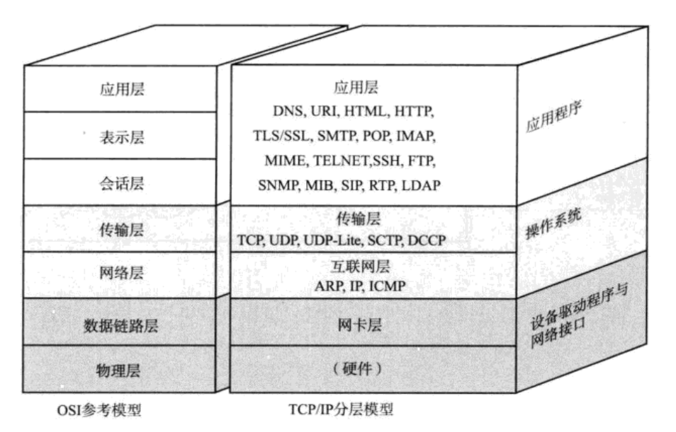
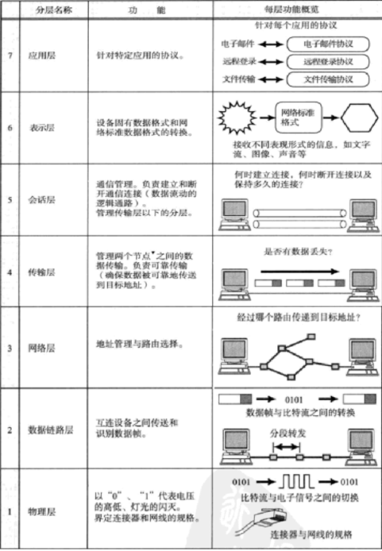
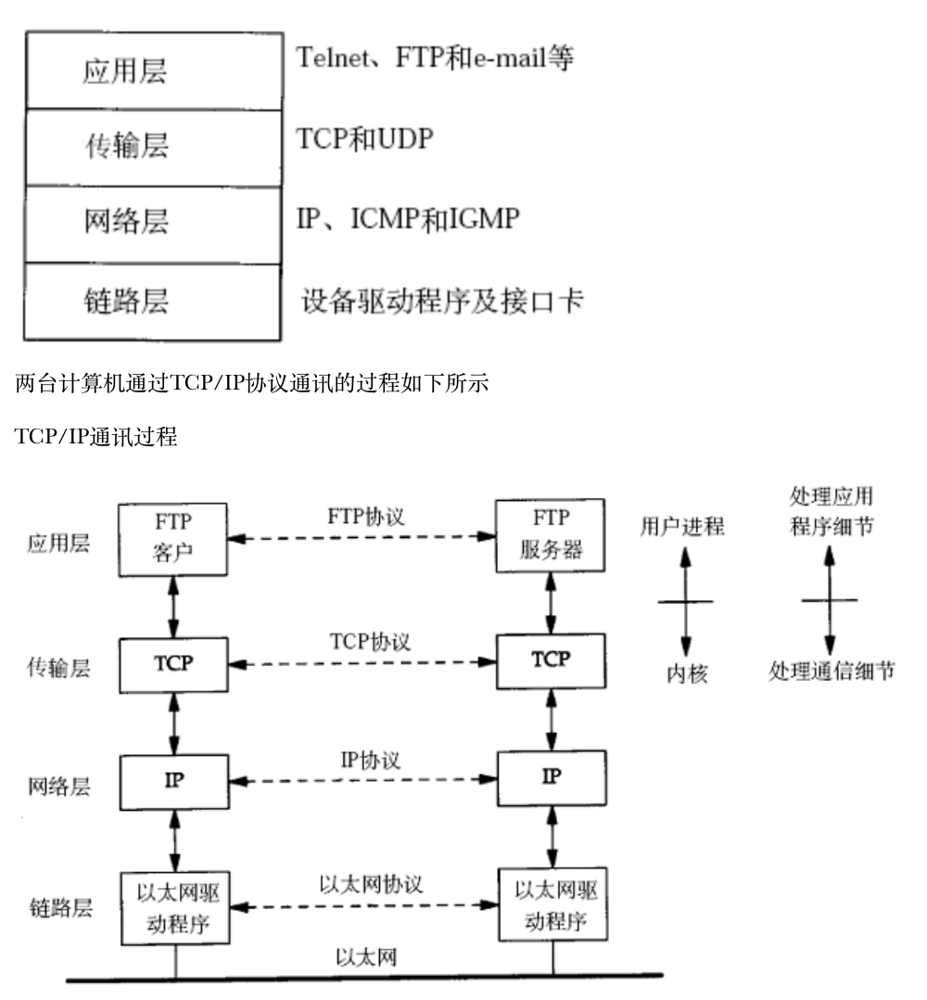
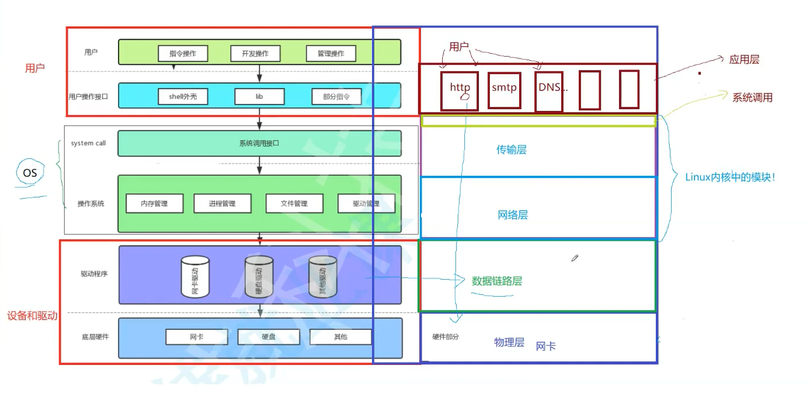
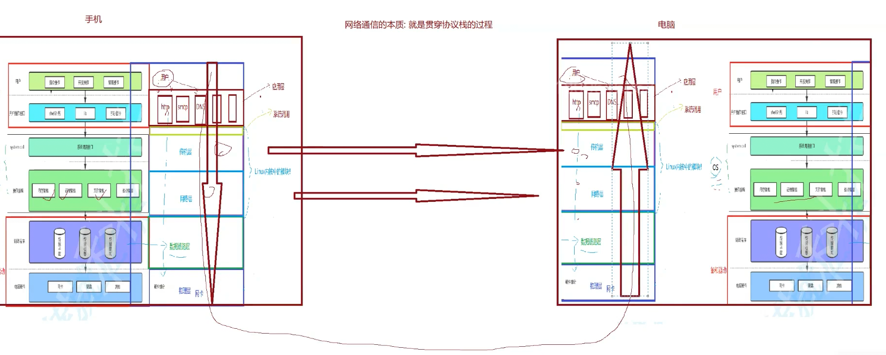
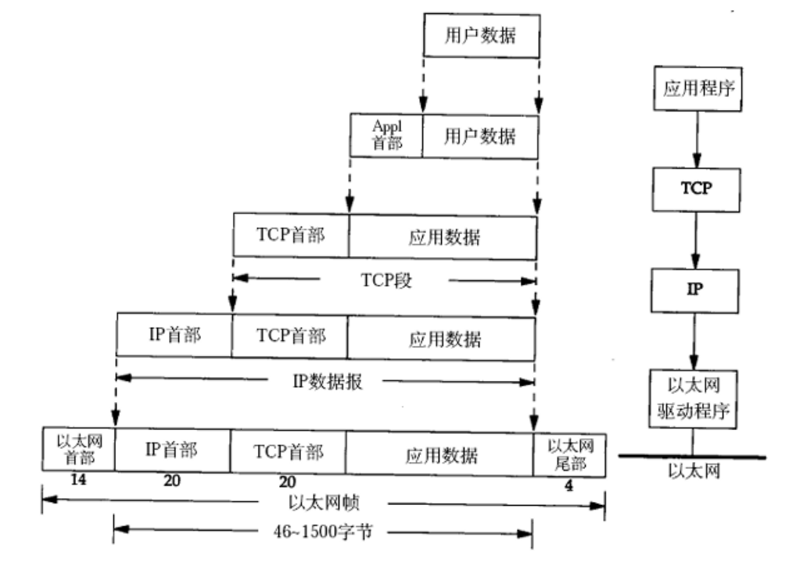
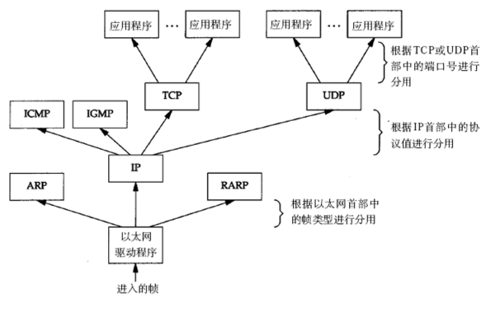
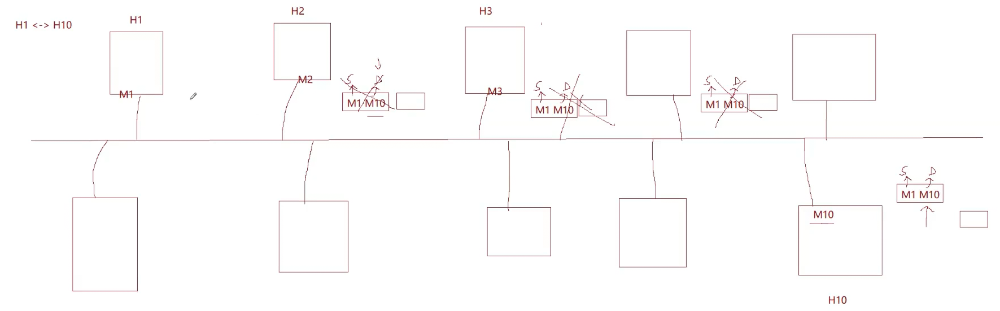
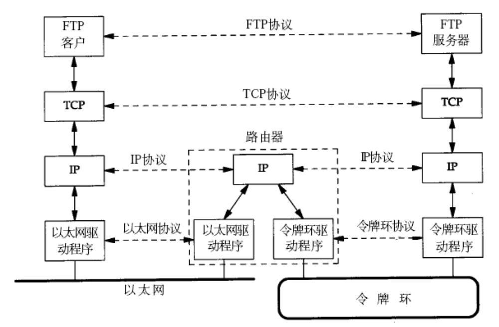
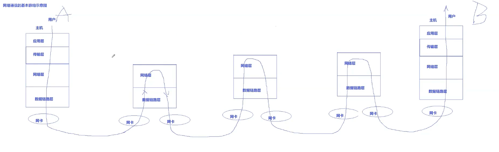

# 基础的网络知识

## 一、网络分层模型

网络分层模型将复杂的网络通信分解为多个层次，每层负责特定功能。主要关注三种模型：**OSI七层模型**、**TCP/IP四层模型**和**五层模型**。



### OSI七层模型

OSI（Open Systems Interconnection）七层模型是由国际标准化组织（ISO）提出的理论模型，它将网络通信分为七个层次，从上到下依次为应用层、表示层、会话层、传输层、网络层、数据链路层和物理层。这个模型虽然在实际应用中并不完全采用，但它为理解网络通信提供了完整的理论框架。

**各层功能详解：**



| 层次 | 核心功能 | 典型协议 |
|------|---------|---------|
| **应用层** | 为应用程序提供网络服务接口 | HTTP、FTP、SMTP |
| **表示层** | 数据格式转换、加密、压缩 | - |
| **会话层** | 建立、管理、终止会话 | - |
| **传输层** | 端到端数据传输、可靠性保证 | **TCP**、**UDP** |
| **网络层** | 路由选择、跨网络数据传输 | **IP** |
| **数据链路层** | 相邻节点可靠传输、帧同步 | 以太网 |
| **物理层** | 物理媒介上传输原始比特流 | - |

**各层协议详细工作机制：**

- **应用层协议（HTTP）**：
  - 请求/响应模式：客户端发送请求（方法+URI+头部+体），服务器返回响应（状态码+头部+体）
  - 无状态协议：每次请求独立，通过Cookie/Session维护状态
  - 扩展方向：HTTPS加密机制、HTTP/2多路复用、HTTP/3 QUIC协议

- **传输层协议（TCP）**：
  - 三次握手建立连接：SYN → SYN-ACK → ACK
  - 四次挥手断开连接：FIN → ACK → FIN → ACK
  - 可靠传输机制：序号、确认号、重传、流量控制（滑动窗口）、拥塞控制
  - 扩展方向：TCP状态机、拥塞控制算法（慢启动、拥塞避免）、TCP优化参数

- **传输层协议（UDP）**：
  - 无连接：直接发送数据，无需建立连接
  - 不可靠：不保证数据到达，不保证顺序
  - 低开销：头部仅8字节，适合实时应用
  - 扩展方向：UDP应用场景、UDP可靠性实现（应用层保证）

- **网络层协议（IP）**：
  - 数据包路由：根据目标IP地址查找路由表，选择下一跳
  - 分片与重组：MTU限制时进行分片，接收端重组
  - 扩展方向：路由算法（RIP、OSPF、BGP）、IP分片机制、IPv6协议

- **数据链路层协议（以太网）**：
  - 帧格式：前导码+目标MAC+源MAC+类型+数据+CRC
  - CSMA/CD：载波监听多路访问/冲突检测（已淘汰，现代使用交换机）
  - 扩展方向：交换机工作原理、VLAN、STP生成树协议

- **物理层**：
  - 信号编码：将比特转换为电信号/光信号
  - 传输介质：双绞线、光纤、无线
  - 扩展方向：编码方式（曼彻斯特编码等）、传输速率、误码率

---

### TCP/IP四层模型

| 层次 | 对应OSI层 | 核心协议 | 主要功能 |
|------|----------|---------|---------|
| **应用层** | 会话层+表示层+应用层 | HTTP/HTTPS、FTP、DNS、WebSocket、gRPC | 应用程序网络服务 |
| **传输层** | 传输层 | **TCP**（可靠）、**UDP**（快速） | 端到端数据传输 |
| **网络层** | 网络层 | **IP**、ICMP | 路由转发 |
| **网络接口层** | 物理层+数据链路层 | 以太网、ARP | 物理网络传输 |


TCP/IP四层模型是实际网络开发中广泛使用的模型，它将OSI七层模型进行了简化和合并，更加贴近实际的网络实现。这个模型从上到下包括应用层、传输层、网络层和网络接口层，是互联网协议栈的基础架构。

**各层功能与协议：**



- **应用层（Application Layer）**：对应OSI模型的会话层、表示层和应用层，为应用程序提供网络服务。常见的应用层协议包括HTTP/HTTPS（Web服务）、FTP（文件传输）、SMTP/POP3/IMAP（邮件服务）、DNS（域名解析）、WebSocket（实时通信）和gRPC（远程过程调用）等。应用层是用户与网络交互的直接接口，定义了各种网络应用的标准。

- **传输层（Transport Layer）**：对应OSI模型的传输层，提供端到端的数据传输服务。TCP协议提供面向连接的、可靠的数据传输服务，适用于需要可靠传输的应用场景；UDP协议提供无连接的、不可靠的数据传输服务，适用于对实时性要求高、可以容忍少量数据丢失的场景。传输层确保数据能够在不同主机上的应用程序之间正确传输。

- **网络层（Internet Layer）**：对应OSI模型的网络层，核心协议是IP协议。主要功能是实现数据包的路由和转发，确保数据包能够从源主机到达目标主机。此外，ICMP（Internet控制消息协议）也工作在这一层，用于网络诊断和错误报告。网络层实现跨网络的数据包路由，是互联网互联互通的基础。

- **网络接口层（Network Interface Layer）**：对应OSI模型的物理层和数据链路层，负责在物理网络上传输数据帧。这一层包括以太网协议、ARP（地址解析协议）等，处理硬件地址（MAC地址）和物理传输。网络接口层直接与物理网络介质交互，实现数据在物理网络上的实际传输。

**各层核心问题：**
- **应用层**：如何处理发来的数据？
- **传输层**：长距离传输的数据丢失的问题？
- **网络层**：如何定位的主机的问题？
- **网络接口层**：你怎么保证你的数据能准确的到达下一个设备？

### 操作系统与网络协议



## 二、网络通信的基本流程：

用户a，发送信息给，用户b，本质就是将信息包装后，通过网络与定位到b的主机，然后再不断解包的过程，然后b通过相应的协议规则得到信息。



局域网可以直接交换信息，举例：家中的同WiFi的设备能进行交互，手机投屏电视；

最重要的局域网通信标准：以太网（企业），当然现在WiFi也很重要。

**为什么叫以太网呢？** 计算机界调侃物理界，物理界假说有一种叫以太的介质，支持光在宇宙真空中传播，结果没找到。

### 1.封装的过程


每层都要添加：报头+有效载荷
报头：就是各层协议的基本格式
有效载荷：就是除开本层报头的数据

### 2.解包的过程（分用）


## ！！！这两句话伴随网络协议学习全部过程！！！
### 1. 几乎任何层协议都要提供将报头和有效载荷分离的能力；
### 2. 几乎任何层协议都要在报头中提供，决定将自己的有效载荷交给上层的哪个协议的能力；


---


## 三、网络地址体系

网络通信的本质就是：开始局域网内能够链接通信，然后以局域网为单位，构成广域网中的一个点，实现广域网主机的通信。

数据链路层和网络层：处理通信细节
传输层和应用层：处理应用细节

### 1.IP地址

**作用**：网络层标识主机的逻辑地址，用于跨网络路由和定位

**IPv4地址格式：**
- 32位二进制数，通常用点分十进制表示（如192.168.1.1）
- 由网络号和主机号两部分组成
- 通过子网掩码或CIDR表示法区分网络部分和主机部分

**地址分类：**
| 类别 | 地址范围 | 网络号位数 | 用途 |
|------|---------|-----------|------|
| A类 | 1.0.0.0 ~ 126.255.255.255 | 8位 | 大型网络 |
| B类 | 128.0.0.0 ~ 191.255.255.255 | 16位 | 中型网络 |
| C类 | 192.0.0.0 ~ 223.255.255.255 | 24位 | 小型网络 |
| D类 | 224.0.0.0 ~ 239.255.255.255 | - | 组播 |
| E类 | 240.0.0.0 ~ 255.255.255.255 | - | 保留 |

**CIDR（无类别域间路由）：**
- 格式：IP地址/前缀长度（如192.168.1.0/24）
- 前缀长度表示网络号的位数
- 更灵活的子网划分方式，替代传统分类

**私有IP地址：**
- 10.0.0.0/8（10.0.0.0 ~ 10.255.255.255）
- 172.16.0.0/12（172.16.0.0 ~ 172.31.255.255）
- 192.168.0.0/16（192.168.0.0 ~ 192.168.255.255）
- 仅在局域网内使用，通过NAT与公网通信

**特殊地址：**
- 127.0.0.1：本地回环地址（localhost）
- 0.0.0.0：表示本网络或默认路由
- 255.255.255.255：广播地址

**扩展方向：**
- IPv6地址格式与特点
- 子网划分计算方法
- NAT（网络地址转换）工作原理
- 公网IP与私有IP的映射关系

### 2.端口号

- **作用**：传输层标识应用程序的逻辑地址
- **范围**：0-65535（16位）
- **分类**：
  - 知名端口（0-1023）：系统服务（HTTP:80、HTTPS:443、SSH:22）
  - 注册端口（1024-49151）：用户应用程序
  - 动态端口（49152-65535）：客户端临时分配
- **套接字**：IP地址 + 端口号，唯一标识通信端点

**扩展方向：**
- 端口冲突处理机制
- 端口扫描与安全防护


### 3.MAC地址
###
- **作用**：数据链路层标识网络设备的物理地址
- **格式**：48位（6字节），十六进制表示（如00:1A:2B:3C:4D:5E）
- **特点**：全球唯一，由制造商分配
- **ARP协议**：将IP地址解析为MAC地址

**扩展方向：**
- ARP协议详细工作流程
- ARP缓存机制
- ARP欺骗与防护

### 4.DNS（域名系统）

- **作用**：将域名转换为IP地址
- **架构**：分布式数据库
- **解析过程**：递归查询 + 迭代查询
- **涉及服务器**：本地DNS缓存、根域名服务器、顶级域名服务器、权威域名服务器

**DNS查询的完整流程：**

**递归查询（客户端 → 本地DNS服务器）：**
1. 客户端向本地DNS服务器发送查询请求（如www.example.com）
2. 本地DNS服务器负责完成整个查询过程，返回最终结果给客户端

**迭代查询（本地DNS服务器 → 各级DNS服务器）：**
1. **查询根域名服务器**：本地DNS服务器向根域名服务器查询".com"的顶级域名服务器地址
2. **查询顶级域名服务器**：根域名服务器返回".com"的顶级域名服务器地址，本地DNS服务器向顶级域名服务器查询"example.com"的权威域名服务器地址
3. **查询权威域名服务器**：顶级域名服务器返回"example.com"的权威域名服务器地址，本地DNS服务器向权威域名服务器查询"www.example.com"的IP地址
4. **返回结果**：权威域名服务器返回IP地址，本地DNS服务器将结果返回给客户端

**完整流程示例（查询www.example.com）：**
```
客户端 → 本地DNS服务器（递归查询）
         ↓
本地DNS服务器 → 根域名服务器（查询.com的顶级域名服务器）
         ↓
本地DNS服务器 → .com顶级域名服务器（查询example.com的权威服务器）
         ↓
本地DNS服务器 → example.com权威服务器（查询www.example.com的IP）
         ↓
本地DNS服务器 → 客户端（返回IP地址）
```

**缓存机制：**
- 本地DNS服务器会缓存查询结果，减少重复查询
- TTL（Time To Live）控制缓存有效期
- 客户端操作系统也有DNS缓存

**扩展方向：**
- DNS缓存机制与TTL详细说明
- DNS记录类型（A、AAAA、CNAME、MX等）
- DNS安全（DNSSEC）


## 四、以太网通信

局域网中通信，mac地址相关

### 一个故事

就像上课，老师叫张三的名字，来回答问题。李四，王五大家都听得到，但是不会回答，只有叫张三的同学会回答。


### 一个原理



同样的，在局域网中，就像教室，他们都有各自的标识符Mac地址，当一个主机A发送消息，给局域网中的另外一个主机B时，主机A会采取广播的方式发送信息，局域网中所有主机都能收到，但因为Mac地址不同，选择丢弃，只有主机B会接受数据。这里数据<源Mac地址，目的Mac地址>，局域网设备对比目的Mac地址，看是不是给自己的。

**1. 问题：当很多人同时发送消息时，光电信息，会发生数据碰撞，所有人都无法完成消息交流。因此有一种恶意攻击，发送大量垃圾信息，与正常信息发生碰撞，碰撞域，碰撞检测。**

**答：避免碰撞算法，发生碰撞，那么所有主机都会随机等待在发送，错峰出行**

**2. 怎么知道发生碰撞：** 就像在吵闹的教室说话，自己的声音自己也听得到，但夹杂着其他声音。人多手机卡，就是发生了局域网碰撞。

**3. 交换机，减少碰撞概率**，交换机划分碰撞域，当通信的两个设备在同一侧，就不把广播信息传到另一侧；当一侧发生碰撞，也不会将碰撞信息传到另一侧。

**4. 抓包软件的原理：** 网卡的工作模式：正常模式&&混杂模式（可以系统调用设置），正常模式收到别人的信息丢掉，混杂模式，抓到后暂时不丢，交给上层。

是否有安全问题，是的，但是我们的数据是经过上层协议封装，以及一些协议算法保障的。

**5. 如何看待局域网：**，主机就是一个一个进程，而局域网可以看成一个临界资源。系统网络不分家。

## 五、IP网络传输


一个设备A要跨网络交给设备B，就需要先交给自己的路由器（本质局域网通信），路由器判断是否在同一子网，查路由表，转发。

上三层协议：应用层，传输层，网络层的协议都是完全一致的，但是数据链路层不一定，比如：以太网和令牌环的报头不同；路由器可以解包和封装。

底层协议可以多种多样，因为路由器的解包和重新封装！！！IP协议屏蔽了底层网络的差异，靠的就是工作在IP层的路由器。

IP实现了全球主机的软件虚拟层，一切皆是IP报文！

**IP地址一般不会改变，目标IP永远不变，协助我们进行路径选择；Mac地址，源地址和目的地址都会改变，出局域网之后路由器重新封装。**


**网络通信示意图：**



## 六、网络通信基本概念

### 客户端/服务器模型

**核心特点：**
- 服务器：提供服务，监听固定IP和端口
- 客户端：主动发起连接请求
- **并发处理**：多线程、多进程、I/O多路复用


**扩展方向：**
- 服务器并发模型对比
- 负载均衡策略
- 分布式架构设计

### 请求/响应模式

**特点：**
- 客户端发送请求 → 服务器返回响应
- 同步模式：等待响应后才能继续
- **典型应用**：HTTP协议

**扩展方向：**
- HTTP请求/响应格式详解
- RESTful API设计
- 状态码含义与应用

### 长连接 vs 短连接

| 类型 | 特点 | 适用场景 | 典型协议 |
|------|------|---------|---------|
| **短连接** | 每次通信建立新连接，结束后关闭 | 低频通信 | HTTP/1.0 |
| **长连接** | 保持连接打开，多次数据传输 | 频繁通信 | HTTP/1.1 Keep-Alive、WebSocket |

**扩展方向：**
- 连接池管理机制
- Keep-Alive参数配置
- WebSocket协议特点
- 连接超时与保活机制

### 同步 vs 异步通信

| 类型 | 特点 | 优缺点 |
|------|------|--------|
| **同步** | 发送后等待响应 | 简单但可能阻塞 |
| **异步** | 发送后继续执行，回调处理响应 | 高效但实现复杂 |

**扩展方向：**
- 阻塞I/O vs 非阻塞I/O
- I/O多路复用（select、poll、epoll）
- 异步编程模型（事件驱动、协程）
- Reactor与Proactor模式
