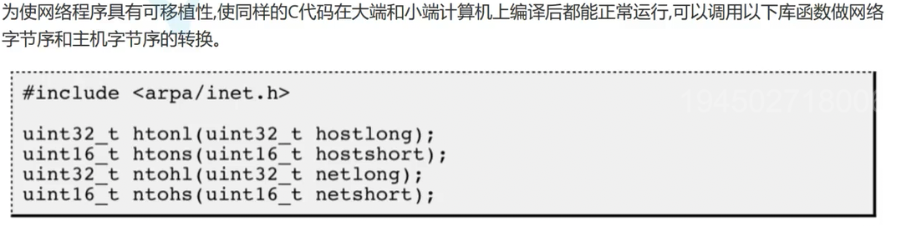
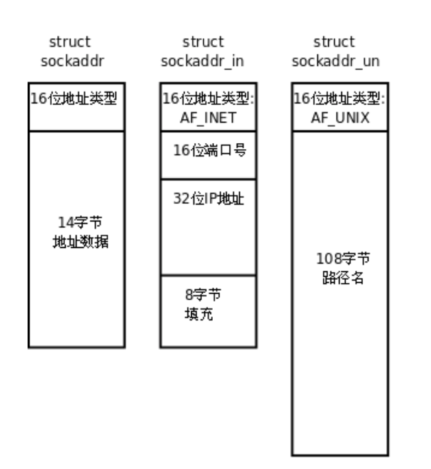
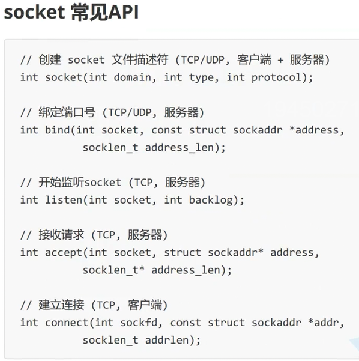

# 网络套接字

## 网络字节序

- 发送主机通常是按照发送缓冲区中的数据按内存地址从低到高的顺序发出；
- 就收主机把从网络上接收到的字节依次保存在接受缓冲区中，也是按照内存地址从低到高的顺序保存；
- 因此，网络数据流地址：先发出的数据是低地址，后发出的数据是高地址；
- TCP/IP协议规定，网络数据流采用大端字节序，即低地址高字节；



### 字节序转换函数

网络协议使用**大端字节序**（网络字节序），而主机可能是大端或小端。因此需要在主机字节序和网络字节序之间进行转换。

#### ① 端口号转换函数（16位）

```c
#include <arpa/inet.h>

// 主机字节序 → 网络字节序（Host TO Network Short）
uint16_t htons(uint16_t hostshort);

// 网络字节序 → 主机字节序（Network TO Host Short）
uint16_t ntohs(uint16_t netshort);
```

**使用示例：**
```c
// 设置端口号（必须转换为网络字节序）
struct sockaddr_in addr;
addr.sin_port = htons(8080);  // 将8080从主机字节序转为网络字节序

// 读取端口号（必须转换为主机字节序）
uint16_t port = ntohs(addr.sin_port);  // 从网络字节序转为主机字节序
printf("Port: %d\n", port);
```


### IP地址转换函数

#### ① inet_pton() - 推荐使用（现代函数）

**功能：** 将点分十进制字符串转换为网络字节序的二进制IP地址（支持IPv4和IPv6）

```c
#include <arpa/inet.h>

int inet_pton(int af, const char *src, void *dst);
```

**参数说明：**
- `af`：地址族
  - `AF_INET`：IPv4
  - `AF_INET6`：IPv6
- `src`：点分十进制字符串（如 "192.168.1.1"）
- `dst`：指向 `struct in_addr`（IPv4）或 `struct in6_addr`（IPv6）的指针

**返回值：**
- 成功返回1
- 输入无效返回0
- 失败返回-1并设置errno

**使用示例：**
```c
struct sockaddr_in addr;
addr.sin_family = AF_INET;
addr.sin_port = htons(8080);

// 将字符串IP转换为网络字节序的二进制格式
if (inet_pton(AF_INET, "192.168.1.1", &addr.sin_addr) <= 0) {
    perror("inet_pton failed");
    exit(1);
}

// 也可以使用 INADDR_ANY（监听所有网卡）
addr.sin_addr.s_addr = INADDR_ANY;  // 已经是网络字节序
```

#### ② inet_ntop() - 推荐使用（现代函数）

**功能：** 将网络字节序的二进制IP地址转换为点分十进制字符串（支持IPv4和IPv6）

```c
#include <arpa/inet.h>

const char *inet_ntop(int af, const void *src, char *dst, socklen_t size);
```

**参数说明：**
- `af`：地址族（`AF_INET` 或 `AF_INET6`）
- `src`：指向 `struct in_addr`（IPv4）或 `struct in6_addr`（IPv6）的指针
- `dst`：存储结果的字符串缓冲区
- `size`：缓冲区大小
  - IPv4：至少 `INET_ADDRSTRLEN`（16字节）
  - IPv6：至少 `INET6_ADDRSTRLEN`（46字节）

**返回值：** 成功返回 `dst`，失败返回NULL

**使用示例：**
```c
struct sockaddr_in addr;
// ... 从网络接收地址后 ...

// 将网络字节序的IP转换为字符串
char ip_str[INET_ADDRSTRLEN];
if (inet_ntop(AF_INET, &addr.sin_addr, ip_str, INET_ADDRSTRLEN) == NULL) {
    perror("inet_ntop failed");
} else {
    printf("IP address: %s\n", ip_str);
}
```

#### ③ inet_addr() - 不推荐（已废弃）

**功能：** 将点分十进制字符串转换为网络字节序的32位整数（仅IPv4）

```c
#include <arpa/inet.h>

in_addr_t inet_addr(const char *cp);
```

**问题：**
- 无法区分 "255.255.255.255"（有效IP）和错误返回值（也是-1）
- 不支持IPv6
- 线程不安全（某些实现使用静态缓冲区）

**返回值：** 成功返回网络字节序的IP地址，失败返回 `INADDR_NONE`（通常是-1）

#### ④ inet_ntoa() - 不推荐（已废弃）

**功能：** 将网络字节序的32位整数转换为点分十进制字符串（仅IPv4）

```c
#include <arpa/inet.h>

char *inet_ntoa(struct in_addr in);
```

**问题：**
- 使用静态缓冲区，**线程不安全**
- 不支持IPv6
- 多次调用会覆盖之前的结果

**使用示例（不推荐）：**
```c
// 不推荐：线程不安全
char *ip_str = inet_ntoa(addr.sin_addr);
printf("IP: %s\n", ip_str);

// 推荐：使用 inet_ntop
char ip_str[INET_ADDRSTRLEN];
inet_ntop(AF_INET, &addr.sin_addr, ip_str, INET_ADDRSTRLEN);
```

### 常用常量

```c
// 特殊IP地址（已经是网络字节序）
INADDR_ANY       // 0.0.0.0，监听所有网卡
INADDR_LOOPBACK  // 127.0.0.1，本地回环
INADDR_BROADCAST // 255.255.255.255，广播地址

```

## 套接字结构体种类

网络方面的三种编程：
1. 域间套接字：主要是用于同一台主机的通信，有点像管道；
2. 原始套接字：制作网络工具；
3. 网络套接字：网络用户间通信；


想要将网络接口统一抽象化，所以有了第一种类型`struct sockaddr`，可以多态样式（C语言写的）的接收`struct sockaddr_in`和`struct sockaddr_un`；如何实现的？不是继承，而是**结构体布局兼容性**

**核心原理：** C语言通过**结构体布局兼容性**和**类型转换**实现类似多态的效果，而不是通过继承（C语言不支持继承）。

### 1. 结构体定义

```c
// 通用地址结构体（抽象接口）
struct sockaddr {
    unsigned short sa_family;    // 地址族（16位，2字节）
    char sa_data[14];            // 地址数据（14字节）
};

// IPv4地址结构体
struct sockaddr_in {
    unsigned short sin_family;   // 地址族（必须是 AF_INET）
    unsigned short sin_port;     // 端口号（网络字节序）
    struct in_addr sin_addr;     // IP地址（网络字节序）
    char sin_zero[8];            // 填充字段，保持与sockaddr大小一致
};

// Unix域套接字地址结构体
struct sockaddr_un {
    unsigned short sun_family;   // 地址族（必须是 AF_UNIX）
    char sun_path[108];          // 路径名（固定大小数组，不是柔性数组）
};
```

### 2. 关键设计点

**① 地址族字段对齐：**
- 所有具体地址结构体的**第一个字段都是地址族**（`sin_family`、`sun_family`等）
- 这个字段与 `sockaddr` 的 `sa_family` **内存位置完全对齐**（都在结构体开头）

**② 结构体大小说明：**
- `struct sockaddr` 总大小为 16 字节（2字节地址族 + 14字节数据）
- `struct sockaddr_in` 也是 16 字节（2字节地址族 + 2字节端口 + 4字节IP + 8字节填充）
- `struct sockaddr_un` 大小为 110 字节（2字节地址族 + 108字节路径）
- **注意**：`sockaddr_un` 比 `sockaddr` 大，但这不影响类型转换的安全性
- **关键**：所有结构体的第一个字段（地址族）都在相同的内存偏移位置（0偏移）
- **安全保证**：函数通过 `socklen_t` 长度参数知道实际结构体的大小，不会越界访问

**③ 类型转换机制（关键理解）：**

**重要：这是指针类型的转换，不是结构体本身的转换！**

```c
// IPv4 地址示例
struct sockaddr_in addr_in;  // 实际内存中存储的是 sockaddr_in 结构体
addr_in.sin_family = AF_INET;
addr_in.sin_port = htons(8080);
inet_pton(AF_INET, "127.0.0.1", &addr_in.sin_addr);

// 关键：&addr_in 是 struct sockaddr_in* 类型的指针
// (struct sockaddr*)&addr_in 将指针类型转换为 struct sockaddr*
// 注意：内存中的结构体数据本身没有任何改变！
bind(sockfd, (struct sockaddr*)&addr_in, sizeof(addr_in));
//                                    ↑              ↑
//                              强制类型转换    实际结构体大小

// Unix域套接字示例（虽然更大，但同样安全）
struct sockaddr_un addr_un;
addr_un.sun_family = AF_UNIX;
strncpy(addr_un.sun_path, "/tmp/my_socket", sizeof(addr_un.sun_path) - 1);

// 同样转换为通用类型，sizeof会返回110字节
bind(sockfd, (struct sockaddr*)&addr_un, sizeof(addr_un));
//                                    ↑              ↑
//                              类型转换安全     函数知道实际大小
```

**为什么大小不同仍然安全？**
- 函数签名：`bind(int sockfd, const struct sockaddr *addr, socklen_t addrlen)`
- `addrlen` 参数告诉函数实际结构体的大小，函数只会访问 `addrlen` 字节的数据
- 只要第一个字段（地址族）对齐，就能安全地读取 `sa_family` 来判断类型

### 3. 运行时类型识别

函数内部通过检查 `sa_family` 字段来判断实际类型：

```c
void handle_address(struct sockaddr* addr) {
    switch(addr->sa_family) {  // 通过地址族判断类型
        case AF_INET: {
            struct sockaddr_in* addr_in = (struct sockaddr_in*)addr;
            // 处理IPv4地址
            printf("IPv4: %s:%d\n", 
                   inet_ntoa(addr_in->sin_addr), 
                   ntohs(addr_in->sin_port));
            break;
        }
        case AF_UNIX: {
            struct sockaddr_un* addr_un = (struct sockaddr_un*)addr;
            // 处理Unix域套接字
            printf("Unix: %s\n", addr_un->sun_path);
            break;
        }
        // ... 其他地址类型
    }
}
```


## 套接字API接口



### 1. 基本套接字API

#### ① socket() - 创建套接字

```c
#include <sys/socket.h>

int socket(int domain, int type, int protocol);
```

**参数说明：**
- `domain`：协议族
  - `AF_INET`：IPv4协议
  - `AF_INET6`：IPv6协议
- `type`：套接字类型
  - `SOCK_STREAM`：TCP流式套接字（可靠、面向连接）
  - `SOCK_DGRAM`：UDP数据报套接字（不可靠、无连接）
  - `SOCK_RAW`：原始套接字（直接访问IP层）
- `protocol`：协议类型，通常设为0（自动选择）

**返回值：** 成功返回文件描述符，失败返回-1并设置errno

#### ② bind() - 绑定地址

```c
int bind(int sockfd, const struct sockaddr *addr, socklen_t addrlen);
```

**功能：** 将套接字绑定到指定的IP地址和端口

**示例：**
```c
struct sockaddr_in server_addr;
memset(&server_addr, 0, sizeof(server_addr));
server_addr.sin_family = AF_INET;
server_addr.sin_port = htons(8080);              // 端口号（网络字节序）
server_addr.sin_addr.s_addr = INADDR_ANY;        // 监听所有网卡

if (bind(sockfd, (struct sockaddr*)&server_addr, sizeof(server_addr)) < 0) {
    perror("bind failed");
    exit(1);
}
```

#### ③ listen() - 监听连接（仅TCP服务器）

```c
int listen(int sockfd, int backlog);
```

**参数说明：**
- `sockfd`：已绑定的套接字
- `backlog`：等待连接队列的最大长度（通常设为5-128）

**功能：** 将套接字设置为监听状态，等待客户端连接

#### ④ accept() - 接受连接（仅TCP服务器）

```c
int accept(int sockfd, struct sockaddr *addr, socklen_t *addrlen);
```

**功能：** 从监听队列中接受一个连接，返回新的套接字描述符

**返回值：** 成功返回新的套接字文件描述符，失败返回-1

**注意：** 
- 原套接字继续监听，新套接字用于与客户端通信
- `addr` 和 `addrlen` 用于获取客户端地址信息（可为NULL）

#### ⑤ connect() - 发起连接（TCP客户端）

```c
int connect(int sockfd, const struct sockaddr *addr, socklen_t addrlen);
```

**功能：** 客户端向服务器发起连接请求

#### ⑥ send() / recv() - 发送/接收数据（TCP）

```c
ssize_t send(int sockfd, const void *buf, size_t len, int flags);
ssize_t recv(int sockfd, void *buf, size_t len, int flags);
```

**参数说明：**
- `flags`：通常设为0，可选 `MSG_DONTWAIT`（非阻塞）、`MSG_NOSIGNAL`（不发送SIGPIPE）等

**返回值：** 成功返回发送/接收的字节数，失败返回-1

#### ⑦ sendto() / recvfrom() - 发送/接收数据（UDP）

```c
ssize_t sendto(int sockfd, const void *buf, size_t len, int flags,
               const struct sockaddr *dest_addr, socklen_t addrlen);
ssize_t recvfrom(int sockfd, void *buf, size_t len, int flags,
                 struct sockaddr *src_addr, socklen_t *addrlen);
```

**功能：** UDP需要每次指定目标地址

#### ⑧ close() - 关闭套接字

```c
#include <unistd.h>
int close(int fd);
```

**功能：** 关闭套接字，释放资源

### 2. UDP服务器和客户端流程

#### UDP服务器端流程：

```c
// 1. 创建套接字
int sockfd = socket(AF_INET, SOCK_DGRAM, 0);

// 2. 设置套接字选项（可选）
int opt = 1;
setsockopt(sockfd, SOL_SOCKET, SO_REUSEADDR, &opt, sizeof(opt));

// 3. 绑定地址（必须）
struct sockaddr_in server_addr;
memset(&server_addr, 0, sizeof(server_addr));
server_addr.sin_family = AF_INET;
server_addr.sin_port = htons(8080);
server_addr.sin_addr.s_addr = INADDR_ANY;  // 监听所有网卡
bind(sockfd, (struct sockaddr*)&server_addr, sizeof(server_addr));

// 4. 接收和发送数据（循环）
while (1) {
    struct sockaddr_in client_addr;
    socklen_t client_len = sizeof(client_addr);
    char buffer[1024];
    
    // 接收数据（阻塞等待，获取客户端地址）
    ssize_t n = recvfrom(sockfd, buffer, sizeof(buffer)-1, 0,
                         (struct sockaddr*)&client_addr, &client_len);
    if (n > 0) {
        buffer[n] = '\0';
        
        // 处理数据...
        printf("Received from client: %s\n", buffer);
        
        // 发送数据回客户端（使用接收到的客户端地址）
        sendto(sockfd, buffer, n, 0,
               (struct sockaddr*)&client_addr, client_len);
    }
}

// 5. 关闭套接字
close(sockfd);
```

#### UDP客户端流程：

```c
// 1. 创建套接字
int sockfd = socket(AF_INET, SOCK_DGRAM, 0);

// 2. 设置服务器地址
struct sockaddr_in server_addr;
memset(&server_addr, 0, sizeof(server_addr));
server_addr.sin_family = AF_INET;
server_addr.sin_port = htons(8080);
inet_pton(AF_INET, "127.0.0.1", &server_addr.sin_addr);

// 3. 发送数据（每次发送都需要指定服务器地址）
char msg[] = "Hello Server";
sendto(sockfd, msg, strlen(msg), 0,
       (struct sockaddr*)&server_addr, sizeof(server_addr));

// 4. 接收数据
char buffer[1024];
ssize_t n = recvfrom(sockfd, buffer, sizeof(buffer)-1, 0, NULL, NULL);
if (n > 0) {
    buffer[n] = '\0';
    printf("Received from server: %s\n", buffer);
}

// 5. 关闭套接字
close(sockfd);
```

**UDP 关键点：**
- UDP 是无连接的，不需要 `listen()`、`accept()`、`connect()`
- 服务端必须 `bind()` 绑定端口，客户端通常不绑定（系统自动分配）
- 每次 `sendto()` 都需要指定目标地址
- `recvfrom()` 可以获取发送方的地址信息

### 3. TCP服务器和客户端流程

#### TCP服务器端流程：

```c
// 1. 创建套接字
int listen_fd = socket(AF_INET, SOCK_STREAM, 0);

// 2. 设置套接字选项（可选，见下文）
int opt = 1;
setsockopt(listen_fd, SOL_SOCKET, SO_REUSEADDR, &opt, sizeof(opt));

// 3. 绑定地址
struct sockaddr_in server_addr;
server_addr.sin_family = AF_INET;
server_addr.sin_port = htons(8080);
server_addr.sin_addr.s_addr = INADDR_ANY;
bind(listen_fd, (struct sockaddr*)&server_addr, sizeof(server_addr));

// 4. 监听
listen(listen_fd, 128);

// 5. 接受连接（循环）
while (1) {
    struct sockaddr_in client_addr;
    socklen_t client_len = sizeof(client_addr);
    int client_fd = accept(listen_fd, (struct sockaddr*)&client_addr, &client_len);
    
    // 6. 处理客户端请求（多线程/多进程/IO多路复用）
    // recv() / send() 与客户端通信
    
    // 7. 关闭客户端连接
    close(client_fd);
}

// 8. 关闭监听套接字
close(listen_fd);
```

#### TCP客户端流程：

```c
// 1. 创建套接字
int sockfd = socket(AF_INET, SOCK_STREAM, 0);

// 2. 连接服务器
struct sockaddr_in server_addr;
server_addr.sin_family = AF_INET;
server_addr.sin_port = htons(8080);
inet_pton(AF_INET, "127.0.0.1", &server_addr.sin_addr);
connect(sockfd, (struct sockaddr*)&server_addr, sizeof(server_addr));

// 3. 发送/接收数据
send(sockfd, "Hello", 5, 0);
char buf[1024];
recv(sockfd, buf, sizeof(buf), 0);

// 4. 关闭连接
close(sockfd);
```

### 4. 套接字选项设置

#### setsockopt() / getsockopt()

```c
int setsockopt(int sockfd, int level, int optname, 
               const void *optval, socklen_t optlen);
int getsockopt(int sockfd, int level, int optname, 
               void *optval, socklen_t *optlen);
```

**参数说明：**
- `level`：选项级别
  - `SOL_SOCKET`：套接字级别选项
  - `IPPROTO_TCP`：TCP协议级别选项
  - `IPPROTO_IP`：IP协议级别选项
- `optname`：选项名称
- `optval`：选项值指针
- `optlen`：选项值长度

### 5. 常用套接字选项详解

#### ① SO_REUSEADDR - 地址复用

**作用：** 允许重用处于TIME_WAIT状态的地址

**问题场景：** 服务器重启时，之前的连接可能处于TIME_WAIT状态（2MSL时间），导致 `bind()` 失败：`Address already in use`

**解决方案：**
```c
int opt = 1;
setsockopt(sockfd, SOL_SOCKET, SO_REUSEADDR, &opt, sizeof(opt));
```

**原理：** TIME_WAIT状态是为了确保最后一个ACK能够到达，SO_REUSEADDR允许新套接字绑定到仍处于TIME_WAIT状态的地址

#### ② SO_REUSEPORT - 端口复用（Linux 3.9+）

**作用：** 允许多个套接字绑定到同一个端口，实现负载均衡

**使用场景：** 多进程/多线程服务器，每个进程监听同一端口

```c
int opt = 1;
setsockopt(sockfd, SOL_SOCKET, SO_REUSEPORT, &opt, sizeof(opt));
```

**优势：**
- 内核自动分配连接给不同的监听套接字
- 提高并发性能，减少锁竞争
- 支持热升级（新进程启动后再关闭旧进程）

#### ③ SO_KEEPALIVE - TCP保活机制

**作用：** 检测连接是否仍然有效

**原理：** 定期发送探测包，如果对方无响应，则认为连接已断开

```c
int opt = 1;
setsockopt(sockfd, SOL_SOCKET, SO_KEEPALIVE, &opt, sizeof(opt));

// 可进一步设置TCP级别的保活参数
int keepalive_time = 7200;      // 2小时后开始探测
int keepalive_intvl = 75;        // 探测间隔75秒
int keepalive_probes = 9;        // 最多探测9次

setsockopt(sockfd, IPPROTO_TCP, TCP_KEEPIDLE, &keepalive_time, sizeof(keepalive_time));
setsockopt(sockfd, IPPROTO_TCP, TCP_KEEPINTVL, &keepalive_intvl, sizeof(keepalive_intvl));
setsockopt(sockfd, IPPROTO_TCP, TCP_KEEPCNT, &keepalive_probes, sizeof(keepalive_probes));
```

#### ④ TCP_NODELAY - 禁用Nagle算法

**作用：** 禁用Nagle算法，立即发送小数据包

**Nagle算法问题：** 
- 为了减少网络中的小包数量，Nagle算法会合并小数据包
- 可能导致延迟增加，影响实时性

**使用场景：** 需要低延迟的应用（游戏、实时通信）

```c
int opt = 1;
setsockopt(sockfd, IPPROTO_TCP, TCP_NODELAY, &opt, sizeof(opt));
```

#### ⑤ SO_RCVBUF / SO_SNDBUF - 接收/发送缓冲区大小

**作用：** 设置套接字接收和发送缓冲区的大小

```c
int recv_buf = 1024 * 1024;  // 1MB
int send_buf = 1024 * 1024;  // 1MB

setsockopt(sockfd, SOL_SOCKET, SO_RCVBUF, &recv_buf, sizeof(recv_buf));
setsockopt(sockfd, SOL_SOCKET, SO_SNDBUF, &send_buf, sizeof(send_buf));
```

**注意：** 内核可能会将缓冲区大小调整为系统允许的最大值或最小值

#### ⑥ SO_LINGER - 延迟关闭

**作用：** 控制 `close()` 的行为

```c
struct linger {
    int l_onoff;   // 0=关闭，非0=开启
    int l_linger;  // 延迟时间（秒）
};

struct linger linger_opt;
linger_opt.l_onoff = 1;
linger_opt.l_linger = 10;  // 延迟10秒关闭
setsockopt(sockfd, SOL_SOCKET, SO_LINGER, &linger_opt, sizeof(linger_opt));
```

**行为：**
- `l_onoff = 0`：`close()` 立即返回，系统尝试发送缓冲区中的数据
- `l_onoff != 0, l_linger = 0`：`close()` 立即返回，丢弃未发送数据
- `l_onoff != 0, l_linger > 0`：`close()` 阻塞直到数据发送完成或超时

#### ⑦ SO_ERROR - 获取套接字错误状态

**作用：** 获取套接字的错误状态（异步错误）

```c
int error = 0;
socklen_t len = sizeof(error);
getsockopt(sockfd, SOL_SOCKET, SO_ERROR, &error, &len);
if (error != 0) {
    printf("Socket error: %s\n", strerror(error));
}
```

### 6. 常用选项总结表

| 选项 | 级别 | 类型 | 主要用途 |
|------|------|------|---------|
| **SO_REUSEADDR** | SOL_SOCKET | int | 解决TIME_WAIT问题，允许地址复用 |
| **SO_REUSEPORT** | SOL_SOCKET | int | 多进程监听同一端口，负载均衡 |
| **SO_KEEPALIVE** | SOL_SOCKET | int | TCP保活，检测死连接 |
| **TCP_NODELAY** | IPPROTO_TCP | int | 禁用Nagle算法，降低延迟 |
| **SO_RCVBUF** | SOL_SOCKET | int | 设置接收缓冲区大小 |
| **SO_SNDBUF** | SOL_SOCKET | int | 设置发送缓冲区大小 |
| **SO_LINGER** | SOL_SOCKET | struct linger | 控制close()行为 |
| **SO_ERROR** | SOL_SOCKET | int | 获取异步错误状态 |

