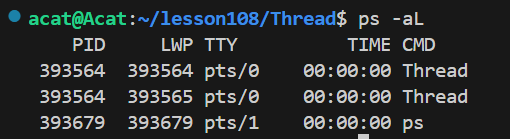
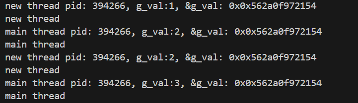
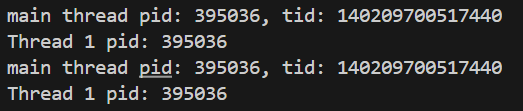
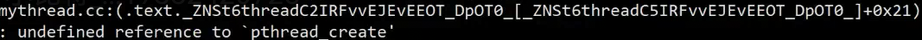
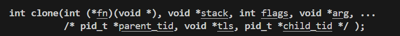
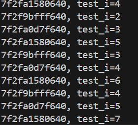

# 线程

## 线程的基本概念

### Linux下认识线程

**1. 什么是线程？**

线程：是进程的一个执行分支。线程的执行粒度，要比进程细。线程是操作系统调度的基本单位。

进程：是操作系统分配资源的基本实体。

在Linux中，线程是在进程“内部”运行的，线程在进程的地址空间中运行。

**2. Linux中，为什么线程在进程的地址空间中运行？**

因为：任何执行流，都需要资源！地址空间是进程的资源窗口（一个进程能看到的数据是通过地址空间来看的）

**3. Linux中，线程的执行粒度比进程更细？**

进程的执行资源被多个进程共享，线程在进程中执行，当然更细。

**4. 如何理解进程？**

最开始认识进程：内核数据结构（task_struct）+ 代码和数据

现在重新理解进程：
内核观点：进程是承担分配系统资源的基本实体（一大堆的内核数据结构 + 代码和数据（地址空间） + 页表 + 一部分物理内存）

操作系统以进程为单位，给我们分配资源，而线程，是进程内部的执行流资源（PCB）。

以前认识的进程，操作系统以进程为单位分配资源，只不过只有一个执行流（PCB）。本质这才是进程的特殊情况。

**5. 操作系统要不要管理线程？**

先描述再组织？是的，在教程中有专门的数据结构：TCB（thread ctrl block）

Windows中就是这样做的，但想一下，操作系统要管理多进程，然后每个进程下还要管理每个进程的多线程执行流。太复杂了。进程EPROCESS 和 线程ETHREAD 分别管理（线程中很多数据结构和进程相同，维护成本，健壮性不强，为什么不能一跑，跑几年）

Linux中，尊重先描述，再组织。但是没规定必须用新的数据结构和方式来描述管理。我们可以直接使用进程的组织框架，进程的task_struct也是有自己的上下文，调度切换，优先级，被调度。线程也是这样，只不过执行粒度更细而已，所以直接复用进程的结构组织模式（task_struct）

这里也可以看到，Linux管理进程的数据结构是（task_struct），应该叫做执行流管理模块，包含了进程和线程。

**操作系统被叫做计算机世界的哲学，是一本设计操作系统的指南，至于具体怎么去做，他不管，但概念根据操作系统来**

**6. CPU能不能知道执行的是进程还是线程？需要关心吗？**

CPU只有调度执行流的概念，不需要关心，只需要给我调度执行流就行了，只要能让我找到代码和数据执行的就行了。

站在它的角度调度大小：
操作系统：执行流<=进程 在Linux内核中：线程<=执行流<=进程
因此，在Linux中的执行流，叫做轻量级进程（可以说没有进程，没有线程，统一是执行流），但要分开来讲，也同样能解释。

**7. 小故事加深理解**

我们把进程看做一个家庭，家庭有爷爷，奶奶，爸爸，妈妈，我，妹妹。爷爷奶奶每天听戏曲《穆桂英挂帅》，喜欢京剧；爸爸妈妈每天外出上班挣钱养家；而我和妹妹每天就是学习；我们都在利用家庭的资源，完成着自己的事，任务。这些任务依赖于家庭的资源，共同目的就是把家里的日子过好。

这也就是多线程的理解，利用进程分配到的资源，执行各种细小的工作任务，最后目的是完成一项任务。

### 重谈地址空间（第4讲）

**1. 当操作系统进行进程/线程切换（上下文切换）时，CPU 需要保存和恢复哪些关键寄存器？其中 CR3 寄存器扮演什么角色？**

通用寄存器

CPU内部的CR3寄存器，直接指向页目录。CR2引起缺页中断的异常虚拟地址，缺页中断后需要重新申请内存啥的，CR2就是保存中断位置，以便于下次访问。

**2. 物理内存**
物理内存，被分为4kb的大小内存块的，叫做页框/页帧（实际RAM中的存储块Page Frame）。`4kb = 2 * 2 ^ 10`


**3. 虚拟地址是如何转换到物理地址的？ 32位计算为例**

32位虚拟地址：`32 = 10 + 10 + 12`

页表不是一整块的，但如果我们假设页表是一整块：虚拟地址+物理地址+权限位 假设按10字节来计算。虚拟地址大小为4GB，就按2^32来算，一个页表都很大了。所以页表不可能是这样。

页表：`32 = 10 + 10 + 12`
- 一级页表（页目录）：10位二进制数，表示十进制0~1023，来充当下标，二进制表示二级页表的地址；
- 二级页表（页表项）：10位二进制数，表示十进制0~1023，来充当下标，二进制表示页框的起始地址；
- 物理内存：12位二进制数，存放的你要访问物理地址的偏移量，也就是说：上面页框的起始地址 + 虚拟地址的最后12位 = 物理内存的地址； 

CPU读取到的虚拟地址，拆分为10+10+12，通过页目录-->二级页表-->物理内存地址。

假设一个页表是4kb那页表整体也就是4MB（更少），并且二级页表大多数情况下是不全的。页表创建是一个很重的工作。

**4. 如果我们只是拿到页框的起始地址加偏移量，那我们在处理大于4kb的类型的时候，会超出的呀，怎么处理？**

所以我们说，类型的概念，C/C++中，任何一个变量取地址只有一个地址，是这个类型的起始地址。他要根据起始地址+偏移量读取内存块。

计算机如何知道我要读取的是多少字节的类型？内置类型的本质都会被转化为偏移量，类型都是给CPU去看的，CPU读取你的数据类型是，他本是知道应该读取多大内存，CPU是硬件，直接跟物理内存相连，直接识别拷贝就行了。

**起始地址 + 类型 = 起始地址 + 偏移量**

**5. 回到线程问题**
**线程分配资源，本质就是分配地址空间范围；而代码有地址吗?有地址，每个函数都有独立的地址，也就是天然的划分，交给线程**

### 线程与进程切换


**1. 线程比进程更轻量化，为什么？**

整个生命周期都轻量化：
a. 创建和释放更加轻量化（生死）
b. 切换更加轻量化（运行）

CPU硬件级别的缓存Cache，Cache，存储CPU调度过程中高度被访问的数据，叫做热数据。也是线程命中率比较大的原因。

**CPU调度的时候，一个进程中的多个线程，上下文虽然在变化，但是Cache中的数据不变或者少量更新，因为很多进程数据都是线程共享的。线程切换的时候只需要数据切换，不需要Cache保存。但是如果是整个进程切换，热的Cache缓存需要直接丢弃，重新缓存Cache数据，又冷变热。所以说线程切换效率更高。Cache配置越高越大**

**2. 如何区分线程切换还是进程切换？**

主线程和新线程

### 线程的优点

- 创建一个新线程的代价比创建一个新进程的代价小的多；
- 与进程之间切换相比，线程之间切换需要操作系统做的工作要少的多；不需要保存地址空间和页表，不需要将Cache数据进行重新缓存；
- 线程占用的资源要比进程少很多；
- 计算密集型应用（CPU密集型），为了能在多处理器系统上运行，将计算分解到多个线程中实现。大部分只使用CPU资源，比如加密，解密，压缩算法。并不是越多越好，计算一般有多少CPU多少线程就好
- I/O密集型应用，为了提高性能，将I/O操作重叠。线程可以同时等待不同的I/O操作。拷贝，网络传输，网络通信

### 线程的缺点

- 性能损失，针对计算密集应用，线程间切换也是有成本的，因为每个线程都会瓜分时间片，不要创建很多线程，建议和CPU数量相近；（多进程同样）
- 健壮性降低和缺乏访问控制：大部分资源线程所共享，缺乏访问控制，一个线程运行时，可能影响另外一个线程，进而导致健壮性降低，一个线程野指针或者除零了，会影响到整个进程。本质就是进程收到信号，所有线程都要执行（进程独立）
- 多线程的编程难度更高，出风险的概率比较大，出问题很难排查。

### 线程的异常

单个线程出现除零，野指针等异常问题，会导致线程崩溃，进程也会崩溃，进程申请的资源就要被释放，多进程也就释放了。线程出异常就等同于进程出异常，收到信号，进而终止所有线程。

### 线程的用途

- 计算密集型（CPU密集型），合理使用多线程能够提升程序执行效率。
- IO密集型，多线程能明显提升用户体验，网盘能够边下载，边观看。

### 线程和进程

- 进程是资源分配的基本单位，线程是调度的基本单位；
- 线程的资源是共享进程数据，单页拥有自己的一部分数据
    - 独占资源（线程ID，**一组寄存器（独立上下文）**，**栈**，errno，信号屏蔽字，调度优先级）
- 进程和多个线程大部分都是共享的，比如地址空间，代码和数据都是共享的，定义一个函数，在各个线程中都是可以调用的
    - 共享资源（**文件描述符表**，每种信号处理方式，当前工作目录，用户id和组id）

## 代码实践体现
Linux 内核中有没有明确的线程的概念呢？没有的。只有轻量级进程的概念，不会给我们直接一共线程的系统调用，只会给我们提供轻量级进程的系统调用。但是我们程序员需要线程接口。因此就有程序员完成了**pthread库** 应用层，轻量级进程接口进行封装。为用户提供线程接口。Linux平台默认自带，编程时使用第三方pthread库。

```cpp
#include <pthread>

int pthread_create(pthread_t* thread,const pthread_attr_t *attr
                        ,void* (*start_routine)(void*),void* arg);
```
- `pthread_t` 整形封装来的，`thread`是个输出型参数，`thread id`，无符号长整数`unsigned long int`
- `const pthread_attr_t* attr` 线程的属性，大多时候不用管，设置为`nullptr`
- `void* (*start_routine)(void*)` 函数指针，返回值和参数都是`void*`的函数指针，指定线程的函数接口（入口函数），参数和返回值的问题
- `void* arg`，线程创建成功后，新线程回调入口函数时，需要参数，这个参数就是给回调函数传递参数的
- 返回值，成功0，非零表示错误，没有errno

**注意：在使用`gcc/g++`编译时，要使用 `-pthread`,才能编译通过（链接成功）即：`g++ -o $@ $^ -pthread`**

提问：为什么只需要`-l`就可以链接成功?
回答：因为`pthread库`是系统自带的。

--- 
```cpp
#include<iostream>
#include<pthread.h>
#include<unistd.h>

void* threadRoutine(void* arg)
{
    while(1)
    {
        std::cout<<"new thread,pid:"<<getpid()<<std::endl;
        sleep(2);
    }
    
    return nullptr;
}

int main()
{
    pthread_t tid;
    pthread_create(&tid,nullptr,threadRoutine,nullptr);
    while(1)
    {
        std::cout<<"main thread,pid:"<<getpid()<<std::endl;
        sleep(1);
    }

    return 0;
}
```

通过指令`ps -aL`可以查询线程（轻量级进程LWP），如图：



可以发现PID是完全相同的，LWP则不相同，其中PID和LWP相同的那个是主线程

那使用信号`killed -9 LWP`，杀死的是进程还是线程？是进程，线程出现异常，进程也会退出

```cpp
#include<iostream>
#include<pthread.h>
#include<unistd.h>
#include<string.h>

int g_val = 0;
void show(const std::string& name)
{
    std::cout<<name<<std::endl;
}

void* threadRoutine(void* arg)
{
    while(1)
    {
        printf("new thread pid: %d,g_val:%d,&g_val: 0x%p\n",getpid(),g_val,&g_val);
        show("new thread");
        sleep(1);
    }
    
    return nullptr;
}

int main()
{
    pthread_t tid;
    pthread_create(&tid,nullptr,threadRoutine,nullptr);
    while(1)
    {
        printf("main thread pid: %d,g_val:%d,&g_val: 0x%p\n",getpid(),g_val,&g_val);
        show("main thread");
        sleep(1);
        g_val++;
    }

    return 0;
}
```



可以的出结论：函数是重入的，全局变量也是共享的，都可以访问，也就是说明线程间通信是很简单的。并发性更加先进。
重入：同一个函数被不同的执行流调用，当前一个·流程还没有结束，就有其他执行流再次进入，我们称之为重入。

```cpp
#include<iostream>
#include<pthread.h>
#include<unistd.h>
#include<string.h>

int g_val = 0;
void show(const std::string& name)
{
    std::cout<<name<<std::endl;
}

void* threadRoutine(void* arg)
{
    char* name = (char*)arg;
    while(1)
    {
        printf("%s pid: %d\n",name,getpid());
        sleep(1);
    }
    
    return nullptr;
}

int main()
{
    pthread_t tid;
    pthread_create(&tid,nullptr,threadRoutine,(void*)"Thread 1");
    while(1)
    {
        printf("main thread pid: %d, tid: %lu\n",getpid(),tid);
        sleep(1);
    }

    return 0;
}
```

在`arg`中传入参数，`threadRoutine`接受到参数，如图：



如果我们想拿到自己的线程id怎么拿到? `pthread_self()`
```cpp
pthread_t pthread_selt(void);
```

### 线程的等待

主线程创建了新线程，也就有管理的义务，所以应该是最后退出。所以新线程创建出来了，也需要被等待。
1. 防止新线程内存泄漏
2. 接受任务结束信息（是否完成，是否有错）

```cpp
int pthread_join(pthread_t thread, void **retval);
```

这个函数默认阻塞等待。主线程要做两件事，确认新线程结束以及获取返回信息。等待可以确定新线程结束，而`retval`可以得到新线程结束的返回信息。返回值是0表示成功执行，返回值22，表示线程分离（一种可能），失败码，可以用strerror(返回值);来查询错误信息。

### 线程退出的方式
1. `return (void*)1;` return返回退出新线程
2. `pthread_exit((void*)1);` 函数退出返回
3. `pthread_cancel(pthread_t tid)` 主线程调用函数取消新线程，不常用

主线程调用pthread_exit(),其他线程不会退出。

**注意：exit()，是专门推出进程的，不能用于退出线程**

### 线程的参数和返回值

**重点，新线程的参数和返回值，可以是任何类对象！！！**

如下代码：

```cpp
struct request
{
    int num1_;
    int num2_;
    char oper_;

    request(int num1,int num2,char oper)
    :num1_(num1),num2_(num2),oper_(oper)
    {}
};

struct response
{   
    int result_;
    std::string retval_="0";

    response* resRun(request* rep)
    {
        switch (rep->oper_)
        {
        case '+':
            result_=rep->num1_+rep->num2_;
            break;
        case '-':
            result_=rep->num1_-rep->num2_;
            break;
        case '*':
            result_=rep->num1_*rep->num2_;
            break;
        case '/':
            if(rep->num2_==0) 
            {
                retval_="除零错误";
                return this;
            }
            result_=rep->num1_/rep->num2_;
            break;
        default:
            break;
        }

        return this;
    }
};

void* threadRoutine(void* arg)
{
    //强转接受
    request* rep = static_cast<request*>(arg);
    //逻辑处理
    response* rsp = new response();
    rsp->resRun(rep);
    //新线程退出
    pthread_exit(rsp);
}
int main()
{
    pthread_t tid;
    request* rep = new request(1,0,'/');
    pthread_create(&tid,nullptr,threadRoutine,rep);
    //数据等待，接受数据
    void* ret;
    pthread_join(tid,&ret);
    response* rsp=static_cast<response*>(ret);
    std::cout<<rsp->result_<<" "<<rsp->retval_<<std::endl;
    return 0;
}
```

### C++11的线程库与Linux的原生线程库

`#include<thread>` 
`#include<pthread.h>`

举例说明关系：当我们用`g++ -o $@ $^ -std=c++11`这样编译的时候，会报错：
链接错误，链接的是pthread_create()，也就是说C++11的<thread>就是对Linux的原生线程库的封装。新版本的ubuntu已经优化`g++ -o $@ $^`就可以直接跑C++11以及线程库。默认Ubuntu>=21.0，已经默认支持C++17了
所以标准的方式是`g++ -o $@ $^ -std=c++11 -lpthread`



**C++语言，具有跨平台型，因为c++11的线程库，已经封装了Linux/Windows各自的线程库。**

### tid如何理解？线程对于Linux来说是什么？
我们之前说过，线程就是轻量级进程,进程的创造是通过用户层的接口fork(),创造的子进程，而这个函数在底层实际上是调用了clone()函数，这是Linux操作系统的函数，用户无法调用。同样，我们的线程创建也是如此。



- 第一个参数是一个函数指针，也就是创建出来的执行流，就会使用这个函数方法。
- 第二个参数自定义一个栈
- 第三个参数就是需不需要和地址空间实现共享，线程是默认需要实现共享

clone我们无法直接调用，就被线程库封装了，我们就是在使用pthread_create等接口。我们调用需要提供一个回调函数，以及一个独立栈，回调函数就是执行代码，独立栈先不管。

也就是说，线程的概念，是线程库在帮我们维护，线程库动态库会加载到内存中，通过页表映射到共享区。线程库维护线程概念，也就是要维护线程的属性，操作系统维护执行流。所以线程库先描述，再组织，维护线程的集合，数组的形式来维护。也就是线程控制块TCB；对上告诉我们属性等，对下要知道这个线程对应那个执行流，由用户来维护的线程，就叫做用户级线程。TCB的每一个起始地址也就是线程的tid。tid地址在堆栈之间的区域

线程栈：每个线程都有自己的调度执行流，这个函数调度到另外的函数，都有自己的函数调度，也就需要独立的栈结构。因此除了主线程的栈是在栈中，其他的栈结构都在TCB中，由mmap()在任何可用虚拟地址分配，地址位于共享区，但是不能被相互访问。


这也就是为什么我们查到底层LWP的值和我们查到tid差距很大的原因，LWP是操作系统轻量级进程的管理，而tid是pthread管理tcb模块用的虚拟地址（动态库中）。

证明：当我们创建多个线程时，都会调用threadRoutine()函数接口，但函数内部的临时变量，都是各自独立的，这就表明，线程是有自己独立的栈结构。

```cpp
void* threadRoutine(void* args)
{
    int test_i=0;
    for(test_i=0;test_i<10;test_i++)
    {
        std::cout<<toHex(pthread_self())<<", test_i="<<test_i<<std::endl;
        sleep(1);
    }
    pthread_exit((void*)0);
}

int main()
{
    std::vector<pthread_t> tids;
    for(int i=0;i<NUM;i++)
    {
        pthread_t tid;
        tids.push_back(tid);
        pthread_create(&tids[i],nullptr,threadRoutine,nullptr);
        sleep(1);
    }
    for(int i=0;i<NUM;i++)
    {
        pthread_join(tids[i],nullptr);
    }

    return 0;
}
```


### 线程局部存储

每个线程都有独立的栈结构，而不是私有的栈结构。线程和线程之间没有秘密，栈上的数据都是可以访问的。
全局变量是每个线程都可以访问的。但如果我要一个私有的全局变量呢？
`__thread int g_val=100;` 线程的局部存储，`__thread`编译选项，每个线程都生成一份。局部存储只能用来定义内置类型，无法定义自定义类型。减少系统调用次数。

### 线程分离

- 默认情况下，新创建的线程是需要被等待资源释放的，没有释放会造成内存泄漏。如果不关心join的返回值时，等待就成了一种负担，因此我们需要一个系统调用，告诉系统，线程退出后自动释放资源。

```cpp
int pthread_detach(pthread_t tid);
```
可以使用主线程分离和新线程自己分离，可以造成同样的效果。注意保证主线程必须最后退出。主线程结束，进程资源就会被释放。
## 同步与互斥
## 互斥
### 线程的互斥问题引入

我们定义一个全局变量时，这个全局变量是共享资源，多线程并发访问时，会造成共享数据发生数据不一致问题！
对于一个多线程全局变量做++/--的时候，是否是安全的？ 不是原子的。

```cpp
int tickets=1000;

class ThreadDatas
{
public:
    ThreadDatas(int num)
    {
        tidname_="This is thread- " + std::to_string(num);
    }
public:
    std::string tidname_;
};

void* gitticket(void* args)
{
    ThreadDatas* td=static_cast<ThreadDatas*>(args);
    while(1)
    {
        if(tickets>0)
        {
            usleep(1000);
            printf("%s: get the ticket::%d\n",td->tidname_.c_str(),tickets);
            tickets--;
        }
        else break;
    }

    return nullptr;
}
int main()
{
    std::vector<pthread_t> tids;
    std::vector<ThreadDatas> thread_datas;
    for(int i=0;i<NUM;i++)
    {
        pthread_t tid;
        ThreadDatas* td=new ThreadDatas(i);
        pthread_create(&tid,nullptr,gitticket,td);
        tids.push_back(tid);
    }

    for(int i=0;i<NUM;i++)
    {
        pthread_join(tids[i],nullptr);
    }
    return 0;
}
```


举个例子，CPU执行`tickets--`操作，有三个步骤：1.将tickets的数据从内存拷贝到CPU；2.执行--操作；3.再将数据拷贝到内存。每个步骤都会有对应的汇编代码。我们举例，有1000张票，CPU中有两个线程在执行抢票操作，进程1，执行完步骤1，将第1000张票拷贝进入CPU，然后时间片就没有了，就等待CPU调度；进程2特别幸运，将第1000张票，拷贝进入后，依次执行完整流程，更新内存票数是999，然后时间片还没有结束，继续多次执行，直到将内存中的票数执行到10时，终于结束了时间片。此时，线程1，重新开始执行，根据上下文接着执行，将原本的1000拿到了，然后依次操作，最后将999覆盖到原本10张票上。这就是数据不一致。

对于tickets--这行代码，被转化为3条汇编代码，我们说它不具备原子性，可以在任意一条汇编代码结束后，时间片切换。一个操作是原子的，意味着它在执行过程中不可分割：要么完全执行，要么完全不执行，不会出现“执行到一半被其他线程打断”的情况。

那图片结果中，为什么会出现负数？跟循环条件判断有关，是因为tickets=1时，5个线程并发进入循环，也就是线程0进入循环，然后时间片结束，CPU切换，线程1进入，再次切换，就这样五个线程都进入循环，都执行tickets--操作，也就有了之前的结果。

为什么会有两个-1呢？那就是因为出现了第一个例子的情况，对全局变量++/--的操作，并发覆盖，覆盖了数据。

**那如何解决这个问题呢？对于共享数据的访问，我们必须保证只有一个执行流进行访问**

### 线程互斥锁

锁的定义初始化，可以是全局的，也可以是局部的，只需要所有线程使用同一把锁就可以。
`pthread_mutex_init` ：两个参数一个是系统类型锁，一个是锁的属性，一般为nullptr，即可，当成构造函数；
`pthread_mutex_destroy`：参数就是所需释放的锁，当成析构函数；
`pthread_mutex_t mutex = PTHREAD_MUTEX_INITIALIZER; `：定义为全局直接初始化，不用init和destroy；

```cpp
#include <pthread.h>

int pthread_mutex_init(pthread_mutex_t *restrict mutex, //初始化锁
    const pthread_mutexattr_t *restrict attr);

int pthread_mutex_destroy(pthread_mutex_t *mutex);  //互斥锁的释放 

pthread_mutex_t mutex = PTHREAD_MUTEX_INITIALIZER;  //全局锁

```

锁的使用：

比如tickets是临界资源，访问临界资源的区域，在加锁与解锁之间的代码叫做临界区。
加锁的本质：是使用时间来换安全。
加锁的表现：对于临界区代码，串行执行。
加锁的原则：尽量保证临界区代码越少越好。
串行执行，会降低并发度，因此越少代码越好。

```cpp
#include <pthread.h>

int pthread_mutex_lock(pthread_mutex_t *mutex);     //使用锁

int pthread_mutex_unlock(pthread_mutex_t *mutex);   //解锁
```

局部锁代码演示：
```cpp
int tickets=10000;

class ThreadDatas
{
public:
    ThreadDatas(int num,pthread_mutex_t* lock)
    {
        tidname_="This is thread- " + std::to_string(num);
        lock_=lock;
    }
public:
    std::string tidname_;
    pthread_mutex_t* lock_;
};

void* gitticket(void* args)
{
    ThreadDatas* td=static_cast<ThreadDatas*>(args);
    while(1)
    {   
        //有可能出现只有一个线程在抢票，是因为线程对锁的竞争能力不同，一直一个线程抢到锁
        pthread_mutex_lock(td->lock_);  //申请到锁就执行，没有申请到，就阻塞等待。
        if(tickets>0)
        {
            usleep(1000);
            printf("%s: get the ticket::%d\n",td->tidname_.c_str(),tickets);
            tickets--;
            pthread_mutex_unlock(td->lock_);
        }
        else 
        {
            pthread_mutex_unlock(td->lock_);
            break;
        }
        usleep(20); //为什么加入这个就可以多线程抢票？因为在这个线程sleep期间，其他线程申请锁
        //这个也是在模拟，抢到票后，收取数据等业务流程，并不会再次立马抢票
    }
    printf("%s ...quit\n",td->tidname_.c_str());
    return nullptr;
}
int main()
{
    std::vector<pthread_t> tids;
    std::vector<ThreadDatas*> thread_datas;
    pthread_mutex_t lock;
    pthread_mutex_init(&lock,nullptr);
    for(int i=0;i<NUM;i++)
    {
        pthread_t tid;
        ThreadDatas* td=new ThreadDatas(i,&lock);
        thread_datas.push_back(td);
        pthread_create(&tid,nullptr,gitticket,td);
        tids.push_back(tid);
    }

    for(int i=0;i<NUM;i++)
    {
        pthread_join(tids[i],nullptr);
    }
    pthread_mutex_destroy(&lock);

    return 0;
}
```
举个例子，你们学校有自习室，外边有一把钥匙，你一大早来，拿到钥匙进入自习室自习。中午你饿了，你拿着钥匙出来，却发现有很多同学虎视眈眈的盯着你手里的钥匙，你刚把钥匙放回原位，其他同学开始走过来了，你就后悔了，害怕吃完饭后抢不到钥匙，所以你就立马重新拿起钥匙，又进入了自习室。但是饿了，啥事没干，你又出去，放钥匙，又后悔，又进入，如此反复。饥饿问题就产生了。

纯互斥环境，容易导致其他线程申请不到锁，从而导致线程的饥饿问题。当然并不是必然存在的。适合用于纯互斥场景。那如何解决可能存在的饥饿问题呢？

我们需要一个观察员：1.外边来的必须排队，一个一个来；2.出来的人，不能立马排队，必须排到队尾；保证所有线程或者人获取锁。无序的获取，变成了有一定的顺序性。

按照一定的顺序获取资源我们叫做同步；，而一次只允许一个执行流访问就叫做互斥

那么，有个问题，我们的锁，也是共享资源，那如何保证锁资源是安全的呢？
所以申请锁和释放锁的过程本身就是原子的。（如何做到的）

那么临界区中，线程可以被切换吗？可以被切换，但是临界区中的线程时带着锁走的，所以其他线程仍然无法访问里面资源。对于其他线程来讲，只关注当前线程是否将锁释放，那么可以说临界区代码对于其他线程来说就是原子的。

### 锁的原理

原子性：一条汇编语句，就是原子的。

那么锁到底是怎样实现原子的呢？

下图是lock的伪代码：


整体逻辑是这样的：现在有线程1和线程2，两个在竞争锁，而锁在内存了就是个普通的数据结构，比如int类型，lock=1;这就是内存中的值。第一句汇编`movb $0, %al` 就是将0赋值到后面这个寄存器中，假设是CPU中的eax寄存器，此时，线程1和线程2都有机会访问执行到这句，假设线程1先执行到这句，线程2就继续等待CPU调度，线程1刚执行完第一句，CPU调度就结束了，线程1就保存eax中的内容0,以及下一次要执行的汇编语句（第二条）；然后就是线程2来接受调度，它又很幸运，它执行完第一句，又执行了第二句，将CPU寄存器中的0和内存中lock=1；做了交换，此时eax中就报存的是1，内存lock就保存的是0，此时调度又结束了，将数据和上下文拷贝带走；线程1被调度，将之前保存的数据和上下文拷贝到相应的寄存器，此时eax中为0，第二句交换，将lock=0和eax中的值交换，都是0，if语句`挂起等待`，直到调度结束，线程2被调度，拷贝数据和上下文，if判断，成立就返回。

这个流程中，最大的特点就是那样，我把钥匙随身携带，xchgb它就是一条汇编，所以是原子的，这也就是锁是原子的关键所在。寄存器!=寄存器的内容。

交换的本质：把内存中共享资源（lock），交换到CPU寄存器当中，在把数据交换到线程上下文硬件中，这个是线程私有的。也就是把一个共享的锁，让一个线程用一条汇编语句的方式，交换到自己的上下文中，当前线程就有了锁。

### 锁的应用

对锁进行相应的封装，使得代码更加优雅。也就是利用率C++的RAII机制。

```cpp
#pragma once
#include<pthread.h>

class LockGuard
{
public:
    LockGuard(pthread_mutex_t* lock):lock_(lock)
    {
        pthread_mutex_lock(lock_);
    }
    ~LockGuard()
    {
        pthread_mutex_unlock(lock_);
    }
private:
    pthread_mutex_t* lock_;
};
```

```cpp
void *gitticket(void *args)
{
    ThreadDatas *td = static_cast<ThreadDatas *>(args);
    while (1)
    {
        {   //临界区，不管以什么方式，只要出了作用域，就直接释放，也就解锁。
            LockGuard lockguard(&lock);
            if (tickets > 0)
            {
                usleep(1000);
                printf("%s: get the ticket::%d\n", td->tidname_.c_str(), tickets);
                tickets--;
            }
            else
                break;
        }
    }
    printf("%s ...quit\n", td->tidname_.c_str());
    return nullptr;
}
```

看起来是否优雅多了。

### 线程安全

线程安全：多个线程并发同一段代码时，不会出现不同的结果。就是线程安全的；常见的是对全局变量或者静态变量进行操作，并且没有锁的保护的情况下，会出现该问题。（多线程）
重入：同一个函数被多个执行流调用，当前一个流程还没有执行完，就有其他执行流再次进入，我们称为重入。一个函数在重入的情况下，结果不会有不同，那么这个是可重入函数，否则，这个是不可重入函数。（重入）

大部分函数是不可重入函数，重入与不重入没有褒贬之分，只是如何使用，也就是加锁。。。
可重入函数，只要没有使用全局变量，没有malloc堆上空间，只是个单纯的临时变量栈上空间，这种比如swap等。

不可重入函数，多线程调用时，可能有问题。可重入函数，多调用时，没有问题；

常见的线程不安全：
- 不保护共享变量的函数
- 函数状态随着被调用的次数，函数状态发生变化的函数
- 返回静态变量指针的函数
- 调用线程不安全函数的函数

常见的线程安全：
- 每个线程对全局变量或静态变量只读，没有写入权限，一般是线程安全的
- 类或者接口对于线程来说都是原子操作
- 多线程切换不会导致该接口出现二义性

 ### 死锁

 一把锁也会生成死锁，死锁是指在一组进程中都有占用释放的资源，但因互相申请被其他进程占用不释放的资源而处于的一种永久等待状态

一把锁也会生成死锁，比如申请两次锁，第一次把锁申请走了，下一次有向内存空间申请，陷入等待。

死锁的必要条件：（条件必须同时满足）
1. 互斥条件，一个资源只能被一个执行流使用；（前提）
2. 请求与保存条件：一个执行流因请求资源而阻塞时，对已获得的资源保持不放；（原则）
3. 不剥夺条件：一个执行流已获得的资源，在未使用完之前，无法强行剥夺；（原则）
4. 循环等待条件：若干执行流之间形成一种头尾相连的等待资源的关系；（重要条件）

如何解决死锁问题？
理念：破坏四个必要条件，破坏其中一个：
1. 请求与保持条件--->请求与不保持--->申请锁2时，失败了，连带释放锁1；`int pthread_mutex_trylock()`
2. 不剥夺条件--->剥夺条件--->释放锁；
3. 循环等待条件--->加锁顺序一致；
4. 资源一次性分配；

避免死锁的算法
1. 死锁检测算法
2. 银行家算法


## 同步

同步问题，是保证数据安全的情况下，让我们线程访问资源具有一定的顺序。

### 解决方案 条件变量

条件变量必须依赖于锁的使用，条件变量的使用是和锁一样的。

```cpp
#include <pthread.h>

int pthread_cond_destroy(pthread_cond_t *cond); 
int pthread_cond_init(pthread_cond_t *restrict cond, const pthread_condattr_t *restrict attr);
pthread_cond_t cond = PTHREAD_COND_INITIALIZER;
```

将线程加入等待：
```cpp
int pthread_cond_wait(pthread_cond_t *restrict cond, pthread_mutex_t *restrict mutex);
```
1. pthread_cond_wait，让线程等待时，会自动释放锁；
2. 

唤醒等待:
```cpp
int pthread_cond_broadcast(pthread_cond_t *cond);   //唤醒所有等待
int pthread_cond_signal(pthread_cond_t *cond);      //唤醒等待队列中的一个线程，默认第一个
```

### cp问题

cp问题：consumer productor问题，生产消费者模型

生产者消费者模型：进行一定程度的解耦，生产者不必在意消费者，消费者也不必在意生产者；是一种多进程多线程的同步互斥策略。321原则；

优点：支持忙闲不均，解耦

 3中关系--2个角色（生产者和消费者）--1个交易场所（特定结构的内存空间）

 ### 基于阻塞队列的cp模型

 BlockingQueue