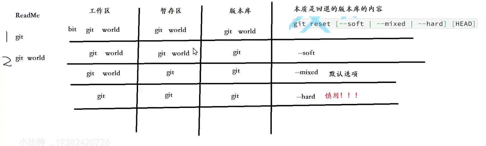
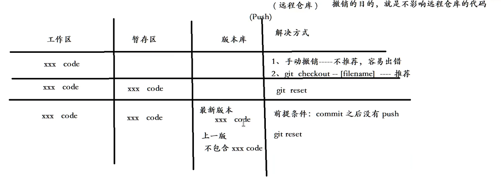
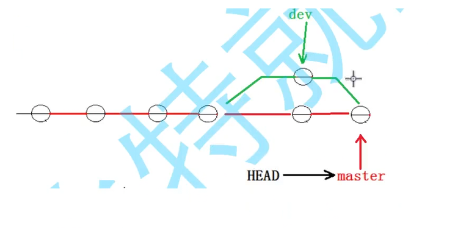

# git学习指南(版本控制系统):

git创建本地仓库：git init 

## 配置本地仓库:
列举出当前本地仓库所有配置项：git config -l
配置用户名： git config user.name "your name"
查看用户名： git config user.name
配置邮箱：   git config user.email your email
查看邮箱：   git config user.email 

重置配置项： git config --unset 配置项
eg:  git config --unset user.name
    
全局生效：git config --global user.name "your name"
全局重置：git config --global --unset 配置项

## 几个概念

1. .git文件时仓库的版本库，而与其同文件目录的文件时处于工作区的文件
2. 暂存区，add加载到的区域
3. 本地仓库，commit到的区域

## 三板斧

1. 添加到git暂存区中：git add 文件路径
2. 提交更改命令，本地仓库： git commit -m "详细描写备注"
3. 查询当前所处的状态： git status  
4. 查询修改前后差异：git diff
5. 

git log 查看最近提交记录 git log --pretty=oneline  
git reflog 查看每次提交命令
Git追踪管理的是修改而不是文件。

## 版本回退功能
1. 版本回退： git reset [--soft | --mixed(默认) | --hard] [HAND]

git reset HAND(表示回退到当前版本)。 HAND^^(表示回退到上两个版本)

2. git checkout -- [filename] 回退到最近一次add

## 删除版本库中文件

1. rm 删除工作区中的文件--->使用add，更改暂存区的文件--->commit，更改本地仓库文件
2. git rm 删除工作区和暂存区的文件--->commit,更新版本库

## 分支管理

git branch 查看本地分支
1. 创建本地分支： git branch 分支名称（指向最新提交）
2. 切换HEAD指针，让它指向新分支： git checkout 分支名称
3. 合并分支：小的分支合并大的 git merge 分支名称 （更新到最新的提交） fast Forword 快速提交模式
4. 删除分支：git branch -d 分支名（需要在其他分支，才能删除） git branch -D 强行删除

## 分支冲突

1. 当merge冲突发生后，会在代码中给你标注处理，操作人员自己选择删除哪一个。最后再commit提交到版本库中
2. 两个分支会重合，但是有一个会指向原本的位置

fast forward：--ff 是看不出是谁提交进来的  默认      
no-fast forward --no-ff 可以看出谁提交进来的  git merge --no-ff -m "备注" 分支名

## 多人协作开发

1. 我们日常使用的网页是master是稳定的，我们程序员可以通过分支，来继续新模块的开发（不稳定的，经过很多测试才能合并），更新合并

2. 当master主分支上有了bug，我们不能直接在主分支上更改，容易造成更严重的问题。因此创建分支进行修改。

3. 再master合并分支之前，前合并到dev分支（开发分支），这样不会影响master的正常运行，经过测试完成后，在和master合并。

git stash pop  删除stash内容
git stash list 查看stash内容