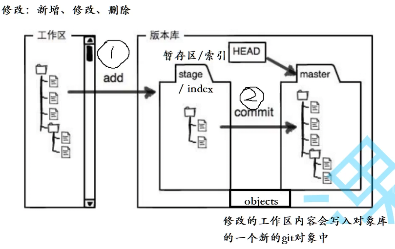
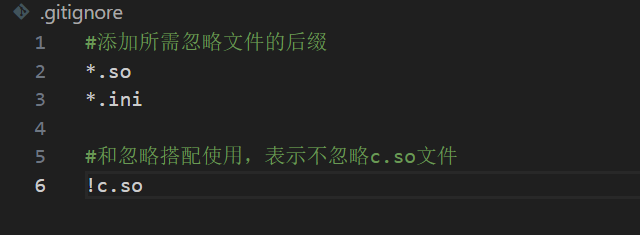
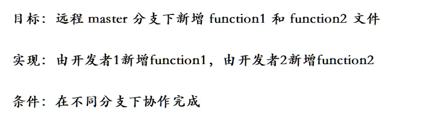
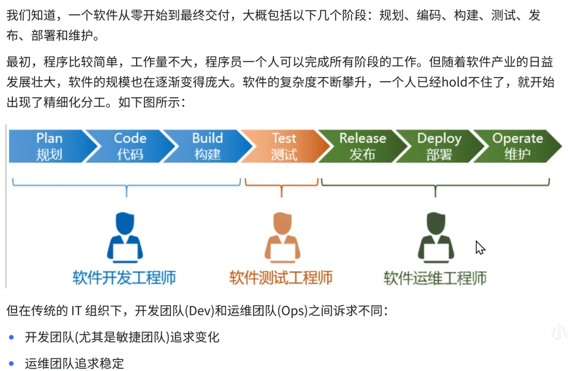

# git学习指南(版本控制系统):

git创建本地仓库：git init 

## 配置本地仓库:
列举出当前本地仓库所有配置项：git config -l
配置用户名： git config user.name "your name"
查看用户名： git config user.name
配置邮箱：   git config user.email your email
查看邮箱：   git config user.email 

重置配置项： git config --unset 配置项
eg:  git config --unset user.name
    
全局生效：git config --global user.name "your name"
全局重置：git config --global --unset 配置项

## 几个概念

1. .git文件时仓库的版本库，而与其同文件目录的文件时处于工作区的文件
2. 暂存区，add加载到的区域
3. 本地仓库，commit到的区域

## 三板斧

1. 添加到git暂存区中：git add 文件路径
2. 提交更改命令，本地仓库： git commit -m "详细描写备注"
3. 查询当前所处的状态： git status  
4. 查询修改前后差异：git diff
5. 本地文件推送远端仓库：git push origin master:master 
6. 从远端仓库获取修改：git pull origin master:master
master和远端master建立联系，直接使用git push/pull即可

git log 查看最近提交记录 git log --pretty=oneline  
git reflog 查看每次提交命令
Git追踪管理的是修改而不是文件。

## 版本回退功能
1. 版本回退： git reset [--soft | --mixed(默认) | --hard] [HAND]

git reset HAND(表示回退到当前版本)。 HAND^^(表示回退到上两个版本)

2. git checkout -- [filename] 回退到最近一次add

## 删除版本库中文件

1. rm 删除工作区中的文件--->使用add，更改暂存区的文件--->commit，更改本地仓库文件
2. git rm 删除工作区和暂存区的文件--->commit,更新版本库

## 分支管理

git branch 查看本地分支 git branch -r 查看远端分支
1. 创建本地分支： git branch 分支名称（指向最新提交）
2. 切换HEAD指针，让它指向新分支： git checkout 分支名称
3. 合并分支：小的分支合并大的 git merge 分支名称 （更新到最新的提交） fast Forword 快速提交模式
4. 删除分支：git branch -d 分支名（需要在其他分支，才能删除） git branch -D 强行删除

## 分支冲突

1. 当merge冲突发生后，会在代码中给你标注处理，操作人员自己选择删除哪一个。最后再commit提交到版本库中
2. 两个分支会重合，但是有一个会指向原本的位置

fast forward：--ff 是看不出是谁提交进来的  默认      
no-fast forward --no-ff 可以看出谁提交进来的  git merge --no-ff -m "备注" 分支名
其中-m 表示我们新增一个提交，新增提交的信息是“备注”

## 多人协作开发

1. 我们日常使用的网页是master是稳定的，我们程序员可以通过分支，来继续新模块的开发（不稳定的，经过很多测试才能合并），更新合并

2. 当master主分支上有了bug，我们不能直接在主分支上更改，容易造成更严重的问题。因此创建分支进行修改。

3. 再master合并分支之前，前合并到dev分支（开发分支），这样不会影响master的正常运行，经过测试完成后，在和master合并。

- 场景：master遇到bug，怎么解决？目前一个master主分支，一个dev开发分支

切换到master，创建fix_bug，在fix_bug分支中修复bug代码，然后切回到master，合并分支。完成后切换回dev，发现我们的代码没有了，是因为我们将代码存到了stash中，需要将stash中数据提取出来（pop）。此时开发完成，但现在合并到master会报错，因为之前修复bug，可能会合并冲突。一个很好的习惯，先在dev分支进行合并，解决冲突，再去master合并dev分支。（23）

stash 是.git中的一个区域
git stash      将工作区内容进行储存（是只已经被追踪管理的文件）
git stash pop  删除stash内容，取出stash
git stash list 查看stash内容

- 场景：产品经理：Acat，新上一个功能吧。过一段时间，将新上的功能去掉吧。

删除分支：git branch -d 分支名（需要在其他分支，才能删除） git branch -D 强行删除
这里因为新功能分支dev，已经进行了提交，并且没有进行merge，是无法通过git branch -d删除的。git branch -D强制删除。

## 远程操作

Git是分布式版本控制系统
Git提供一台中央服务器（持续不挂），多人协作，所有人和中央服务器仓库进行交互。 

Issue：就是发现问题的成员和我们进行交流的地方。
Pull Request：开发过程中，dev分支开发，直接合并到master是不被允许的，很危险，比如：双十一。所以需要PR进行合并申请单，由管理员决定是否合并。

## 克隆操作
不允许在本地仓库环境下进行克隆。远程仓库：origin（远程仓库的默认名字）
git remote 查询远程仓库信息，git remote -v 查询相应权限：fetch 拉权限，push 推权限

1. Https：git clone https://github.com/AAsupercat/lesson108.git 通过https将远端仓库克隆到本地。
2. SSH：git clone git@github.com:AAsupercat/lesson108.git 
查询主目录中是否有.ssh这个文件夹，里面是否存在id_rsa和id_rsa.pub，没有就需要手动创造。
ssh-keygen -t rsa -C "2261391739@qq.com" 就完成了创造。然后我们查看公钥cat id_rsa.pub。然后一字不差的复制到Github中，公钥配置中。然后就可以clone了。

## 本地与远端仓库 push pull
这里推送至的是，我们本地的master分支，推送到远端仓库的master分支，是分支与分支的操作

1. git push origin master:master 这里是推送到origin云端仓库，本地master推送到云端master分支，名称相同可以省略冒号后的内容，即：git push origin master。
2. git pull origin master:master 将origin的master分支拉取到本地master分支，合并操作。

为什么可以push/pull？因为我们有push权限，git remote -v查询的时候可以知道，另外在克隆仓库的时候，本地和远端仓库建立了联系。

## 配置Git

1. .gitignore文件：我们有一些本地不想远端看到的内容，在推送时，我们忽略他们，不将相应文件推送。比如数据库。注意：这个文件要在Git工作区的根目录下。

2. 给指令起别名，比如：status比较复杂就使用，给它取个别名st ---> git config --global alias.st status

3. 打标签，给重要的提交打标签，就能更快速的定位。

本地操作：
打标签：git tag tagname (提交ID：commitID) 默认给最新的提交打一个tagname的标签
打标签添加备注：git tag -a tagname -m "备注" commitID
查看目前存在的标签： git tag，查看具体 tree .git 中tags可以清晰查看
查看某个标签的详细内容：git show tagname
删除标签：git tag -d typename

推送tagname到远端：git push origin tagname 
推送所有标签到远端：git push origin --tags
删除远端tagname的标签：git push origin :tagname

# 多人协作实践（35）

- 场景1，同一分支下，两人合作，一人添加aaa，一人添加bbb，添加到origin/dev分支中
1. git push/pull 直接操作，需要本地分支和远端分支进行联系
2. git checkout -b dev origin/dev 创建dev分支，并且追踪远端的dev分支
3. git branch -vv 查看本地和云端的分支，以及联系

问题：当一人将添加数据aaa同步到远端后，添加bbb的人，push会发生冲突，需要先pull拉取到本地，在进行冲突处理，最后提交。

- 场景1：远端库，合并master和dev分支
1. 本地先合并，再提交到远端，本地合并操作：先拉取远端最新代码，再在本地dev合并master，解决可能性的冲突代码，再进行master合并dev。
2. 通过提交PR申请单，管理员同意（老板和项目经理审查，保障性），merge操作（推荐）

- 场景1：功能开发完毕，最后删除dev

- 场景2：不同分支，一个功能对应一个分支，合作开发（38）

# 企业级开发模型

